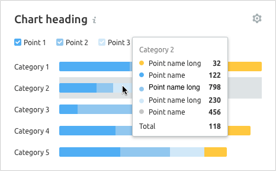

> 💡 Basic data visualization rules are described in the [Chart principles](/data-display/chart/).

@## Description

**Bar chart** is a method to visualize distribution of values by category for value comparison. A bar chart can be [vertical](/data-display/bar-chart/) or horizontal.

> 💡 **Difference from Histogram chart**
>
> Bar chart displays distribution of data sets by quality categories.
>
> Histogram charts are used to display distribution of data sets: how often values fall into quantitative ranges.

Important points to keep in mind when presenting data as a bar chart:

- The axes should be clear to the user from the chart name. However, in cases where the graph name is not enough, you can denote the axes.
- Don't use too many colors to represent values. One color or shades of the same color shall be sufficient for your tasks. However, you can always select a value if necessary.

@## Usage

See detailed information in the [Horizontal bar chart guide](/data-display/bar-horizontal/#ac6451).

@## Margins

See detailed information in the [Horizontal bar chart guide](/data-display/bar-horizontal/#abd326).

@## Grid and axes

See detailed information in the [Horizontal bar chart guide](/data-display/bar-horizontal/#a9e6f0).

@## Labels of categories and values

See detailed information in the [Horizontal bar chart guide](/data-display/bar-horizontal/#a05155).

@## Appearance

The Stacked bar chart has no margin between values inside the column. **Choose contrasting colors for different categories.**

@## Interaction

When you hover over a column, we highlight it with a grey background – `rgba 152 170 175, 0.3` (`$mist` with .3 opacity). The hover takes up half of the margin column on the right and left sides.

> 💡 If the column is clickable, the cursor must change to `pointer`.

If the chart has a trend line, then while hovering a line and a point shall be displayed on the trend line.

@## Edge cases

Edge cases for stacked bar chart are pretty much the same as [Horizontal bar chart](/data-display/bar-horizontal/#a54381) has.

@## Data loading

See detailed information in the section about data loading in the [Horizontal bar chart guide](/data-display/bar-horizontal/#ac26f2).

@page stacked-horizontal-bar-api
@page stacked-horizontal-bar-d3-code
@page stacked-horizontal-bar-recharts-code
