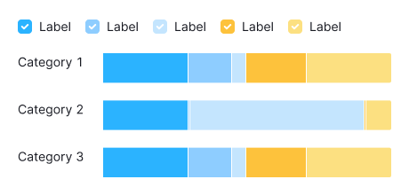
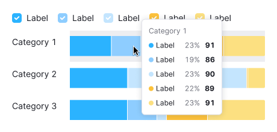

::: react-view

:::

::: tip
Basic data visualization rules are described in the [D3 chart](/data-display/d3-chart/d3-chart).
:::

## Description

**Horizontal stacked bar chart** is used to display multiple categories of values and illustrate their proportions relative to the total.

**Key points for using horizontal stacked bar chart:**

- Choose this chart to compare more than two categories.
- It's ideal for showing how parts contribute to a whole.
- Pick distinctly different colors for clarity. Avoid using too many colors for categories. Shades of one color can work well.
- Ensure the chart is large enough to easily read the data.

::: tip
**Bar vs. Histogram Chart**

- Bar charts categorize data qualitatively, showing how different categories compare.
- Histograms organize data quantitatively, indicating how often values fall within certain ranges.
:::

## Usage

Refer to the [Horizontal bar chart](/data-display/bar-horizontal/bar-horizontal#usage).

## Appearance

Choose contrasting colors for different categories.

### Margins

Refer to the [Horizontal bar chart](/data-display/bar-horizontal/bar-horizontal#margins).

## Grid and axes

Refer to the [Horizontal bar chart](/data-display/bar-horizontal/bar-horizontal#grid-and-axes).

## Category labels

Refer to the [Horizontal bar chart](/data-display/bar-horizontal/bar-horizontal#category-labels).

## Legend

Refer to the [Horizontal bar chart](/data-display/bar-horizontal/bar-horizontal#legend).

## Interaction

Hovering highlights a bar with `--chart-grid-bar-chart-hover`, indicating focus or clickability. The hover takes up half of the bars margin on the top and bottom sides.

## Edge cases

Refer to [Horizontal bar chart](/data-display/bar-horizontal/bar-horizontal#edge-cases).

## Initial data loading

Refer to the [Horizontal bar chart](/data-display/bar-horizontal/bar-horizontal#initial-data-loading).
