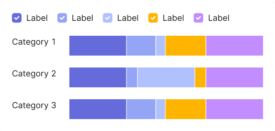
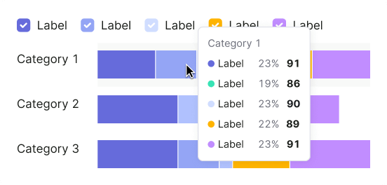

<Playground for="Chart.StackedHorizontalBar" />

::: info
Basic data visualization rules are described in the [D3 chart](/data-display/d3-chart/d3-chart).
:::

## Description

**Horizontal stacked bar chart** is used to display multiple categories of values and illustrate their proportions relative to the total.

**Key points for using horizontal stacked bar chart:**

- Choose this chart to compare more than two categories.
- It's ideal for showing how parts contribute to a whole.
- Pick distinctly different colors for clarity. Avoid using too many colors for categories. Shades of one color can work well.
- Ensure the chart is large enough to easily read the data.

## Usage

Refer to [Horizontal bar chart > Usage](/data-display/bar-horizontal/bar-horizontal#usage).

## Appearance

Choose contrasting colors for different categories.

### Margins

Refer to [Horizontal bar chart > Margins](/data-display/bar-horizontal/bar-horizontal#margins).

## Grid and axes

Refer to [Horizontal bar chart > Grid and axes](/data-display/bar-horizontal/bar-horizontal#grid-and-axes).

## Category labels

Refer to [Horizontal bar chart > Category labels](/data-display/bar-horizontal/bar-horizontal#category-labels).

## Legend

Refer to [Horizontal bar chart > Legend](/data-display/bar-horizontal/bar-horizontal#legend).

## Interaction

Hovering highlights a bar with `--chart-grid-bar-chart-hover`, indicating focus or clickability. The hover takes up half of the bars margin on the top and bottom sides.

## Edge cases

Refer to [Horizontal bar chart > Edge cases](/data-display/bar-horizontal/bar-horizontal#edge-cases).

## Initial data loading

Refer to [Horizontal bar chart > Initial data loading](/data-display/bar-horizontal/bar-horizontal#initial-data-loading).
