> 💡 Basic data visualization rules in widgets with graphs are described in [Data vizualization](/data-display/chart/).

@## Description

**Venn chart** helps to show the intersection of circles to present all possible intersections between two (or sometimes more) sets.

> This chart type is also called a **set chart**.

- Each set in such a chart is a set of data. The data sets may have something in common.
- The circles overlapping area is called the "intersection area", — it shows data with common qualities from all intersecting sets.
- This chart type focuses on how much different groups of sets have in common (or how different they are).

> 💡 Keep in mind that when comparing more than 2 sets on one chart, the chart may become unreadable.

**When is it better to use a Venn chart?**

- When you need to visually show the relationships between sets, their common features and differences between them.
- When you need to compare two or more sets, and clearly show what they have in common.
- When you need to show Boolean expressions, such as `"or"` and `"and"` expressions.

> 💡 John Venn came up with this type of chart around 1880. They were used in the study of set theory as they excellently illustrated the relations of different groups.
>
> [Venn diagram on datavizproject](https://datavizproject.com/data-type/venn-diagram/)

@## Appearance

In the default state for all circles:

- fill opacity is 50%;
- stroke size is 2px.

### Sizes

- Minimum Venn chart size is **180px \* 180px**.
- Maximum Venn chart size is **300px \* 300px**.

> 💡 It is not recommended to make Venn charts smaller or larger than these values, because in the first case, the intersection area may be very small and, consequently, invisible. In the second case, you should not "enlarge" the report with an unnecessarily large chart.

|                                                     | Appearance example                         |
| --------------------------------------------------- | ------------------------------------------ |
| Chart inside small narrow widgets (less than 400px) | 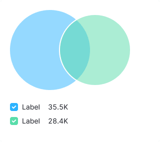 |
| Chart inside large widgets (more than 400px)        | 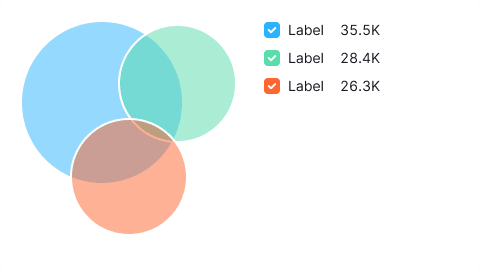     |

### Margins

The chart has a 12px top margin.

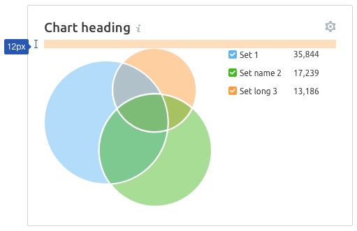

@## Legend

The legend for this type of chart:

- shall be added with values (this is necessary both for a quick comparison and for different extreme states of sets of type 0 or n/a);
- in some cases, it is possible to add an additional legend to explain what the set refers to.

If the legend doesn't fit the widget width, you can put it under the chart.

### General rules

- The legend should not be far from the chart, the margin is 24px maximum (the rule of proximity between external and internal elements).
- The legend label is set to 16px. The margin between the values is 12px.
- The legend is aligned to the top of the chart. This is a more versatile option compared to center alignment.
- If you want to place the legend under the chart, then allow 24px margin to the legend.

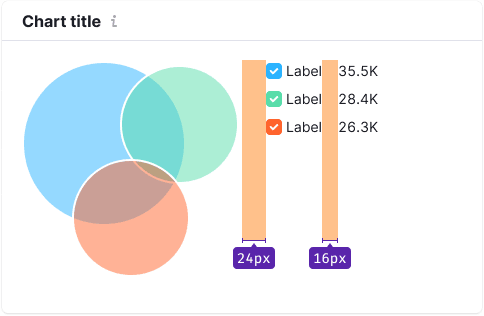

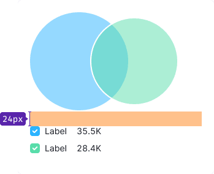

### Legend content

If you need to add the name of the set in the legend and what it refers to, then use the secondary text `$gray60` of the same size as the set text.

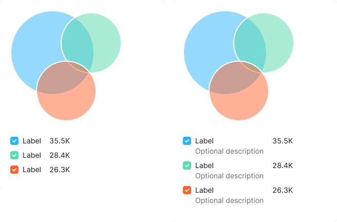

### Long legend

If the category names in the legend are very long, they can be displayed in full length with the text moving to the second line.

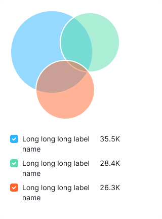

@## Interaction

|         | Appearance example                         | Styles                                                                                                                                              |
| ------- | ------------------------------------------ | --------------------------------------------------------------------------------------------------------------------------------------------------- |
| default |  | In default state for all circles: the fill transparency is 50%, stroke size is 2px.                                                                 |
| hover   | 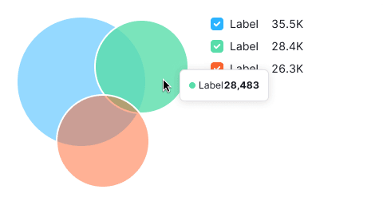 | When hovering, the transparency of the fill for the sector that the user hovered over changes by 70%. All other sectors will have 50% transparency. |

@## Tooltip

|                                           | Appearance example                          | Tooltip content                                                                                                                                                   |
| ----------------------------------------- | ------------------------------------------- | ----------------------------------------------------------------------------------------------------------------------------------------------------------------- |
| Hovering over a sector                    |   | Displaying the name of the set and its value.                                                                                                                     |
| Hovering over the intersection of sectors |  | Displaying how much is the intersection of sectors as a percentage and the usual value. Below you can see the names of all intersecting sectors and their values. |

@## Edge cases

### The set has a very small value

Here, we show the minimum size of the circle of the corresponding color — `12px * 12px`.

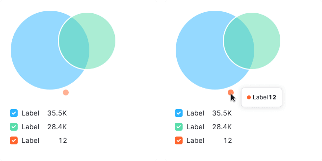

### Intersection 100%

In this case, we show the sets centered on the left side.

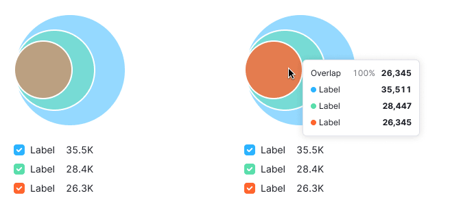

### Null

- If the set value is zero, it is not displayed on the chart.
- The legend shall contain the information that the value is 0.

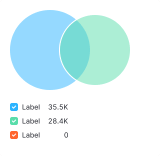

- If the values for all data sets are 0, then a `$mercury` color, transparency 50% circle shall be displayed.

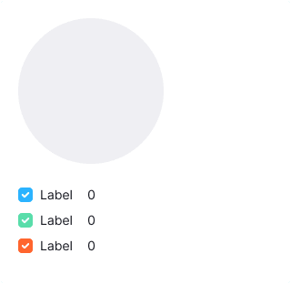

### Not available data

- If we can't calculate the value of the set or the data is not available, the value is also not displayed on the chart.
- The legend shall contain the information that the value is `n/a`.
- If the values for all data sets are not known, then a `$mercury` color, transparency 50% circle shall be displayed.

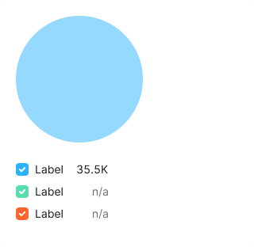

### First loading of the widget

- In this case, we display [Skeleton](/components/skeleton) in the widget instead of the chart.
- If the chart has a title, it should be displayed during loading. The user shall have an idea of what is being loaded and whether they need to wait for the loading process to complete.

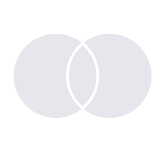

@page venn-chart-api
@page venn-chart-d3-code
@page venn-chart-recharts-code
