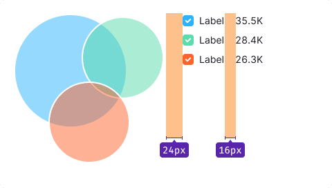
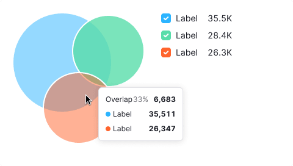

::: react-view

:::

::: info
Basic data visualization rules are described in the [D3 chart](/data-display/d3-chart/d3-chart).
:::

## Description

**Venn chart** illustrates how different data sets relate and overlap. It's also known as a set chart.

- Each circle represents a data set.
- Overlapping areas called "intersection area" show common elements across data sets.
- This chart type focuses on how much different groups of sets have in common (or how different they are).

::: tip
Venn charts can become cluttered with more than two data sets.
:::

**When to use venn chart?**

- To show data set relationships and differences.
- To compare data sets, highlighting commonalities.
- To show boolean logic like "or" and "and" for data sets.

::: tip
John Venn came up with this type of chart around 1880. They were used in the study of set theory as they excellently illustrated the relations of different groups.

[Venn diagram on datavizproject](https://datavizproject.com/data-type/venn-diagram/)
:::

## Appearance

All circles have 50% fill opacity and 2px stroke.

### Sizes

- Minimum: 180px by 180px.
- Maximum: 300px by 300px.

Avoid sizes outside the minimum limits, because For too small venn chart, the intersection area may be very small and, consequently, invisible.

## Legend

Add a legend with values for clarity.

Table: Venn chart legend placement

|                                      | Appearance example         |
| ------------------------------------ | -------------------------- |
| Chart inside small widgets (< 400px) |  |
| Chart inside large widgets (> 400px) |    |

### General recommendations

- Keep legend close to the chart, max 24px away.
- Legend labels should have a 16px margin-right.
- Align legends to the top of the chart.
- If it doesn't fit, place it below the chart with a 24px margin.

### Legend content

Use `--text-secondary` color for data set names and their descriptions.

### Long label

Wrap long labels onto the next line.

## Interaction

Table: Venn chart interaction

| State   | Appearance example                         | Styles                        |
| ------- | ------------------------------------------ | ----------------------------- |
| Default |  | 50% fill transparency and 2px stroke size.      |
| Hover   |  | Hovered sector fill increases to 70% opacity. |

## Tooltip

Show data set names and values, including intersection details and percentages.

Table: Venn chart tooltip

|                                           | Appearance example                          | Tooltip content                                                                                                                                        |
| ----------------------------------------- | ------------------------------------------- | ------------------------------------------------------------------------------------------------------------------------------------------------------ |
| Hover over a sector                    |   | Show name of the data set and its value.    |
| Hover over an intersection area |  | Display the intersection percentage and its value. List the names and values of intersecting sectors below.|

## Edge cases

### Value less than 1%

Display the smallest circle possible (12px by 12px).

### Intersection 100%

Align data sets to the left.

### Null values

If the data set value is zero, don't show it on the chart, but show the value in the legend.

::: tip
Zero counts as data. 0 ≠ n/a.
:::

If all data set values are zero, display a circle in `--chart-palette-order-null` color.

### No data

Exclude unavailable data from the chart, marking it as n/a in the legend. If all dataset values are unknown, show a circle in `--chart-palette-order-null` color.

## Initial data loading

Show [Skeleton](/components/skeleton/skeleton) during initial loading. If the chart has a title, display it to inform users about what's loading. Refer to [Skeleton](/components/skeleton/skeleton) for more details.

Use the `--skeleton-bg` color token for the skeleton's background.

Refer to [Error & n/a widget states](/components/widget-empty/widget-empty) for all other empty states.
