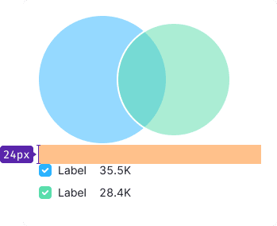

> 💡 Basic data visualization rules in widgets with charts are described in [Data vizualization](/data-display/chart/).

@## Description

**Venn chart** shows the relationship and intersections between two (or sometimes more) data sets. This chart type is also called a **set chart**.

- Each circle in such a chart is a set of data.
- The circles overlapping area is called the "intersection area", — it shows data with common qualities from all intersecting sets.
- This chart type focuses on how much different groups of sets have in common (or how different they are).

> 💡 Keep in mind that when comparing more than 2 sets on one chart, the chart may become unreadable.

**When is it better to use a Venn chart?**

- When you need to visually show the relationships between data sets, their common features and differences between them.
- When you need to compare two or more data sets, and clearly show what they have in common.
- When you need to show boolean expressions, such as "or" and "and" expressions.

> 💡 John Venn came up with this type of chart around 1880. They were used in the study of set theory as they excellently illustrated the relations of different groups.
>
> [Venn diagram on datavizproject](https://datavizproject.com/data-type/venn-diagram/)

@## Appearance

In the default state for all circles:

- fill opacity is 50%;
- stroke size is 2px.

### Sizes

- Minimum Venn chart size is **180px \* 180px**.
- Maximum Venn chart size is **300px \* 300px**.

> 💡 It is not recommended to make Venn charts smaller or larger than these values, because in the first case, the intersection area may be very small and, consequently, invisible. In the second case, you should not "enlarge" the report with an unnecessarily large chart.

|                                                     | Appearance example                         |
| --------------------------------------------------- | ------------------------------------------ |
| Chart inside small narrow widgets (less than 400px) |  |
| Chart inside large widgets (more than 400px)        |      |

@## Legend

The legend for this type of chart:

- shall be added with values (this is necessary both for a quick comparison and for different edge cases such as not available and null data);
- in some cases, it is possible to add an additional legend to explain what the set refers to.

If the legend doesn't fit the widget width, you can put it under the chart.

### General recommendations

- The legend should not be far from the chart, the margin is 24px maximum.
- **The legend label has 16px margin-right.**
- The legend is aligned to the top of the chart.

- If you need to place the legend under the chart, then add 24px margin to the legend.

### Legend content

If you need to add the name of the data set in the legend and what it refers to, then use the secondary text `--gray-500` of the same size as the set name.

### Long label

If legend label is very long, wrap it to the next line.

@## Interaction

|         | Appearance example                         | Styles                                                                                                |
| ------- | ------------------------------------------ | ----------------------------------------------------------------------------------------------------- |
| default |  | The fill transparency is 50%, stroke size is 2px.                                                     |
| hover   |  | When hovering, the transparency of the fill for the sector that the user hovered over changes by 70%. |

@## Tooltip

|                                           | Appearance example                          | Tooltip content                                                                                                                                        |
| ----------------------------------------- | ------------------------------------------- | ------------------------------------------------------------------------------------------------------------------------------------------------------ |
| Hovering over a sector                    |   | Show the name of the data set and its value.                                                                                                           |
| Hovering over the intersection of sectors |  | Show how much is the intersection of sectors as a percentage and the value. Below you can show the names of all intersecting sectors and their values. |

@## Edge cases

### Value less than 1%

Show circle with the minimum size — 12px \* 12px.

### Intersection 100%

In this case, show the data sets left aligned.

### Null values

- If the data set value is zero, don't show it on the chart.
- The legend shall contain the information that the value is 0.

- If the values for all data sets are 0, then show a circle with `--gray-100` color.

### Not available data

- If the values of data set is not available, don't show the them on the chart.
- The legend shall show the value as `n/a`.
- If the values for all data sets are not known, then show a circle with `--gray-100` color.

### Initial loading

When loading the chart for the first time, show [Skeleton](/components/skeleton/) instead of the chart.

If the chart has a title, show it during the loading. The user shall have an idea of what is being loaded and whether they need to wait for the loading process to complete.

More information about this state see in the guide for [Skeleton](/components/skeleton/).

@page venn-chart-api
@page venn-chart-d3-code
@page venn-chart-recharts-code
