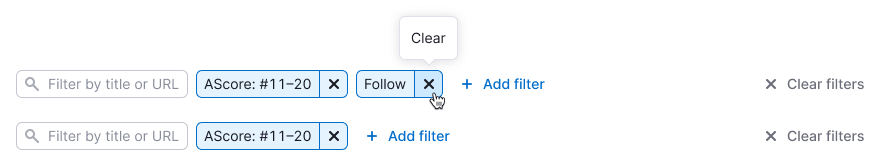

## Description

**Add filter** is a pattern that allows adding filters one by one. It allows to save space when there's a big number of filters available, and the user might only want to use only some of them.

## Initial state

In the initial state, **Add filter** is a tertiary button. It can be preceeded by a set of persistent filters that can't be hidden by the user.

## Adding filters

When activated, **Add filter** opens the list of all available filters.

* Include a search input if there's more than 10 list items
* Sort the list alphabetically

As soon as the user selects one of the filters, this filter is added to the filter row and activated, so that the user can immediately proceed to choosing the filter value.

* Pressing `Esc` or clicking elsewhere at this point removes the filter
* Added filters are hidden from the list

## Removing filters

Clearing an added filter removes it from the filter row and adds it back to the list.

If one or more filters are set, including persistent filters, you can provide a **Clear filters** button. **Clear filters** resets all filters, removing added filters from the filter row.

## Adding multiple filters

Filters wrap to the next line when there's no more horizontal space.
If all possible filters are added, the **Add filter** button disappears.

