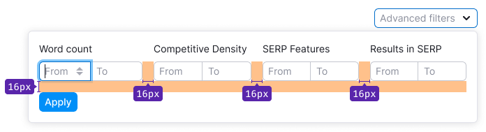
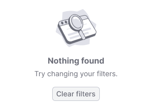

## Description

**Advanced filters** is a pattern for filter controls that need to be combined into a group for any reason (logical relationship or related filters).

When working with combined filters, the user should know the number of applied filters in the group and be able to quickly add or remove filters.


<!-- ### Combination of conditions

Advanced filters can combine the following conditions:

**By logical division:**

- Including/excluding conditions (Include/exclude filters).
- Separate filters (SERP features, etc.).

**By the method of applying the selected filters:**

- Triggered instantly when any filter group is selected.
- Triggered by a button. -->

## Appearance

If you need to increase or decrease the margins between filters inside the form, make them multiples of 4.



You can visually separate submit buttons from the filters by using the following border style: `border: 1px solid var(--intergalactic-border-primary)`.


### Counter

Counter appears after applying the filter. It shows the number of filters applied within the advanced filters group.


### Clear button

The **Clear advanced filters** button works the same way as the [**Clear** button in FilterTrigger](/components/filter-trigger/filter-trigger#interaction), with the only difference being its name.

## Dropdown or accordion?

**Use a dropdown for advanced filters when:**

- The filter needs to be visible while scrolling so the user can open it and change filters while scrolling the page.
- The filter has many conditions, making it advisable to hide them.

**Use an accordion for advanced filters when:**

- The user needs to interact with filters within a table.
- The applied filters should be visible when switching to another report.

## Filters in dropdown

Advanced filters implemented in the dropdown must have:

- A button to add a new condition (optional)
- **Apply** and **Clear all** buttons

You can fix advanced filters implemented in the dropdown at the top of the page while scrolling.

### Opened filter

- The dropdown width should be fixed.
- If the dropdown has many lines with filters, after 4 lines, we recommend hiding others with a scroll.
- Clicking the **Apply** button closes the dropdown, and the counter in the trigger appears or updates.
- The **Clear all** button clears all entered values.
- The value entered in the input is applied by pressing **Enter**.

Table: Opened filter examples

| Case                         | Appearance example                         |
| ---------------------------- | ------------------------------------------ |
| Separate filters             |   |
| Additional filter conditions |  |

### Filled filter

After applying the filter:

- Show the counter of applied filters in the trigger.
- The counter must be recalculated after each filter application.


## Filters in accordion

This filter expands, shifting down the page content. Use the following styles for accordion content:

```css
background-color: var(--intergalactic-bg-primary-neutral);
border: 1px solid var(--intergalactic-border-primary);
```


### Filled filter

After applying the filter:

- Show the counter of applied filters in the trigger.
- The counter must be recalculated after each filter application.


## Interaction

For the filter trigger use [Select](/components/select/select) and [FilterTrigger](/components/filter-trigger/filter-trigger) components.

Table: Advanced filter states

| State       | Appearance                                         |
| ----------- | -------------------------------------------------- |
| Placeholder |         |
| Hover       |             |
| Active      |  |

- Dynamic filter application (no **Apply** button) is useful when loading data while applying the filter strongly affects the output. It's important to show the content to the user immediately when applying the filter, without waiting for confirmation from the **Apply** button.
- Filters are valid only within one report. However, they should be saved when returning to this report (within the same product) and when reloading the page.
- When changing the base, date, or switching between reports, the values in advanced filters should be saved.
- Filter settings are forwarded to the URL.

### Clearing filter group

- The delete button appears in the filter form after applying filters and clears the entire group of filters.
- The advanced filters-dependent page content is reloaded and overrides the applied values.
- By clicking the **Clear all** button, everything applied in the group will be deleted.

### Loading

When the filter's content or some of the filters are loading, show [Spin](/components/spin/spin) with the "Loading..." text.


Wrap the filter form in a [SpinContainer](/components/spin-container/spin-container) when the user-selected data needs time to be applied.


### Nothing found

Show an [empty state](/components/widget-empty/widget-empty) with the option to update the filter.



## Tooltip

If the accordion needs a Close button, then show a `Hint` with the text: "Hide".


