@## Description

**Advanced filters** is used when filters need to be combined into a group for any reason (logical relationship, related filters, can also be used as a container to combine different filters).

**When working with the advanced filters, the user should:**

- see the number of applied filters in the group;
- be able to quickly apply or remove applied filters.

### Advanced filter types can contain a combination of the following conditions

**By logical division:**

- containing including / excluding conditions (Include / exclude) filters;
- containing separate filters (SERP features, etc.).

**By the method of applying the selected filters:**

- triggered instantly when any filter group is selected;
- triggered by button by button.

@## Should I use dropdown or accordion?

**Implement the advanced filters in a dropdown when:**

- it is necessary to fix this filter when scrolling so the user can open it when scrolling the page and change applied filters;
- the filter has a large number of conditions that load the page, and it is advisable to hide them.

**Implement the advanced filters in an accordion when:**

- the user needs to interact with filters most of the time with the table;
- you need to see the filters applied when you switch to another report and return to a report with an advanced filter.

@## Other features

- Dynamic filter application (no `Apply` button) can be present when loading data while applying the filter strongly affects the output. It is important to show the content to the user immediately when applying the filter, not to wait for confirmation from the `Apply` button.
- Filters are valid only within one report. But at the same time, they should be saved when returning to this report (within the same tool) and when reloading the page.
- When changing the base, date, switching between reports, the values in Advanced filters are saved.
- Filter settings are forwarded to the URL.

@## Counter

The counter appears after applying the filter. It shows the number of filters applied within the advanced filters group.

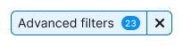

@## Clearing a filter group

- The delete button appears in the select dropdown after applying filters, clears the entire group of filters.
- The advanced filters-dependent page content is reloaded and overrides the applied values.
- By clicking the `Clear all` button, everything applied in the group is deleted.

@## Loading

When the filter's content or some of the filters are loading, you can show [Spin](/components/spin/) in the filter dropdown with the `Loading ...` text.

Show loading status if the backend request is too long.

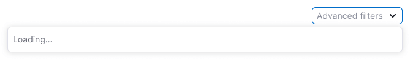

Show [SpinContainer](/components/spin-container/) over the dropdown content in the case when the user-selected data needs a time to be applied.

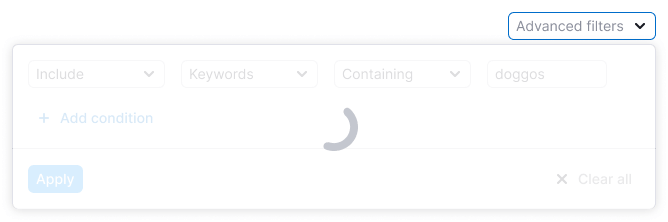

@## Nothing found

Show an ["empty" error state](/components/widget-empty/) with the option to update the filter, if an error occurs during the request.

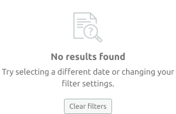

@## Interaction

Trigger states inherites styles from the [Select](/components/select/) and [FilterTrigger](/components/filter-trigger/) components.

| State       | Appearance                                         |
| ----------- | -------------------------------------------------- |
| placeholder | 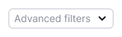        |
| hover       | 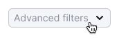            |
| active      |  |

@## Tooltips

|                                                                                                                                   | Appearance example                      |
| --------------------------------------------------------------------------------------------------------------------------------- | --------------------------------------- |
| When hovering over the button with the Close icon in the filled filter show the tooltip with the text: `Clear advanced filters.`. | 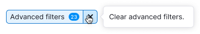 |
| When hovering over an open select, show a tooltip with the text: `Hide advanced filters`.                                         | 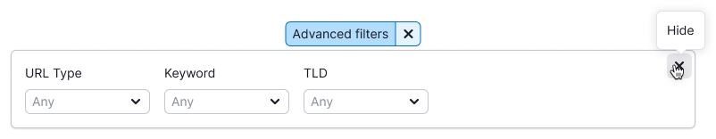 |
| If the accordion needs a Close icon, then hang a tooltip on it with the text: `Hide`.                                             | 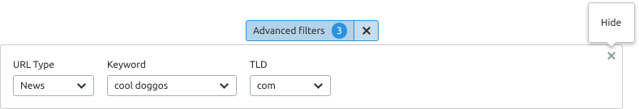 |

@## Advanced filters in the dropdown

Advanced filters implemented in the dropdown have:

- a button for adding a new line of conditions (optional)
- buttons `Apply` and`Clear all`.

**You can fix advanced filters implemented in dropdown at the top of the page when scrolling.**

### Opened filter

- The dropdown has a fixed width, which depends on the number of controls placed in it.
- If the dropdown has a large number of lines with filters, then after 4 lines we recommend adding a scroll inside.
- Clicking the `Apply` button closes the dropdown, and the counter of the applied filters appears in the trigger
- The `Clear all` button clears all values entered into filters.
- The value entered in the input is applied by Enter.

|                                | Appearance example                                           |
| ------------------------------ | ------------------------------------------------------------ |
| Example with separate filters  | 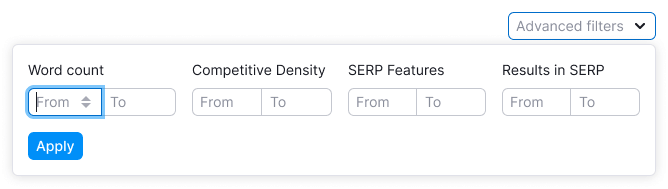  |
| Example with filter-conditions | 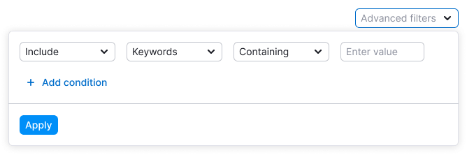 |

### Filled filter

After applying the filter:

- Show the counter of applied filters in the trigger.
- The counter is recalculated after each filter application.

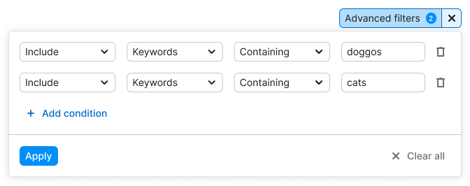

@## Advanced filters in the accordion

Container in accordion has styles: `border: 1px solid $gay80;`.

### Opened filter

- The filter expands in the accordion, shifting down the page content.
- The accordion has a fixed width, which depends on the width of the page content.
- When applying any filter in the trigger, we show a counter with the number of applied filters.
- This group of filters has no buttons `Apply`,`Clear all`, `Cancel`.

An example of a dynamically applied filter.

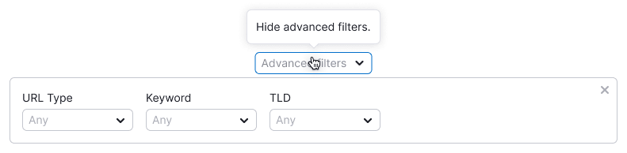

An example of a filter applied by the `Apply` button.

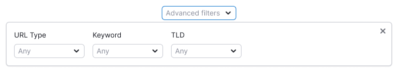

### Filled filter

After applying the filter:

- Show the counter of applied filters in the trigger.
- The counter is recalculated after each filter application.

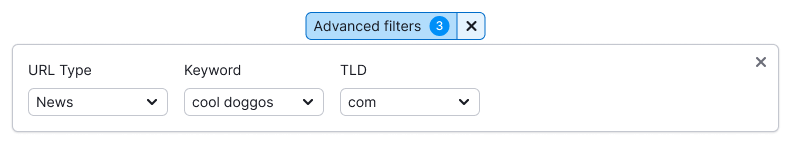

@## Paddings and styles recommendations

| Recommendation                                                                                                                                                                                                                                                                                 | Example                                                 |
| ---------------------------------------------------------------------------------------------------------------------------------------------------------------------------------------------------------------------------------------------------------------------------------------------- | ------------------------------------------------------- |
| Since the content of the dropdown for Advanced filters differs from tool to tool, stick to the rule of padding in multiples of 4 between filters. **If you need to increase or decrease the space between filters inside the dropdown, make them multiples of 4: 8px, 12px, 24px, 32px, etc.** | 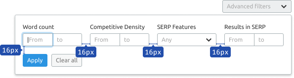                 |
| Always visually separate filter controls from the filters themselves. For this we use `border: 1px solid $ gay80;`.                                                                                                                                                                            |  |

@page advanced-filters-code
