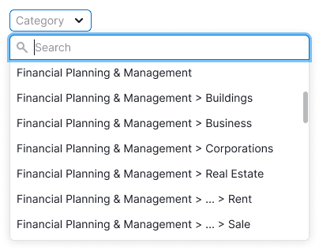
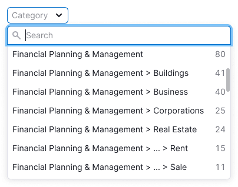
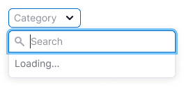
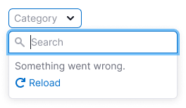
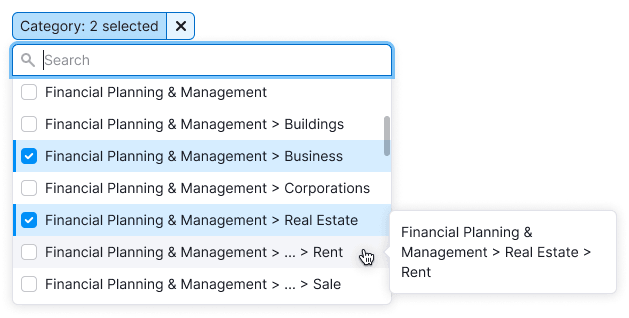
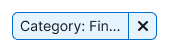

@## Description

**Filter Category** is select or multiselect with a list of domain categories.

<!-- For more details on how to use the list of categories in reports and how to display it, see the guide Categories. -->

When working with the Filter Category, the user should:

- understand is it list of domain categories or interests.
- quickly find the appropriate category.
- understand, what category is selected, because they can have very long and similar names.

@## Appearance

The filter inherits all [FilterTrigger](/components/filter-trigger/) styles and properties.

- Select min-width — 100px
- FilterTrigger min-width — 160px

It's better not to make controls smaller than recommended min-widths, otherwise the user may not read at all what the filter is or cann't see what category is selected.

| Input sizes                                        | Inactive filter (select)              | Active filter (filterTrigger)              |
| -------------------------------------------------- | ------------------------------------- | ------------------------------------------ |
| M (26px height), L (32px height), XL (42px height) |  |  |

@## Filter by one category

Use [Select](/components/select/) for such kind of filters.

There can be a lot of categories, load them with user's request. **To load quickly, limit the output to 50 categories.** We recommend to load the rest when scrolling.

### Placeholder

Category (in case, there are domain categories inside).

### Active trigger

The list of categories is sorted by:

- alphabetically (if there are no counters in the list options)
- by the number of domains (if there are domain counters in the list optons)

Long categories are shortened according to the [rules of long URLs](/table-group/table-working/#a19308) and must have a tooltip.

**Add search if there are more than 10 categories in the list.**

|                    | Alphabetically                                           | By the number of domains                      | Long category name                         |
| ------------------ | -------------------------------------------------------- | --------------------------------------------- | ------------------------------------------ |
| Appearance example |  |  |  |

> The counters in the list are optional, as if there are many filters nearby, it can be difficult to recount data on the fly. Also, if the table is heavy, it can also be difficult to calculate right away. However, if possible, we recommend using counters.

### Filled trigger

**Long categories are shortened according to the [rules of long URLs](/table-group/table-working/#a19308).**

We recommend always putting a label to the filter. But, if there is not enough space and if you are sure that without a label, users will understand what kind of filter is in front of them, you can remove the label.

### Loading

Show the download status in the dropdown, if the request is long.

### Error

Show an error in the dropdown with the ability to update the filter if an error occurred during the request.

@## Filter by multiple categories

- Use this type of filter if you are sure you need it (for example, users are asking for it).
- Usually, such a filter is very complex, and most reports only need to select one category.

Use [Multiselect](/components/select/) for such kind of filters.

There can be a lot of categories, load them with user's request. **To load quickly, limit the output to 50 categories.** We recommend to load the rest when scrolling.

### Placeholder

Category (in case, there are domain categories inside).

### Active trigger

The list of categories is sorted by:

- alphabetically (if there are no counters in the list options)
- by the number of domains (if there are domain counters in the list optons)

Long categories are shortened according to the [rules of long URLs](/table-group/table-working/#a19308) and must have a tooltip.

- **Add search if there are more than 10 categories in the list.**
- Select all/Deselect all functionality is optional.

|                    | Alphabetically                                                       | By the number of domains                                  | Long category name                                     |
| ------------------ | -------------------------------------------------------------------- | --------------------------------------------------------- | ------------------------------------------------------ |
| Appearance example |  |  |  |

> The counters in the list are optional, as if there are many filters nearby, it can be difficult to recount data on the fly. Also, if the table is heavy, it can also be difficult to calculate right away. However, if possible, we recommend using counters.

### Filled trigger

One category selected — show the full category name in the trigger.

If the filter is a [multiselect](/components/select/) and you can select more than two values, then reduce them in the trigger to the `N selected` construction.

The label is required, as without the label it will be difficult for the user to understand what the filter is.

> Selected categories are always pinned at the very top of the list, as in the [example](/components/select/#a0bb9a).

### Loading

Show the download status in the dropdown, if the request is long.

### Error

Show an error in the dropdown with the ability to update the filter if an error occurred during the request.

@## Use in UX/UI

> Technically, categories do not have nesting, it is purely visual to distinguish between categories.
>
> **Example:**
>
> News > Team Sports > **Baseball** — website with basebal news
>
> Goods > Sports Goods > **Baseball** — website with baseball goods

### Category abbreviations rules

The last part of the category name is the most important, it should be shown anyway.

Therefore, abbreviate the category name so that the last part is read in full and the abbreviation starts with >.

> 💡 When hovering over the abbreviated category name, ALWAYS show the tooltip with its full name.

### Trigger min-width

Provide the minimum width of the active trigger so that the filter name fits and at least the beginning of the category name.

Check names in other languages 🤓

