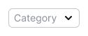
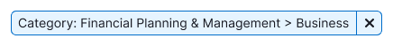
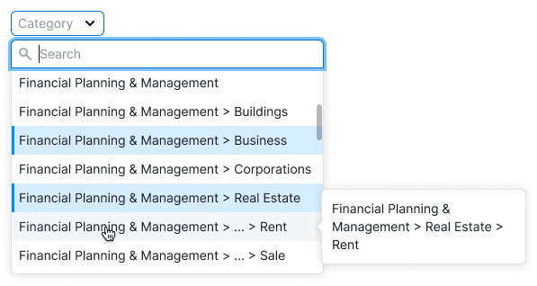
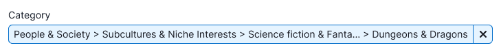
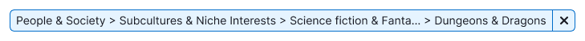
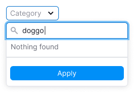
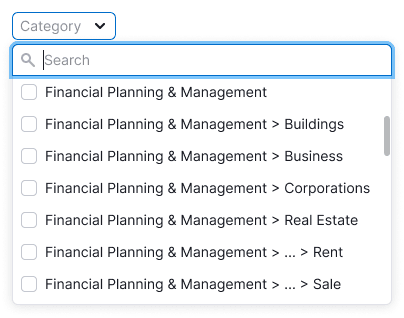
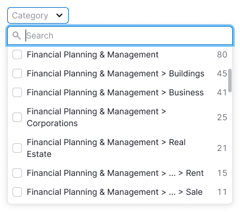

## Description

**Category filter** is a pattern for selecting or multiselecting of domain categories.

When working with the category filter, the user should:

- understand is it list of domain categories or interests;
- quickly find the appropriate category;
- understand, what category is selected, because they can have very long and similar names.

## Appearance

For trigger use [Select](/components/select/select) with `min-width: 102px` and [FilterTrigger](/components/filter-trigger/filter-trigger) with `min-width: 160px`.

It's better not to make the controls smaller than recommended min-widths, otherwise the user may not read the filter's name or cannot understand what category is selected.

| Input size | Inactive filter (Select)               | Active filter (FilterTrigger)               |
| ---------- | -------------------------------------- | ------------------------------------------- |
| M          |  |  |

## Filter by one category

Use [Select](/components/select/select) as a trigger.

There can be a lot of categories, load them with user's request. **To load quickly, limit the output to 50 categories.** We recommend to load the rest while scrolling the list.

### Placeholder

For placeholder text use: "Category".

### Active trigger

Table: Sorting variants for categories

| The list of categories is sorted:                                          | Appearance example                                       |
| -------------------------------------------------------------------------- | -------------------------------------------------------- |
| Alphabetically (if there are no counters in the list options)              |  |
| By the number of domains (if there are domain counters in the list optons) |             |

::: tip
Add search if there are more than 10 categories in the list.
:::

Collapse long categories according to the [rules for long URLs](../../table-group/table-controls/table-controls#long-links-and-text) and add a tooltip to them.

The counters in the list are optional. If the table is heavy with data, it can be difficult to calculate values for counters right away. However, if possible, we recommend using counters.

### Filled trigger

**Collapse long categories according to the [rules for long URLs](../../table-group/table-controls/table-controls#long-links-and-text).**

We recommend always add a label to the filter. But, if there isn’t enough space and if you are sure that without a label, users will understand what kind of filter they are using, you can remove the label.

### Loading

When the filter's content or some of the filters are loading, show [Spin](/components/spin/spin) with the "Loading ..." text.

### Nothing found

Show an ["empty" state](/components/widget-empty/widget-empty) with the option to update the filter.

### Error

Show an error in the dropdown with the ability to update the filter if an error occurred during the request.

## Filter by multiple categories

- Use this type of filter if you are sure you need it (for example, users are asking for it).
- Usually, such a filter is very complex, and most products only need selection of one category.

Use [Multiselect](/components/select/select) for such kind of filters.

It can has a lot of categories, load them with user's request. **To load quickly, limit the output to 50 categories.** We recommend to load the rest while scrolling the list.

### Placeholder

For placeholder text use: "Category".

### Active trigger

Table: Sorting variants for categories

| The list of categories is sorted:                                          | Appearance example                                                   |
| -------------------------------------------------------------------------- | -------------------------------------------------------------------- |
| Alphabetically (if there are no counters in the list options)              |  |  |
| By the number of domains (if there are domain counters in the list optons) |             |

::: tip
Add search if there are more than 10 categories in the list.
:::

Collapse long categories according to the [rules for long URLs](../../table-group/table-controls/table-controls#long-links-and-text) and add a tooltip to them.

Select all / Deselect all functionality is optional.

::: tip
The counters in the list are optional, as if there are many filters nearby, it can be difficult to recount data on the fly. Also, if the table is heavy, it can also be difficult to calculate right away. However, if possible, we recommend using counters.
:::

### Filled trigger

- If one category is selected then show the full category name in the trigger.
- If user can select more than two values, then reduce them in the trigger into the `N selected` construction.

The label is required, as without the label it will be difficult for the user to understand what the filter is about.

::: tip
Selected categories are pinned at the top of the list, as described in the [Select guide](/components/select/select#specific-multiselect-cases).
:::

### Loading

When the filter's content or some of the filters are loading, show [Spin](/components/spin/spin) with the "Loading ..." text.

### Nothing found

Show an ["empty" state](/components/widget-empty/widget-empty) with the option to update the filter.

### Error

Show an error in the dropdown with the ability to update the filter if an error occurred during the request.

## Usage in UX/UI

::: tip
Technically, categories don’t have nesting, it is purely visual to distinguish between categories.

**Example:**

News > Team Sports > **Baseball** – website with basebal news

Goods > Sports Goods > **Baseball** – website with baseball goods
:::

### Category abbreviations rules

1. The last part of the category name is the most important, so show it by all means.
2. Therefore, collapse the category name so that the last part is read in full and the collapsed part starts with >.

::: tip
When hovering over the collapsed category name, always show the tooltip with category's full name.
:::

### Trigger min-width

Provide the minimum width of the active trigger so that the filter name fits and at least the beginning of the category name.

