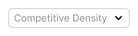
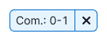
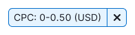
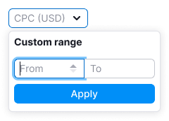
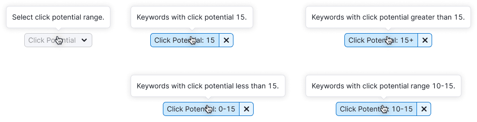

> **General recommendations for filters are described in the [Filter common rules guide](/filter-group/filter-rules/).**

**These filters are combined in one guide, since they differ only in the sorting parameter and the name.** The principle of work and states are the same.

@## Description

**Click Potential filter** is a filter to sort the data on the page by the Click Potential parameter.

**Competitive Density filter** is a filter to sort the data on the page by the Competitive Density parameter.

**CPC filter** is a filter to sort the data on the page by the CPC parameter.

They contain only a field for a custom range value, there is no preset data, since click potetntial, competitive density and cost per click are very individual parameters for each product.

**When working with these filters, it is important for the user to:**

- quickly enter the data it needs;
- quickly understand that nothing was found;
- quickly reset the entered data and search again;
- be able to change data.

@## Appearance

### Trigger

**Set the trigger min-width to 80px**. It's not recommended to make the trigger smaller. When there is enough space in the interface, make the width of the trigger dependent on the content, so the label inside the trigger doesn't have to be collapsed into the `ellipsis`.

| Filter              | Appearance example                                                    | Description                                                                         |
| ------------------- | --------------------------------------------------------------------- | ----------------------------------------------------------------------------------- |
| Click Potential     |   | The Click Potential filter trigger always has one size. Do not abbreviate its name. |
| Competitive Density |   |                                                                                     |
| CPC                 |         | The CPC filter trigger always has one size. Abbreviate its name to CPC (USD).       |

### Dropdown

**Don't make a dropdown width less than 224px**, otherwise the maximum possible values will not fit into the custom range inputs.

| Filter              | Appearance example                                                    |
| ------------------- | --------------------------------------------------------------------- |
| Click Potential     |   |
| Competitive Density |   |
| CPC                 |       |

@## Custom range

If the filter has the ability to select a custom period, then use [InputNumber](/components/input-number/).

The behavior and appearance of the stepper buttons is described in the [Filter common rules](/filter-group/filter-rules/).

@## Interaction

When user opens a dropdown, the focus immediately goes to the first custom range input.

Working and interacting with the filter are described in detail in the [Filter common rules](/filter-group/filter-rules/).

@## Tooltips

For more information about tooltips, see [Filter common rules](/filter-group/filter-rules/).

| Filter              | Appearance example                     |
| ------------------- | -------------------------------------- |
| Click Potential     |  |
| Competitive Density |  |
| CPC                 |    |

@## Validation

Validation is described in the [Filter common rules](/filter-group/filter-rules/).

@## Nothing found

"Empty" states is described in the [Filter common rules](/filter-group/filter-rules/).

@page filter-cp-cd-cpc-code
