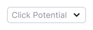
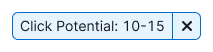
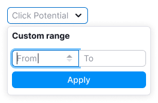
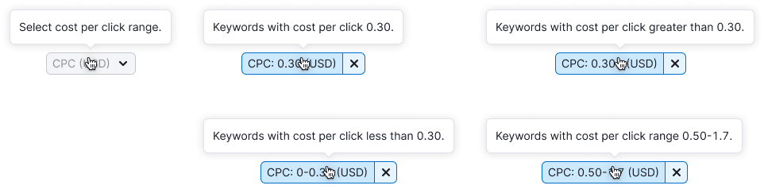

::: tip
Make sure to read [Filter common rules](/filter-group/filter-rules/filter-rules).
:::

**These filters are combined in one guide, since they differ only in the filter parameter and the name.** The principle of work and states are the same.

## Description

These filters allow to enter only a custom number range. They have no preset data since click potetntial, competitive density and cost per click are very individual parameters for each product.

**When working with these filters, it's important for the user to:**

- understand that they can enter custom values
- quickly enter the data
- quickly understand that nothing was found
- quickly reset the entered data and search again
- be able to change data

## Appearance

### Trigger

**Set the trigger min-width to 80px**. It's not recommended to make the trigger smaller. When there is enough space in the interface, make the width of the trigger dependent on the content, so the trigger value isn't truncated.

| Filter              | Appearance example                                                    | Description                                                                         |
| ------------------- | --------------------------------------------------------------------- | ----------------------------------------------------------------------------------- |
| Click Potential     |   | The Click Potential filter trigger always has one size. Don’t abbreviate its name. |
| Competitive Density |   |                                                                                     |
| CPC                 |         | The CPC filter trigger always has one size. Abbreviate its name to CPC (USD).       |

### Dropdown

**Don't make the dropdown width less than 224px**, otherwise the maximum possible values won't fit into the inputs.

| Filter              | Appearance example                                                    |
| ------------------- | --------------------------------------------------------------------- |
| Click Potential     |   |
| Competitive Density |   |
| CPC                 |       |

## Interaction

These filters use the [InputRange](/components/input-number/input-number#inputrange) pattern.

When user opens the dropdown, keyboard focus immediately goes to the first custom range input.

Filter interaction is described in detail in [Filter common rules](/filter-group/filter-rules/filter-rules).

## Tooltips

For more information about tooltips, refer to [Filter common rules](/filter-group/filter-rules/filter-rules).

| Filter              | Appearance example                     |
| ------------------- | -------------------------------------- |
| Click Potential     |  |
| Competitive Density |  |
| CPC                 |    |

## Validation

Validation is described in the [Filter common rules](/filter-group/filter-rules/filter-rules).

## Nothing found

"Empty" states is described in the [Filter common rules](/filter-group/filter-rules/filter-rules).

