::: tip
Make sure to read [Filter common rules](/filter-group/filter-rules/filter-rules).
:::

## Description

The custom range filter allows entering a custom number range or choosing a value from presets.

**When working with these filters, it's important for the user to:**

- understand that they can enter custom values
- quickly enter the data
- quickly understand that nothing was found
- quickly reset the entered data and search again
- be able to change data

## Appearance

### Trigger

**Set the trigger min-width to 80px**. It's not recommended to make the trigger smaller. When there is enough space in the interface, make the width of the trigger dependent on the content, so the trigger value isn't truncated.

| Filter              | Appearance example                                                      | Description                                                                                                                                                               |
|---------------------|-------------------------------------------------------------------------|---------------------------------------------------------------------------------------------------------------------------------------------------------------------------|
| Click Potential     | 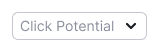 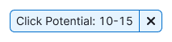   | The Click Potential filter trigger always has one size. Don’t abbreviate its name.                                                                                        |
| Competitive Density | 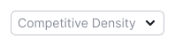 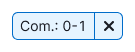   |                                                                                                                                                                           |
| CPC                 | 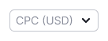 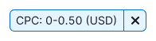         | The CPC filter trigger always has one size. Abbreviate its name to CPC (USD).                                                                                             |
| Keyword Difficulty  | 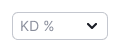 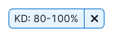   | The Keyword Difficulty filter trigger always has one size. Abbreviate the name to **KD %**.                                                                               |
| Positions           | 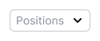 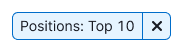 | If the filter name and the value fits the width of the trigger, show the name of the filter Positions in full. If they don’t fit, abbreviate the filter name to **Pos.**. |
| Volume              | 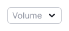 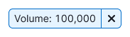 | If the filter name and the value fits the width of the trigger, show the name of the filter Volume in full. If they don’t fit, abbreviate the filter name to **Vol.**.    |

### Dropdown

**Don't make the dropdown width less than 224px**, otherwise the maximum possible values won't fit into the inputs.

| Filter              | Appearance example                                                        |
|---------------------|---------------------------------------------------------------------------|
| Click Potential     | 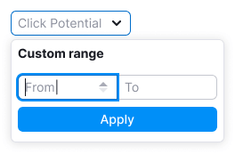 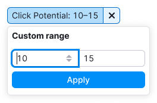     |
| Competitive Density | 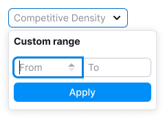 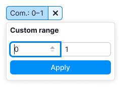     |
| CPC                 | 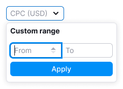 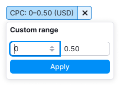         |
| Keyword Difficulty  | 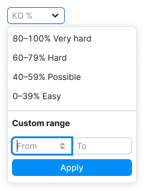 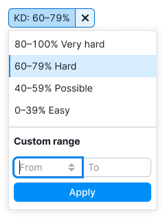     |
| Positions           | 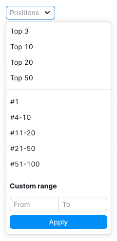 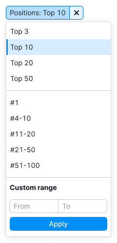 |
| Volume              | 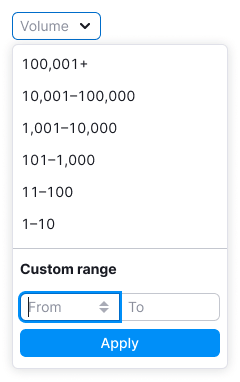 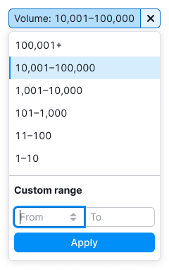 |

### Preset values

::: tip
Use an en dash, not a hyphen, between values – `Opt/Alt` + `-`.
:::

| Filter             | Keyword Difficulty                 | Positions                            | Volume                               |
|--------------------|------------------------------------|--------------------------------------|--------------------------------------|
| Appearance example |  |  |  |

## Interaction

These filters use the [InputRange](/components/input-number/input-number#inputrange) pattern.

When user opens the dropdown, keyboard focus immediately goes to the first input.

Filter interaction is described in detail in the [Filter common rules](/filter-group/filter-rules/filter-rules).

## Tooltips

For more information about tooltips, refer to the [Filter common rules](/filter-group/filter-rules/filter-rules).

## Validation

Validation is described in the [Filter common rules](/filter-group/filter-rules/filter-rules).

## Nothing found

"Empty" states is described in the [Filter common rules](/filter-group/filter-rules/filter-rules).
