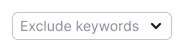
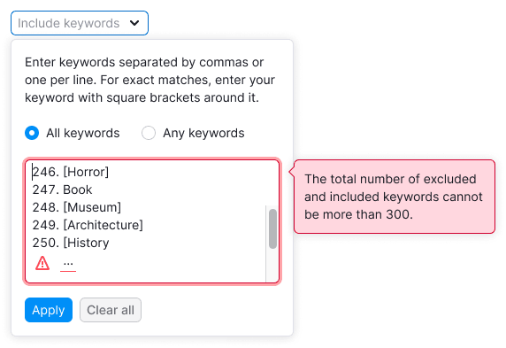
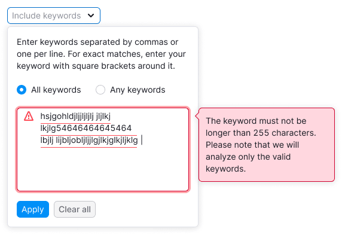
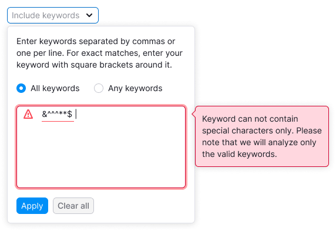
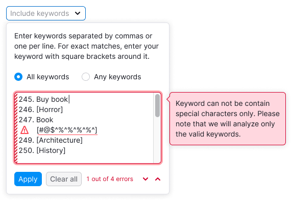

> 💡 **General rules for filters are described in the [Filters, common rules guide](/filter-group/filter-rules/).**

@## Description

**Filter Include/Exclude keywords** — filter for sorting by a large amount of keywords.

**When to use it:**

- We need the ability to add a large list of keywords. And users frequently copy/paste and edit this data in the process.
- The logic “AND” + “Or” is needed in the work with the entered data.
- If users need syntax while working with keywords.

**When working with filters, it is important for the user to:**

- be able to copy/paste large amounts of data.
  -see the copied data is formatted by the filter in the correct view/format.
  -quickly reset the entered data and search again;
- be able to change data.

@## Appearance

### Trigger

- Trigger has styles of [Select](/components/select/) and [FilterTrigger](/components/filter-trigger/).
- **Set the trigger min-width to 140px**. It's not recommended to make the trigger smaller. When there is enough space in the interface, make the width of the trigger dependent on the content, so the text inside the trigger doesn't have to be collapsed into the `ellipsis`.

### Dropdown

- The Include filter, unlike Exclude, contains radiobuttons for selecting the search logic — "AND"/"Or". They help looking for keywords containing all entered words or any of the entered ones (`All keywords` and `Any keywords`).
- **Textarea has 7 lines by default.**
- When opening a dropdown texarea immediately gets the focus.
- The filter has the `Broad / Exact match` syntax and a hint above the field and in the placeholder about its work. If the user enters a keyword without parentheses, then show keywords containing this word. If the user enters a keyword in square brackets, then show only the exact value.

**Don't make a dropdown width less than 224px**, so if there are long keywords in the list, most of them will be readable and fit on one line.

@## Interaction

> All common rules for working and interacting with filters are described in the [Filters, common rules guide](/filter-group/filter-rules/).

When opening a dropdown texarea immediately gets the focus.

### We have entered keywords

- If the number of entered keywords in the field is more than 7, show the scroll in the field.
- Clicking`Apply` applies the filter with the entered data, and we show the number of applied keywords.
- Clicking `Clear all` clears the field. The next click on `Apply` applies the cleaned filters.
- Wrapping of words in the input applies by clicking the `Enter`, using a comma or semicolon.
- If the user entered something, but did not apply, save the entered data until the page is refreshed.

### Additional cases

- If the user pressed the square bracket at the beginning and then he pressed a comma or `Enter`, then we close the square bracket in this line. This behavior should work in the case when the user puts only a square bracket at the end.
- If we close the square bracket in a line, then we move the cursor to the next line.
- **The "AND" logic works in the line between words.**
- Change the logic between the lines using radiobuttons (in the `Include keywords` filter).
- We do not allow to nest additional square brackets inside square brackets. When the user opens (or when inserting) a new open parenthesis, we close the previous word and wrap the data onto a new line of data.

@## Validation

- When validating the data, highlight invalid lines with a `Warning` icon at the beginning of the line.
- By clicking on `Apply`, cut out special characters and leave only keywords.

### Limitation — number of keywords

Include/Exclude filters are linked, so the user can enter only 300 keywords in both filters (restriction on the backend) in total.

### Limitation — keyword length

The keyword cannot be longer than 255 characters. If a keyword does not fit on a line, it is wrapped to the next. Highlight such a long keyword, show a tooltip with a description of the error.

### Limitation — special characters

There is a restriction on entering special characters in the textarea.

### The input has many errors

If there are many keywords with errors in the input, show the text below the field with the number of errors and controls (down/up arrows) to switch between them.

For each error, be sure to show a tooltip with an explanation of what needs to be corrected. **When switching between errors, change the contents of the tooltip.**

@## Abbreviations and tooltips

If the names of filters Include keywords and Exclude keywords do not fit completely, abbreviate them to `Include` and `Exclude`, respectively.

@## Old browsers support

> **Why do we have a separate view of this filter for the older browsers?**
>
> Some of our users have old browsers, and we want to keep working in them. According to the company regulations, we must support the versions of the last 6 months.
>
> To make users use this filter, we have a cut version of it.

- For users with a new browser, we show errors on the fly and highlight them, and there is also line numbering with keywords in the input.
- In the old browser, these convenient things are absent, and the validation applies only after the clicking on `Apply` button.

We can determine that the user has an input in the old browser only at the moment of the first input — the interface will blink and the `Info` icon will appear. While hovering over this icon we show a tooltip with a message about the old browser and why the interface has changed.

**Since in older browsers we cannot indicate on the fly input errors and highlight invalid data, report errors in general.**

@## Nothing found

The "empty" state is described in the [Filters, common rules](/filter-group/filter-rules/) guide.

@page filter-include-exclude-code
