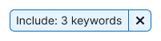

::: tip
Make sure to read [Filter common rules guide](/filter-group/filter-rules/filter-rules).
:::

## Description

**Include/Exclude keywords filter** is used to filter by a large number of keywords.

**Use it when the user needs to:**

- enter a large list of keywords, copy/paste and edit this data in the process
- apply “AND” or “OR” logic to the entered keywords
- filter keywords by a broad or an exact match, by using square brackets

**When working with filters, it's important for the user to:**

- be able to copy and paste large amounts of data
- be sure the copied data is formatted correctly by the filter
- quickly reset the entered data and search again
- be able to edit the data

## Appearance

### Trigger

Use [FilterTrigger](/components/filter-trigger/filter-trigger) as the trigger.

**Set the trigger min-width to 140px**. It's not recommended to make the trigger smaller. When there is enough space in the interface, make the width of the trigger dependent on the content, so the trigger text isn't truncated.

### Dropdown

- The Include filter, unlike Exclude, contains radio buttons for selecting the search logic—AND/OR. They help looking for keywords containing all entered words or any of the entered ones ("All keywords" and "Any keywords").
- The textarea has 7 lines by default.
- The textarea is automatically focused when the dropdown opens.
- The filter has the "Broad / Exact match" syntax and hints about its work before the field and in the placeholder. If the user enters a keyword without square brackets, then show keywords containing this word. If the user enters a keyword in square brackets, then show only the exact value.

**Don't make the dropdown width less than 224px**, so if there are long keywords in the list, most of them will be readable.

## Interaction

::: tip
All common rules for working with filters are described in the [Filter common rules guide](/filter-group/filter-rules/filter-rules).
:::

### User have entered keywords

- If the number of entered keywords in the field is more than 7, show the scroll in the field.
- Clicking **Apply** applies the filter with the entered data, and shows the number of applied keywords.
- Clicking **Clear all** clears the textarea. The next click on **Apply** applies the cleared filter.
- Wrapping to the next line happens by pressing `Enter`, entering a comma or a semicolon.
- If the user have entered something but didn't apply, save the entered data until the page is refreshed.

### Additional cases

- If user entered a square bracket at the beginning and then entered a comma or pressed `Enter`, close the square brackets in this line. This behavior should also work if the user puts only a square bracket at the end.
- If user enters a closing square bracket at the end of a line, move the cursor to the next line.
- **The "AND" logic always applies to words within the same line.**
- Logic between lines is changed using the radio buttons (in the "Include keywords" filter).
- Don’t allow to nest additional square brackets inside square brackets. When user opens or pastes a new opening bracket, close the previous word and wrap the data to the new line.

## Validation

- When validating the data, highlight invalid lines with a Warning icon at the beginning of the line.
- By clicking on **Apply**, cut out special characters and leave only keywords.

### Limit for number of keywords

Include/Exclude filters are linked, so user can enter only 300 keywords in both filters in total, due to a backend restriction.

### Limit for keyword length

A keyword can't be longer than 255 characters. If a keyword doesn't fit on a line, wrap it to the next line. Highlight such a long keyword, show a tooltip with a description of the error.

### Limit for special characters

Add a restriction on entering special characters in the textarea.

### Input has many errors

If there are several keywords with errors, show the number of errors and **Up**/**Down** navigation buttons after the input.

For each error, be sure to show a tooltip with an explanation of what needs to be corrected. **When switching between errors, change the contents of the tooltip.**

## Abbreviations and tooltips

If the names of filters "Include keywords" and "Exclude keywords" don’t fit completely, abbreviate them to "Include" and "Exclude", respectively.

## Old browsers support

::: tip Why a separate view for older browsers?
Some of our users have old browsers, and we want make the filter available for them. This filter has a light version specifically for this case.
:::

- In new browsers, show errors on the fly, highlight invalid lines, and show line numbers.
- In old browsers, these convenient things are absent, and validation happens only after clicking on the **Apply** button.

Determine that the user has an old browser at the moment of the first input—the interface will blink and an [Informer](../../patterns/informer/informer.md) will appear. Informer will contain a message about the old browser and why the interface has changed.

**Since in older browsers we can't indicate input errors on the fly and highlight invalid data, report errors in general.**

## Nothing found

Empty state is described in [Filter common rules](/filter-group/filter-rules/filter-rules).

