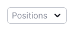
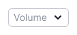
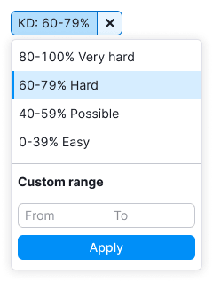
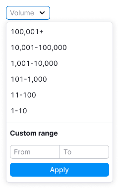
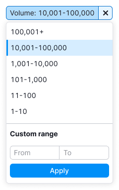
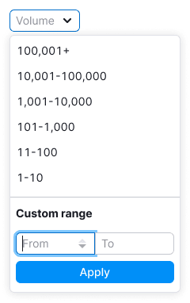
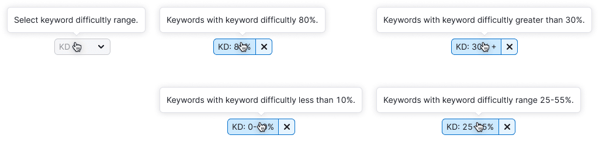

> 💡 **General recommendations for filters are described in the [Filters, common rules guide](/filter-group/filter-rules/).**
>
> **These filters are combined in one guide, since they differ only in the sorting parameter, a set of preset values and the name.**
>
> The principle of work and states are the same.

@## Description

**Filter Keyword Difficulty** is a filter to sort the data on the page by the Keyword Difficulty parameter.

**Filter Positions** is a filter to sort data on the page by position.

**Filter Volume** is a filter to sort the data on the page by the Volume parameter.

They have a set of preset values and a custom range inputs.

**When working with filters, it is important for the user to:**

- understand that there are preset values and the ability to enter what he needs;
- **quickly navigate and choose a value from the preset ones;**
- quickly understand that nothing was found;
- quickly reset the entered data and search again;
- be able to change data.

@## Appearance

### Trigger

- Trigger has styles of [Select](/components/select/) and [FilterTrigger](/components/filter-trigger/).
- **Set the trigger min-width to 80px**. It's not recommended to make the trigger smaller. When there is enough space in the interface, make the width of the trigger dependent on the content, so the text inside the trigger doesn't have to be collapsed into the `ellipsis`.

| Filter             | Description                                                                                                                                                              | Appearance example                                                      |
| ------------------ | ------------------------------------------------------------------------------------------------------------------------------------------------------------------------ | ----------------------------------------------------------------------- |
| Keyword Difficulty | The Keyword Difficulty filter trigger always has one size, abbreviate the name to `KD%`.                                                                                 |     |
| Positions          | If the filter name and the value fits the width of the trigger, show the name of the filter Positions in full. If they do not fit, abbreviate the filter name to `Pos.`. |   |
| Volume             | If the filter name and the value fits the width of the trigger, show the name of the filter Volume in full. If they do not fit, abbreviate the filter name to `Vol.`.    |   |

### Dropdown

**Don't make a dropdown width less than 224px**, otherwise the maximum possible values will not fit into the Custom range inputs.

| Filter             | Appearance example                                                        |
| ------------------ | ------------------------------------------------------------------------- |
| Keyword Difficulty |       |
| Positions          |   |
| Volume             |   |

### Preset values

> Use an en dash, not a hyphen, between values — `Opt/Alt` + `-`.

| Filter             | Keyword Difficulty                 | Positions                            | Volume                               |
| ------------------ | ---------------------------------- | ------------------------------------ | ------------------------------------ |
| Appearance example |  |  |  |

@## Custom range

Use the [InputNumber](/components/input-number/), if the filter has the ability to select a custom period.

Stepper buttons appear when you hover over such an input and in the focus state.

|                                                                    | Appearance example                   |
| ------------------------------------------------------------------ | ------------------------------------ |
| If nothing is entered, the bottom stepper is disabled.             |      |
| If a maximum value is entered, the upper stepper becomes inactive. |  |

@## Interaction

When you open a dropdown, the focus immediately goes to the first Custom range field.

Working and interacting with the filter are described in detail in the [Filters, common rules](/filter-group/filter-rules/) guide.

@## Tooltips

For more information about tooltips, see [Filters, common rules](/filter-group/filter-rules/) guide.

| Filter             | Appearance example                       |
| ------------------ | ---------------------------------------- |
| Keyword Difficulty |    |
| Positions          |  |
| Volume             |      |

@## Validation

The validations work is described in the [Filters, common rules](/filter-group/filter-rules/) guide.

@## Nothing found

The "empty" state is described in the [Filters, common rules](/filter-group/filter-rules/) guide.

@page filter-kd-position-volume-code
