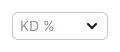
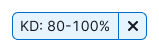
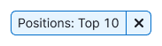
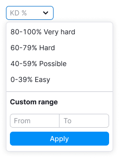
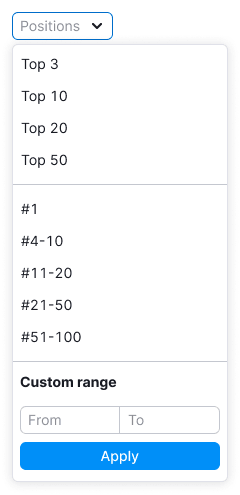
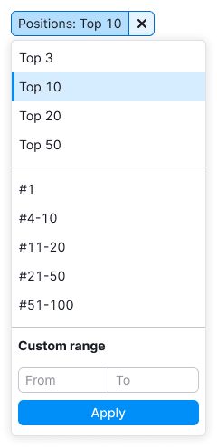
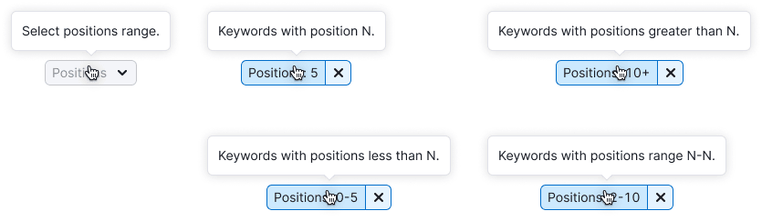
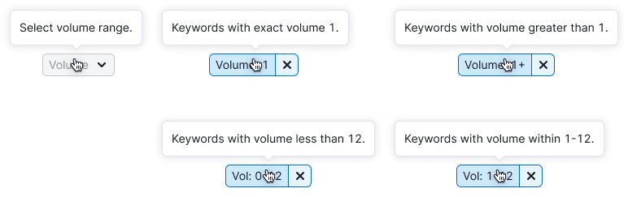

> **General recommendations for filters are described in the [Filter common rules guide](/filter-group/filter-rules/).**

**These filters are combined in one guide, since they differ only in the sorting parameter, a set of preset values and the name.** The principle of work and states are the same.

@## Description

**Keyword Difficulty filter** is a filter to sort the data on the page by the Keyword Difficulty parameter.

**Positions filter** is a filter to sort data on the page by position.

**Volume filter** is a filter to sort the data on the page by the Volume parameter.

They have a set of preset values and a custom range inputs.

**When working with filters, it is important for the user to:**

- understand that there are preset values and the ability to enter what he needs;
- quickly navigate and choose a value from the preset ones;
- quickly understand that nothing was found;
- quickly reset the entered data and search again;
- be able to change data.

@## Appearance

### Trigger

- For trigger use [Select](/components/select/) and [FilterTrigger](/components/filter-trigger/) components.
- **Set the trigger min-width to 80px**. It's not recommended to make the trigger smaller. When there is enough space in the interface, make the width of the trigger dependent on the content, so the label inside the trigger doesn't have to be collapsed into the `ellipsis`.

| Filter             | Appearance example                                                      | Description                                                                                                                                                                |
| ------------------ | ----------------------------------------------------------------------- | -------------------------------------------------------------------------------------------------------------------------------------------------------------------------- |
| Keyword Difficulty |     | The Keyword Difficulty filter trigger always has one size. Abbreviate the name to **KD %**.                                                                                |
| Positions          |   | If the filter name and the value fits the width of the trigger, show the name of the filter Positions in full. If they do not fit, abbreviate the filter name to **Pos.**. |
| Volume             |   | If the filter name and the value fits the width of the trigger, show the name of the filter Volume in full. If they do not fit, abbreviate the filter name to **Vol.**.    |

### Dropdown

**Don't make a dropdown width less than 224px**, otherwise the maximum possible values will not fit into the custom range inputs.

| Filter             | Appearance example                                                        |
| ------------------ | ------------------------------------------------------------------------- |
| Keyword Difficulty |       |
| Positions          |   |
| Volume             |   |

### Preset values

> Use an en dash, not a hyphen, between values — `Opt/Alt` + `-`.

| Filter             | Keyword Difficulty                 | Positions                            | Volume                               |
| ------------------ | ---------------------------------- | ------------------------------------ | ------------------------------------ |
| Appearance example |  |  |  |

@## Custom range

Use [InputNumber](/components/input-number/), if the filter has the ability to select a custom period.

|                                                                    | Appearance example                   |
| ------------------------------------------------------------------ | ------------------------------------ |
| If nothing is entered, the bottom stepper is disabled.             |      |
| If a maximum value is entered, the upper stepper becomes inactive. |  |

@## Interaction

When you open a dropdown, the focus immediately goes to the first custom range input.

Working and interacting with the filter are described in detail in the [Filter common rules](/filter-group/filter-rules/).

@## Tooltips

For more information about tooltips, see [Filter common rules](/filter-group/filter-rules/).

| Filter             | Appearance example                       |
| ------------------ | ---------------------------------------- |
| Keyword Difficulty |    |
| Positions          |  |
| Volume             |      |

@## Validation

Validation is described in the [Filter common rules](/filter-group/filter-rules/).

@## Nothing found

"Empty" state is described in the [Filter common rules](/filter-group/filter-rules/).

@page filter-kd-position-volume-code
