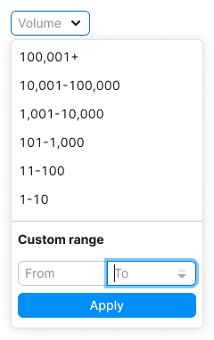
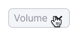
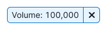
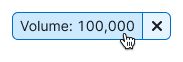
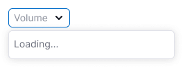
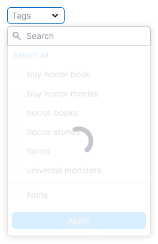

@## Best practices

**When working with filters, it is important for the user to:**

- understand that there are preset values and the ability to enter what he needs;
- **quickly navigate and choose a value from the preset ones;**
- quickly understand that nothing was found;
- quickly reset the entered data and search again;
- be able to change data.

> 💡 **It is good practice to save the entered/selected value in the filter dropdown if the user didn't save their selection.**
>
> For example, a user opened a filter dropdown, entered something into the search input, but got distracted and accidentally closed the dropdown. In this case, save the data he entered when re-opening the filter dropdown. It's not necessary to keep the scroll position.

@## Appearance

### Trigger

- Trigger has styles of [Select](/components/select/) and [FilterTrigger](/components/filter-trigger/).
- Set the trigger min-width to 80px. It's not recommended to make the trigger smaller. When there is enough space in the interface, make the width of the trigger dependent on the content, so the text inside the trigger doesn't have to be collapsed into the `ellipsis`.
- When it turns out that the name of the filter is larger than the width specified for the filter, collapse it into the `ellipsis`.

### Dropdown

Dropdown has styles of [Dropdown-menu](/components/dropdown-menu/).

### Preset values

> Use an en dash, not a hyphen, between values — `Opt/Alt` + `-`.

@## Custom range

Use the [InputNumber](/components/input-number/), if the filter has the ability to select a custom period.

Stepper buttons appear when you hover over an [InputNumber](/components/input-number/) and in the focus state.

|                                                                    | Appearance example                   |
| ------------------------------------------------------------------ | ------------------------------------ |
| If nothing is entered, the bottom stepper is disabled.             |      |
| If a maximum value is entered, the upper stepper becomes inactive. |  |

@## Interaction

- The value is applied when user clicks on the item. Then the filter applies and closes.
- The filter can be closed by clicking outside the dropdown. If the user didn't select anything, no values are applied.
- Also, if the user hasn't selected anything or there is no data in the custom range inputs, clicking on `Apply` closes the dropdown and nothing is applied.

### Opening the filter for the first time

**Preset values**

- If the filter has predefined values, rank them from largest to smallest.
- The value is applied when user clicks on the item. Then the filter applies and closes.
- If a value is selected, be sure to highlight this value when reopening the filter.

**Custome range**

Inputs has placeholders `From` and `To`, respectively.

### Preset period is selected

**Preset values**

User-selected values are duplicated in the trigger.

**Custome range**

- Don't duplicate selected preset values in the custom range.
- Clicking on the filter clear cross clears the filter from the selected values. It's not depend on whether the filter is open or closed.

### Choosing a custom range

**Custome range**

The user can copy/paste values into the input, increase/decrease them by the step set for InputNumber - 1.

- If the user entered a value between 100 and 100, show keywords with an exact value of 100.
- If the user entered a value from 100 in the left input, show data from 100 to maximum values.
- If the user entered 100 in the right input, show a range up to 100 in the results.

**Apply button**

- We apply the custom data entered by the user by clicking on the `Apply` button.
- The entered values are duplicated in the trigger.
- Keep user-entered data in Custom Range before refreshing the page if the user has entered something but not applied.

@## Trigger states

| State          | Appearance example                           |
| -------------- | -------------------------------------------- |
| placeholder    |        |
| hover          |                    |
| active         |                  |
| active + hover |  |

@## Loading

Show [Spin](/components/spin/) in the dropdown and the text `Loading ...` in the case when the content of the filter takes a long time to load.

Show [SpinContainer](/components/spin-container/) over the dropdown content in the case when the user-selected data needs a time to be applied.

@## Nothing found

Show in the widget/widgets to which the filter was applied an ["empty" error state](/components/widget-empty/) with the ability to update the filter, if an error occurs during the request.

@## Tooltips

Don't add tooltips for the sake of tooltips.

- Add them when the name is abbreviated in the filter.
- Use them to explain how the filter works when a value is already selected.

@## Validation

**Comma/period**

The user can enter only numerical data into the input: numbers, period, comma, minus. All other data such as slash, letters, etc. the [InputNumber](/components/input-number/) is truncated.

In cases where thousandths are separated by commas rather than periods in a particular locale, format the user-entered value to match the locale.

**Max/min value**

Minimum value — 0, maximum value — 999 999 999.

If the user entered an invalid value (less than minimum, greater than maximum), the input will reset them to min/max, respectively.

**InputNumber step**

- You can set the step by which the entered numerical value will be reduced/increased when using the stepper buttons.
- The user can change the step using the keyboard arrows or `Shift` + keyboard arrows (`Up`, `Down`).

**Keyboard control**

> See all main rules and recommendations in the [Keyboard navigation](/patterns/keyboard-navigation/) guide.

The shortcut keys `Cmd` + `Enter` (macOS) and `Ctrl` + `Enter` (Windows) apply the filter.

**Values switched places**

If the user entered a value in the right input that is less than the value in the left one, they will swap when the focus is lost.

**Inserting values into an input**

When pasting the copied value, invalid characters are truncated.
