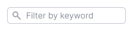
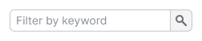
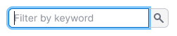
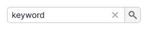
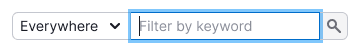
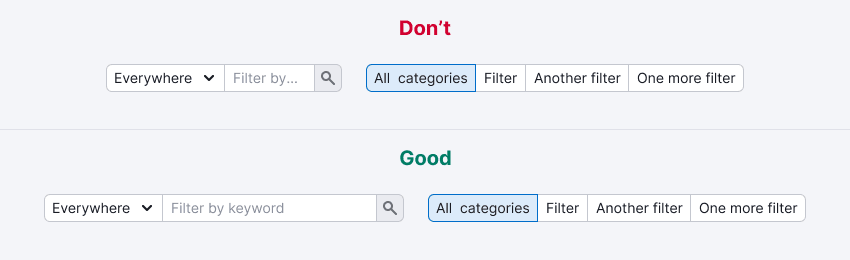
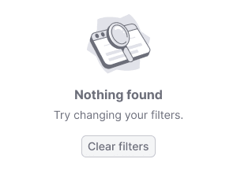

@## Description

**Filter search** is an [Input](/components/input/) we use in filters to search in a table or other kind of data. It can apply entered data dynamically and by clicking on the submit button.

**When working with Filter Search, it is important for the user:**

- it is easy to find a searchable filter, as there can be many filters in the product;
- quickly understand what exactly user is looking for;
- quickly understand that nothing was found;
- quickly delete the entered data and search for new ones.

@## Appearance

This filter inherits all [Input](/components/input/) styles and properties.

| Unactive filter                                | Active filter                               |
| ---------------------------------------------- | ------------------------------------------- |
|  |  |

@## Interaction

The filter searches by the entered value, not just by exact match.

@## Dynamic search

Dynamic search applies entered value as soon as at least one character is entered into the input.

**Suitable for filters that are not limited, and there is little data**.

> 💡 Set a delay for sending the entered value. So you'll not burden the search engine and it will show the results more smoothly and predictably.

| State       | Appearance example                                 | Description                                                                                                                                                                                                                                        |
| ----------- | -------------------------------------------------- | -------------------------------------------------------------------------------------------------------------------------------------------------------------------------------------------------------------------------------------------------- |
| Placeholder |  | Default filter state. Input should always have a placeholder that reflects the purpose of the filter. If it searches only for one parameter, then write: "Filter by {parametr}". **If it searches for many parameters, then write just "Search"**. |
| Focus       |              | The placeholder remains until at least one character is entered.                                                                                                                                                                                   |
| Filled      |            | When filling in the input, the filter is triggered for each character. Be sure to display the Close icon to reset the entered value.                                                                                                               |

> **Why not "Search"**
>
> 💡 This search filter works exactly like a filter. In order to make it obvious by what parameter it searches, indicate it in the placeholder. Leave "Search" only for simple search inputs, or when there is an additional functionality for choosing by which parameter to search.

@## Search by button

Slow but accurate user assistant, searches by button or by clicking "Enter".

**Suitable for filters when:**

- filters are limited;
- there is a lot of data and each filter application is a long and expensive query.

Use [NeighborLocation](/utils/neighbor-location/) to "glue" multiple controls.

| State       | Appearance example                                        | Description                                                                                                                                                                                                                                        |
| ----------- | --------------------------------------------------------- | -------------------------------------------------------------------------------------------------------------------------------------------------------------------------------------------------------------------------------------------------- |
| Placeholder |  | Default filter state. Input should always have a placeholder that reflects the purpose of the filter. If it searches only for one parameter, then write: "Filter by {parametr}'. **If it searches for many parameters, then write just "Search"**. |
| Focus       |              | The placeholder remains until at least one character is entered.                                                                                                                                                                                   |
| Filled      |            | When filling in the input, the filter is triggered for each character. Be sure to display the Close icon to reset the entered value.                                                                                                               |

@## Search tuning

For the case when fine-tuning of the filter is needed, add select next to the input. You can also use a combo — input with both select and button.

| State       | Appearance example                                        | Description                                                                                                                                                                                                                                      |
| ----------- | --------------------------------------------------------- | ------------------------------------------------------------------------------------------------------------------------------------------------------------------------------------------------------------------------------------------------ |
| Placeholder |  | Default filter state. Input should always have a placeholder that reflects the essence of the filter. If you search only for one parameter, then write: "Filter by {parametr}". **If you search for many parameters, then write just "Search"**. |
| Focus       |              | The placeholder remains until at least one character is entered.                                                                                                                                                                                 |
| Filled      |            | When filling in the input, the filter is triggered for each character. Be sure to display the Close icon to reset the entered value.                                                                                                             |

@## Text label

**In most cases, we don't put a label next to the filter**. Its role is played by a placeholder or additional options in the select next to it.

@## Input width

The width depends on what parameter we are looking for. _For example, if this is a URL, then it is better to make input wider, and if input searches keywords, then **don't make it less than 160px**._

For a dynamic input, you can set a minimum width, since in most cases it's enough to enter a couple of characters to filter and find what you need.

Always add minimum width of 160px for the search input, otherwise something like this might happen:

@## Results highlighting

This is an optional functionality. It helps the user to find on the page what he was looking for.

Use `--yellow-300` color with 40% opacity for highlighting. The height of the highlighted area must match the line-height of the line.

@## Nothing found

For this state add a control to reset the filter. This will help the user to understand how to fix the situation and there is no data because of the filter.

You can change the secondary text if necessary.

**Don't confuse these two "empty" states below. They differ in message and illustration.**

| State                         | Appearance example                   |
| ----------------------------- | ------------------------------------ |
| No data at all                |  |
| No data due to applied filter |   |

@page filter-search-code
