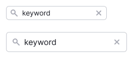
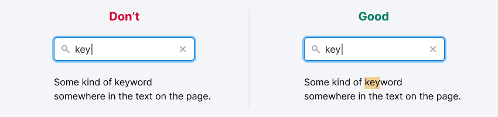
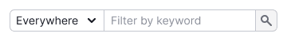
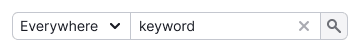
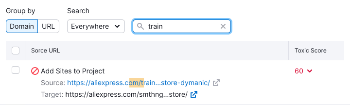

@## Description

**Filter search** is an [input](/components/input/) we use in filters to search in a table or other kind of data. It can work dynamically and by clicking on the button.

When working with Filter Search, it is important for the user:

- It is easy to find a searchable filter, as there can be many filters in the product.
- Quickly understand what exactly user is looking for.
- Quickly understand that nothing was found.
- Quickly delete the entered data and search for new ones.

@## Appearance

This filter inherits all [input search](/components/input/) styles and properties.

> An input with the entered value and an icon `Close` to delete it.

| Unactive filter                                | Active filter                               |
| ---------------------------------------------- | ------------------------------------------- |
|  |  |

@## Interaction

The filter searches the entire word, not just a complete match.

@## Dynamic search

Dynamic search searches as soon as at least one character is entered into the input.

**Suitable for filters that are not limited, and there is little data**.

> 💡 Set a delay for sending the entered value. So you'll not burden the search engine and it will show the results more smoothly and predictably.

| State       | Description                                                                                                                                                                                                                                      | Appearance example                                 |
| ----------- | ------------------------------------------------------------------------------------------------------------------------------------------------------------------------------------------------------------------------------------------------ | -------------------------------------------------- |
| Placeholder | Default filter state. Input should always have a placeholder that reflects the essence of the filter. If you search only for one parameter, then write: `Filter by {parametr}`. **If you search for many parameters, then write just `Search`**. |  |
| Focus       | The placeholder remains until at least one character is entered. Don't add a tooltip.                                                                                                                                                            |              |
| Filled      | When filling in the input, the filter is triggered for each character. Be sure to display the `Close` icon to reset the entered value. **Don't color in red the reset icon when hovering**.                                                      |            |

> **Why not `Search`**
>
> 💡 This search filter works exactly like a filter. In order to make it obvious by what parameter it searches, indicate it in the placeholder. Leave Search only for simple search inputs, or when there is an additional functionality for choosing by which parameter to search.

@## Search by button

Slow but accurate user assistant, searches by button or by pressing `Enter`.

**Suitable for filters when:**

- filters are limited;
- there is a lot of data and each filter application is a long and expensive query.

Use [NeighborLocation](/utils/neighbor-location/) to "glue" multiple controls.

| State       | Description                                                                                                                                                                                                                                      | Appearance example                                        |
| ----------- | ------------------------------------------------------------------------------------------------------------------------------------------------------------------------------------------------------------------------------------------------ | --------------------------------------------------------- |
| Placeholder | Default filter state. Input should always have a placeholder that reflects the essence of the filter. If you search only for one parameter, then write: `Filter by {parametr}`. **If you search for many parameters, then write just `Search`**. |  |
| Focus       | The placeholder remains until at least one character is entered. Don't add a tooltip.                                                                                                                                                            |              |
| Filled      | When filling in the input, the filter is triggered for each character. Be sure to display the `Close` icon to reset the entered value.                                                                                                           |            |

@## Search with select

An extremely rare dynamic search, we use it when fine-tuning of this filter is needed, since there is a lot of different kinds of data.

_It is actively used, for example, in Backlinks and Link Building._

> 💡 You can use it as a combo with both select and button.

| State       | Description                                                                                                                                                                                                                                      | Appearance example                                        |
| ----------- | ------------------------------------------------------------------------------------------------------------------------------------------------------------------------------------------------------------------------------------------------ | --------------------------------------------------------- |
| Placeholder | Default filter state. Input should always have a placeholder that reflects the essence of the filter. If you search only for one parameter, then write: `Filter by {parametr}`. **If you search for many parameters, then write just `Search`**. |  |
| Focus       | The placeholder remains until at least one character is entered. Don't add a tooltip.                                                                                                                                                            |              |
| Filled      | When filling in the input, the filter is triggered for each character. Be sure to display the `Close` icon to reset the entered value.                                                                                                           |            |

@## Filter label

**In most cases, we don't put a label next to the filter**. Its role is played by a placeholder or additional options in the select next to it.

@## Input width
The width depends on what parameter we are looking for. _For example, if this is a URL, then it is better to make input wider, and if inout searches keywords, then **don't make it less than 160px**._

For a dynamic input, you can set a minimum width, since in most cases it's enough to enter a couple of characters to filter and find what you need.

The minimum width of 160px for this kind of input must always be specified, otherwise something like this might turn out:

@## Search results highlighting

This is an optional functionality. It's used extensively in Backlinks and Link Buildings. And it helps the user to find on the page what he was looking for.

| Appearance example                               | Styles                                                                                                                                                                               |
| ------------------------------------------------ | ------------------------------------------------------------------------------------------------------------------------------------------------------------------------------------ |
|  | Use `--light-orange` color with 40% opacity for highlighting: `background-color: rgb(249 176 88 / 40%);`. The height of the highlighted area must match the line-height of the line. |

@## Nothing found

In this state, there must be a control to reset the filter. This will help the user to understand how to fix the situation and there is no data because of the filter.

You can change the secondary text if necessary, but don't get carried away 🤓 This is a fairly common case in products, so it's not worth wasting the user's time to let reading a new message once again.

**Don't confuse these two "empty" states below. They differ in message and illustration.**

| State                         | Appearance example                   |
| ----------------------------- | ------------------------------------ |
| No data at all                |  |
| No data due to applied filter |   |

@page filter-search-code
