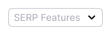
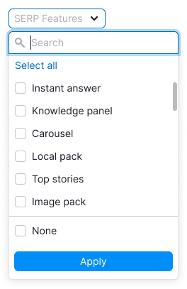
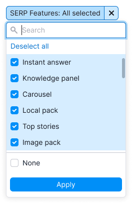
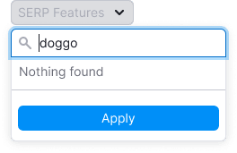
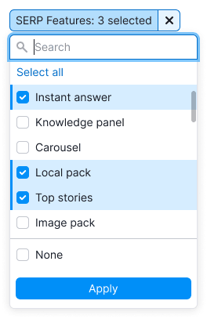
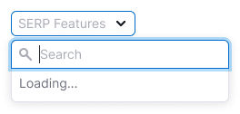
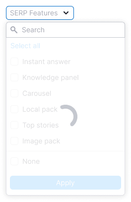
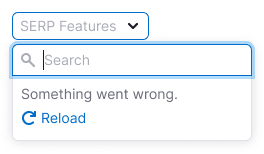
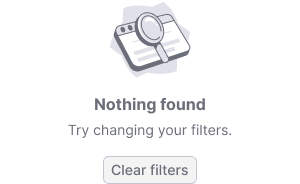
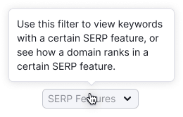

> 💡 **General recommendations for filters are described in the [Filter common rules guide](/filter-group/filter-rules/).**

@## Description

**SERP Features filter** is a filter to sort the data on the page by the SERP Features parameter.

You can select multiple values or "None", which will show all keywords without SERP Features.

**When working with SERP Features filter, it is important for the user to:**

- quickly understand it can choose one or several SERP Features;
- sort keywords with no SERP Features;
- quickly reset the entered data and search again;
- be able to select all SERP Features.

@## Appearance

### Trigger

- For trigger use [Select](/components/select/) and [FilterTrigger](/components/filter-trigger/) components.
- **Set the trigger min-width to 120px**. It's not recommended to make the trigger smaller. When there is enough space in the interface, make the width of the trigger dependent on the content, so the label inside the trigger doesn't have to be collapsed into the `ellipsis`.

### Dropdown

- Dropdown has the list of all SERP Features (23 for mobile and 22 for desktop).
- There is a special option - the ability to select keywords without SERP Features (`None`).
- You cannot select both "None" and SERP Features.
- Add a search input to the list. Read more about the search in [Filter Search](/filter-group/filter-search/).
- Add **Select / Deselect all** option to the list.

**Don't make a dropdown width less than 224px**, otherwise, long SERP Features names can become unreadable after localization. If the SERP Feature name is too long, collapse into the `ellipsis`, and show its full name in the tooltip while hovering.

@## Interaction

- By default, nothing is selected in the filter.
- If user has selected a SERP feature, checkbox gets `active` state.
- Clicking on **Select all** selects all SERP features. After taht the option changes to **Deselect all**.
- Since there can be many selected SERP features, do not pin them after closing and reopening the dropdown.

Other rules for working and interacting with filters are described in the [Filter common rules guide](/filter-group/filter-rules/).

### States

| State/edge case   | Appearance example                                                                                                                                    | Description                                                                                                                                                                                                                                                                                                                                                                                                         |
| ----------------- | ----------------------------------------------------------------------------------------------------------------------------------------------------- | ------------------------------------------------------------------------------------------------------------------------------------------------------------------------------------------------------------------------------------------------------------------------------------------------------------------------------------------------------------------------------------------------------------------- |
| **Nothing found** |                                                                                                        | Show the message: "Nothing found", if nothing was found.                                                                                                                                                                                                                                                                                                                                                            |
| **Select all**    |                                                                      | When selecting all SERP Features, change **Select all** to **Deselect all**. If at least one item is not selected, then the option will be **Select all**.                                                                                                                                                                                                                                                          |
| **Loading**       | The list is loading.  The applying of the selected options need time.  | In the case when the content of the filter takes a long time to load, show [Spin](/components/spin/) in the dropdown and add the message: "Loading...". In the case when the selection is long-lasting, wrap the list into [SpinContainer](/components/spin-container/) to show the loading process.                                                                                                                |
| **Error**         |                                                                                                                        | If there was any error while loading data in the filter, show the message: "Something went wrong.". Let a user reload the filter with the "Reload" control.                                                                                                                                                                                                                                                         |
| **Filled filter** |                                                                     | If user has applied the filter, show the number of selected SERP Features in the trigger. For more information on abbreviation rules, see [FilterTrigger](/components/filter-trigger/).                                                                                                                                                                                                                             |
| **No results**    |                                                                                                             | If there are no keywords with the selected SERP Features, show the ["empty" state](/components/widget-empty/), as with any other filter. When there are no options, show the title: "No results found" — and the message: "Try selecting a different date or changing your filter settings.". _You can see this case in the situation when the user selected "None", and all data have SERP Features in the table._ |

@## Abbreviations and tooltips

For more information about tooltips, see the [Filter common rules guide](/filter-group/filter-rules/).

**If the SERP Features filter name doesn't fit, abbreviate it to **SF**.**

@## Validation

Validations work is described in the [Filter common rules guide](/filter-group/filter-rules/).

@page filter-serp-features-code
