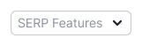
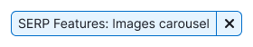
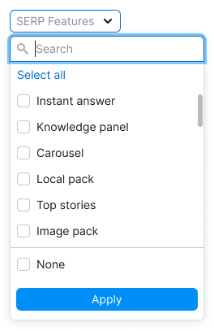
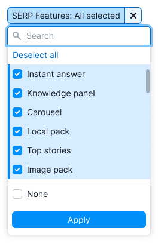
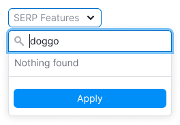
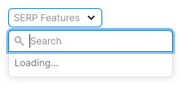
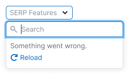
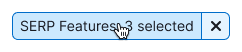

::: tip
Make sure to read [Filter common rules](/filter-group/filter-rules/filter-rules).
:::

## Description

**SERP Features filter** allows showing data with one or multiple selected SERP features, or without any SERP features.

**When working with this filter, it's important for the user to:**

- quickly understand they can choose one or several SERP Features;
- filter keywords with no SERP Features;
- quickly reset the entered data and search again;
- be able to select all SERP Features.

## Appearance

### Trigger

The trigger is built using [Select](/components/select/select) and [FilterTrigger](/components/filter-trigger/filter-trigger).

**Set the trigger min-width to 120px**. It's not recommended to make the trigger smaller. When there is enough space in the interface, make the width of the trigger dependent on the content, so the trigger text isn't truncated.

### Dropdown

The dropdown has:

- An [InputSearch](../../components/select/select.md) component for filtering options
- **Select all** / **Deselect all** options
- A list of all SERP Features
- The "None" option to select keywords without SERP Features

**Don't make the dropdown width less than 224px**, otherwise, long SERP Features names can become unreadable after localization. If the SERP Feature name is too long, use the `ellipsis` and show the text in a `Hint` on hover.

## Interaction

- By default, nothing is selected in the filter.
- Clicking on **Select all** selects all SERP features. After that the option changes to **Deselect all**.
- Since there can be many selected SERP features, don’t pin them after closing and reopening the dropdown.
- User can't select both "None" and SERP Features.

Other rules for working and interacting with filters are described in the [Filter common rules guide](/filter-group/filter-rules/filter-rules).

### States

| State/edge case   | Appearance example                                                                                                                                    | Description                                                                                                                                                                                                                                                                                                                                                                                                         |
| ----------------- | ----------------------------------------------------------------------------------------------------------------------------------------------------- | ------------------------------------------------------------------------------------------------------------------------------------------------------------------------------------------------------------------------------------------------------------------------------------------------------------------------------------------------------------------------------------------------------------------- |
| **Nothing found** |                                                                                                        | Show the message: "Nothing found", if nothing was found.                                                                                                                                                                                                                                                                                                                                                            |
| **Select all**    |                                                                      | When selecting all SERP Features, change **Select all** to **Deselect all**. If at least one item isn’t selected, then the option will be **Select all**.                                                                                                                                                                                                                                                          |
| **Loading**       | The list is loading.  The applying of the selected options need time.  | In the case when the content of the filter takes a long time to load, show [Spin](/components/spin/spin) in the dropdown and add the message: "Loading...". In the case when the selection is long-lasting, wrap the list into [SpinContainer](/components/spin-container/spin-container) to show the loading process.                                                                                                                |
| **Error**         |                                                                                                                        | If there was any error while loading data in the filter, show the message: "Something went wrong.". Let a user reload the filter with the "Reload" control.                                                                                                                                                                                                                                                         |
| **Filled filter** |                                                                     | If user has applied the filter, show the number of selected SERP Features in the trigger. Read more about abbreviation rules in [FilterTrigger](/components/filter-trigger/filter-trigger).                                                                                                                                                                                                                             |
| **No results**    |                                                                                                 | If there are no keywords with the selected SERP Features, show the ["empty" state](/components/widget-empty/widget-empty), as with any other filter. When there are no options, show the title: "No results found" – and the message: "Try selecting a different date or changing your filter settings.". _This can occur if the user selected "None", but all available data has SERP Features._ |

## Abbreviations and tooltips

For more information about tooltips, refer to the [Filter common rules guide](/filter-group/filter-rules/filter-rules).

**If the SERP Features filter name doesn't fit, abbreviate it to **SF**.**

## Validation

Validations work is described in the [Filter common rules guide](/filter-group/filter-rules/filter-rules).
