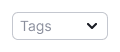
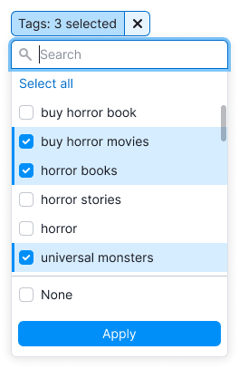
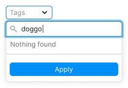
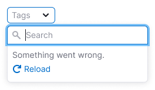

> 💡 **General rules for filters are described in the [Filters, common rules guide](/filter-group/filter-rules/).**

@## Description

**Filter Tags** is a filter to sort the data on the page by the tags.

- You can select multiple values or `None`, which will show all keywords without tags.
- All tags are pulled from the table data and attached to it. So the filter shows data the user can work with in the context of this table.
- The filter works with the "Or" logic.

**When working with Tags filter, it is important for the user to:**

- quickly understand it can choose one or several tags;
- sort keywords with no tags;
- quickly reset the entered data and search again;
- be able to select all tags.

@## Appearance

### Trigger

- Trigger has styles of [Select](/components/select/) and [FilterTrigger](/components/filter-trigger/).
- **Set the trigger min-width to 80px**. It's not recommended to make the trigger smaller. When there is enough space in the interface, make the width of the trigger dependent on the content, so the text inside the trigger doesn't have to be collapsed into the `ellipsis`.

### Dropdown

- Dropdown has the list of all tags from the table data.
- There is a special option - the ability to select keywords without tags (`None`).
- Sort a list of tags in alphabetical order.
- You cannot select both `None` and tags.

- Show scroll if the list has more than 6 tags.
- Add search input if the list has more than 10 tags. See the [Filter Search](/filter-group/filter-search/) guide to know more.
- Add `Select/Deselect` all option if the list has more than 10 tags.

**Don't make a dropdown width less than 224px**,so if there are long names for tags, most of them will be readable. If the name of the tag is too long, collapse it into `ellipsis`, and show its full name in the tooltip while hovering.

@## Interaction

- By default, nothing is selected in the filter.
- If the user has selected a tag, the checkbox becomes active.
- Clicking on `Select all` selects all tags, the option changes to `Deselect all`.
- Since there can be many selected tags, we will not pin them after closing and reopening the filter.

Other rules for working and interacting with filters are described in the [Filters, common rules guide](/filter-group/filter-rules/).

### States

| State/edge case   | Description                                                                                                                                                                                                                                                                                                                                                                                                                                                | Appearance example                                                                                                                                                             |
| ----------------- | ---------------------------------------------------------------------------------------------------------------------------------------------------------------------------------------------------------------------------------------------------------------------------------------------------------------------------------------------------------------------------------------------------------------------------------------------------------- | ------------------------------------------------------------------------------------------------------------------------------------------------------------------------------ |
| **Empty state**   | If there are no tags in the filter, show the message in the dropdown: `No tags here yet`.                                                                                                                                                                                                                                                                                                                                                                  |                                                                                                                                                 |
| **Nothing found** | Show the message: `Nothing found`, if nothing was found.                                                                                                                                                                                                                                                                                                                                                                                                   |                                                                                                                                 |
| **Select all**    | When selecting all tags, change `Select all` to `Deselect all`. If at least one item is not selected, then the option will be `Select all`.                                                                                                                                                                                                                                                                                                                |                                                                                               |
| **Loading**       | In the case when the content of the filter takes a long time to load, show [Spin](/components/spin/) in the dropdown and the message: `Loading...`. In the case when the selection is long-lasting, use the [SpinContainer](/components/spin-container/) over the dropdown to show the loading process.                                                                                                                                                    | The filter dropdown is loading.  The selected options are applied for a long time.  |
| **Error**         | If there was any error while loading data in the filter, show the message: `Something went wrong.`. Let a user reload the filter with the `Reload` control.                                                                                                                                                                                                                                                                                                |                                                                                                                                                 |
| **Filled filter** | If the user has applied the filter, show the number of selected tags in the trigger. For more information on abbreviation rules, see [FilterTrigger](/components/filter-trigger/).                                                                                                                                                                                                                                                                         |                                                                                                                                          |
| **No results**    | If there are no keywords in the table with the selected tags, show the ["empty" state](/components/widget-empty/), as with any other filter. In this case, the search works like a sort. When there are no options, show the title: "No results found" — and the message: "Try selecting a different date or changing your filter settings.". _You can see this case in the situation when the user selected `None`, and all data have tags in the table._ |                                                                                                                                 |

@## Abbreviations and tooltips

For more information about tooltips, see the [Filters, common rules guide](/filter-group/filter-rules/).

Don't abbreviate the name of this filter, it is always `Tags`.

@## Validation

The validations work is described in the [Filters, common rules guide](/filter-group/filter-rules/).

@page filter-tags-code
