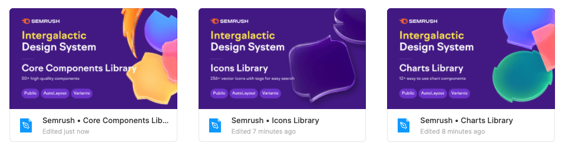

@## Core libraries

We have some Figma libraries with core components, icons and charts.

- Library with all core components — **[Core components](https://www.figma.com/file/0947BMukARv0QgQ263JNnx/00-CORE-COMPONENTS)**
- Library with all interface icons – **[Icons](https://www.figma.com/file/4Hk7v6uIQ19ZpgCG5z1kOk/01-ICONS)**
- Library with charts — **[Charts](https://www.figma.com/file/g2aAIv3jlvrgp26ZRGljkxpP/02-CHARTS)**

@## Additional libraries for inner usage

We also have special libraries for:

- UX/UI patterns — **[Patterns](https://www.figma.com/file/pK5cFpKXVzBzSW1mJyNu4t/03-PATTERNS)**;
- UI illustrations — **[UI illustrations](https://www.figma.com/file/RqNKwz285OsvD48zlMMOHN/04-UI-ILLUSTRATIONS)**;
- product email marketing templates — **[Product email](https://www.figma.com/file/nWUZkhBAFRZLYYlRL68xYh/06-EMAIL)**;
- components for mobile devices (work in progress) — **[Mobile](https://www.figma.com/file/15OlJiZ3NRBYS94LasDpEM/07-MOBILE)**;
- different supporting elements for decoration in our files — **[Decorations](https://www.figma.com/file/WOJHmjxdmhcTmrvifJo1FkRL/Decorations-for-your-files)**.

> 💡 **Libraries with UI illustrations, patterns and email templates are open for editing for all UI Team members**.
>
> Therefore, if you have a new illustration, pattern or email template, feel free to add them to the shared libraries. This will make it easier for your colleagues to find ready-to-use illustrations, icons and email templates in the future.
