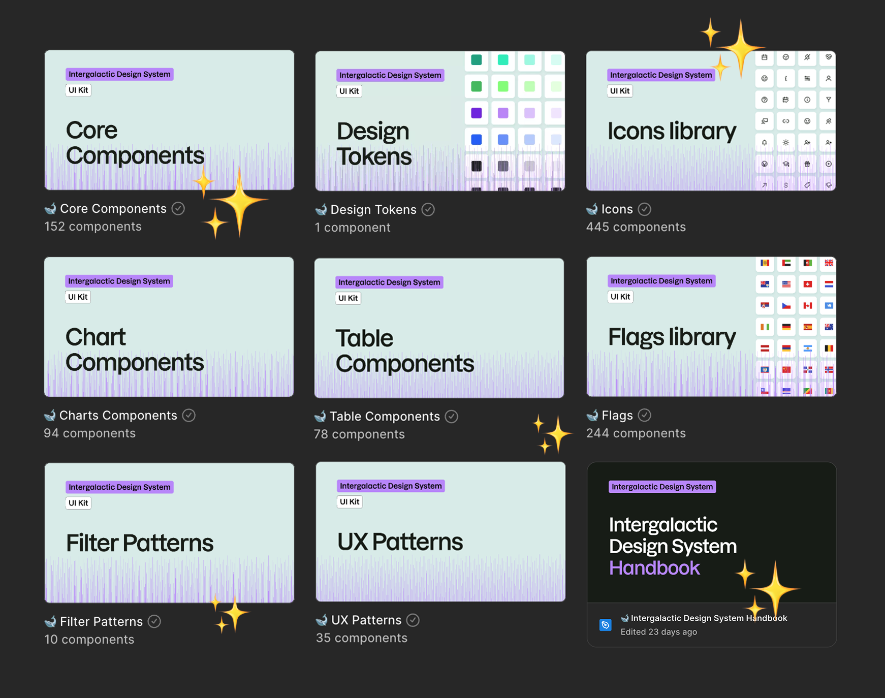

::: tip
The following libraries are currently available only to Semrush employees.
:::

## Core libraries

[Folder with all core component libraries](https://www.figma.com/files/826881787188133920/project/53077201?fuid=618475703437253953) for building UI based on the Intergalactic Design System:

- [🐋 Design Tokens](https://www.figma.com/design/3oPFz95uakNgr0diY7k5dW/%F0%9F%90%8B-Design-Tokens?m=auto)
- [🐋 Core Components](https://www.figma.com/design/RLic9ruqNNm6qgARKFk5Ae/%F0%9F%90%8B-Core-Components?m=auto)
- [🐋 Interface Icons](https://www.figma.com/design/lVX2dKnVFtcSTQV7eSS5j1/%F0%9F%90%8B-Icons?m=auto)
- [🐋 Chart components](https://www.figma.com/design/EBG44NotS7lmjZnUOkhyrp/%F0%9F%90%8B-Charts-Components?m=auto)
- [🐋 Table Components](https://www.figma.com/design/hwYZpLVEg6TU1AFwpBvYXA/%F0%9F%90%8B-Table-Components?m=auto)

## Onboarding playground

We have a special [onboarding tutorial](https://www.figma.com/design/iwWLdt4VZkZBx1XQltLsBL/Libraries-onboarding---playground-%F0%9F%8E%93?m=auto) with tips to help you get familiar with the main libraries.

## Additional libraries

In addition, we some other common libraries for internal use:

- UX/UI patterns with common modules and patterns we use across different Semrush products: [🐋 UX Patterns](https://www.figma.com/design/t7T1SLzIkERV1IrsjsKugE/%F0%9F%90%8B-UX-Patterns?m=auto)
- Filter Patterns: [🐋 Filter patterns](https://www.figma.com/design/1zWWz7R5Lt9tt9BM6Bzf6W/%F0%9F%90%8B-Filter-Patterns?m=auto&t=AbU0iELz1TgW9b82-6)
- All images for [Flags](/components/flags/flags) component: [🐋 Flags](https://www.figma.com/design/DjWsMXmFfCMxtiyNtoYjRO/%F0%9F%90%8B-Flags?m=auto&t=AbU0iELz1TgW9b82-6)
- Product Email Library: [Product Emails](https://www.figma.com/design/uBxKSTlXSEDiKvFp6txzrr/%F0%9F%93%AE-Product-Email-Library?m=auto)
- Components for organizing your files and specs: [Design File Template Library](https://www.figma.com/file/ZDRC056k8PbUFi3qoFAWj9/Design-File-Template-Library)

::: tip
All Semrush product designers have an editing access to the libraries containing UI illustrations, patterns, experiments, and email templates.

As a result, if you create any new illustrations, patterns, or email templates, you're encouraged to add them to the libraries through Figma branches. By doing so, you will facilitate your colleagues in finding readily usable illustrations, icons, and email templates in the future.
:::
