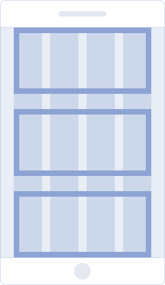
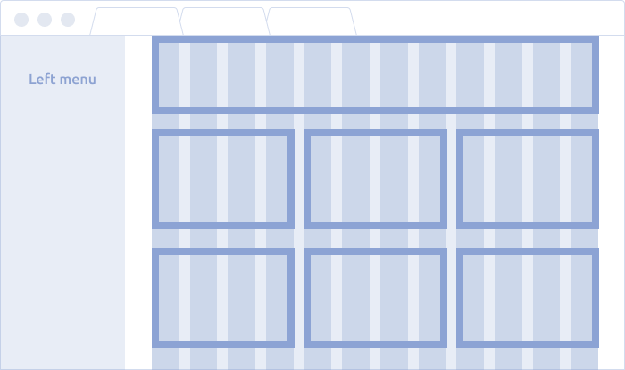

@## Adaptivity

Our product interfaces are desktop first, so adaptability of the core products is optional yet.

Most of the core components can be used on the adaptive interface. You need to increase their size to the biggest (XL) for ease of use on touch devices.

Use also [Grid](/layout/grid-system/) to build the page grid. The component has an adaptive API.
The adaptivity (css with media-queries) of components can be enabled by adding our [babel-plugin-react-semcore plugin](https://github.com/semrush/intergalactic/blob/master/tools/babel-plugin-react-semcore/README.md) for babel.

This is how your **webpack.config.js** might look like:

```js
module.exports = {
  // ...
  module: {
    rules: [
      {
        test: /\.js$/,
        include: /\/node_modules\/@semcore\//,
        use: [
          {
            loader: 'babel-loader',
            options: {
              babelrc: false, // is u use .babelrc
              configFile: false, // if u use babel.config.js, doesnt affect babelrc option https://babeljs.io/docs/en/options#configfile
              plugins: [['@semcore/babel-plugin-react-semcore', { media: true }]],
            },
          },
        ],
      },
    ],
  },
};
```

@## Breakpoints

> 💡 The breakpoint system is based on the left menu width (250px) and the maximum content width (840px) on our product landing pages.

- The layout of the landing page depends on the breakpoint.
- Each resolution range determines the number of columns, maximum content width, main container margins and text sizes.

A list of the main breakpoints that we recommend to use in our product interfaces:

- `414px` for mobile devices
- `768px` for tablet devices
- `1154px` for desktop devices

> The maximum width of the content area on the main product landing pages is 840px. If your product visually differs from the core Semrush products, then, of course, your maximum width may differ.
>
> 💡 After 991px, the left menu appears and, with its width of 250px, "eats away" space from the product page 🙃

| Breakpoint | Columns | Gutter | Max. container width | Content wrapper margins | Layout scheme                                             | Description                                                                                                      |
| ---------- | ------- | ------ | -------------------- | ----------------------- | --------------------------------------------------------- | ---------------------------------------------------------------------------------------------------------------- |
| ≤ 414px    | 4       | 24px   | 374px                | `margin: 80px 20px;`    |              | **Mobile devices**. The content has a one-column structure. The left menu is hidden.                             |
| ≤ 768px    | 6       | 24px   | 704px                | `margin: 120px 32px;`   |              | **Mobile devices**. You can arrange the content as a two-column structure. The left menu is hidden.              |
|            |         |        |                      |                         |    | **Mobile devices (landscape mode)**. The content is arranged as a two-column structure. The left menu is hidden. |
| ≥ 1154px   | 12      | 24px   | 840px                | `margin; 0 auto;`       |          | **Tablet & desktop devices**. The left menu is open. You can rearrange the content as a three-column structure.  |
|            |         |        |                      |                         |  | **Tablet (landscape mode)**. The left menu is open. You can rearrange the content as a three-column structure.   |

@page breakpoints-api
@page breakpoints-code
