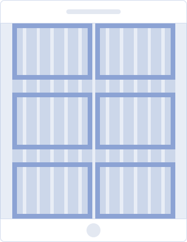
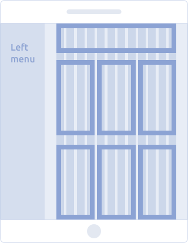

@## Adaptivity

Our interfaces are desktop first, so adaptability is still optional.

Most of the core components are adaptive. They increase their size for ease of use on touch-appliances. Complex components can change their behaviors and appearance on small screens.

**Component adaptability is enabled for screens smaller than 768px**.

Use also [Grid](/layout/grid-system/) to build the page grid. The component has an adaptive API.
The adaptivity (css with media-queries) of components can be enabled by adding our [babel-plugin-semcore plugin](https://github.com/semrush/intergalactic/blob/master/tools/babel-plugin-semcore/README.md) for babel.

This is how your **webpack.config.js** might look like:

```js
module.exports = {
  // ...
  module: {
    rules: [
      {
        test: /\.js$/,
        include: /\/node_modules\/@semcore\//,
        use: [
          {
            loader: 'babel-loader',
            options: {
              babelrc: false, // is u use .babelrc
              configFile: false, // if u use babel.config.js, doesnt affect babelrc option https://babeljs.io/docs/en/options#configfile
              plugins: [['@semcore/babel-plugin-semcore', { media: true }]],
            },
          },
        ],
      },
    ],
  },
};
```

@## Breakpoints

A list of the main breakpoints that we recommend to use in our interface:

- `768px`
- `992px`

| Breakpoint       | Layout scheme                                           | Description                                                                                                                              |
| ---------------- | ------------------------------------------------------- | ---------------------------------------------------------------------------------------------------------------------------------------- |
| less than 768    |            | **Mobile devices**. The content has a one-column structure. The left menu is hidden in the burger menu icon.                             |
| 768-992          |            | **Mobile devices**. You can arrange the content as a two-column structure. The left menu is hidden in the burger menu icon.              |
|                  |  | **Mobile devices (landscape mode)**. The content is arranged as a two-column structure. The left menu is hidden in the burger menu icon. |
| greater than 992 |            | **Tablet & desktop devices**. The left menu is open. You can rearrange the content as a three-column structure.                          |
|                  |  | **Tablet (landscape mode)**. The left menu is open. You can rearrange the content as a three-column structure.                           |
