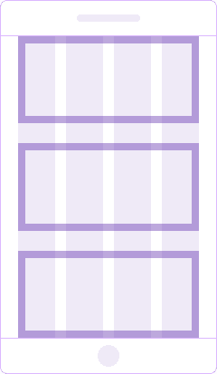
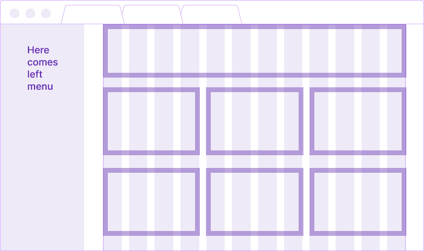

@## Description

- The layout of the page depends on the breakpoint.
- Each range determines the number of columns, maximum content width, main container margins and text sizes.
- **You can set your own breakpoints, if it's necessary for the correct display of the interface in a particular case. _For example, change a breakpoint for desktop screens._**

> 💡 After 1199px, the left menu appears and, with its width of 250px, "eats away" space from the product page 🙃

@## Breakpoints system

| Breakpoint                      | Columns | Gutter | Max. content width                                                                                                                             | Content wrapper margins | Layout scheme                                                    | Description                                                                                                               |
| ------------------------------- | ------- | ------ | ---------------------------------------------------------------------------------------------------------------------------------------------- | ----------------------- | ---------------------------------------------------------------- | ------------------------------------------------------------------------------------------------------------------------- |
| **min-width: 320px** (320-767)  | 4       | 24px   | We recommend setting it to 500px. But you can choose another value if necessary.                                                               | For landing and product pages `margin: 16px 20px 80px;`.  |              | **Mobile & tablet devices**. The content has a one-column structure. The left menu is hidden.                             |
| **min-width: 768px** (768-1199) | 6       | 24px   | We recommend setting it to 720px. But you can choose another value if necessary.                                                               | For landing and product pages `margin: 16px 24px 96px;`. |              | **Mobile & tablet devices**. You can arrange the content as a two-column structure. The left menu is hidden.              |
|                                 |         |        |                                                                                                                                                |                         |    | **Mobile & tablet devices (landscape mode)**. The content is arranged as a two-column structure. The left menu is hidden. |
|                                 |         |        |                                                                                                                                                |                         |           | **Desktop devices**. The content is arranged as a three-column structure. The left menu is hidden.                        |
| **min-width: 1200px** (1200-∞)  | 12      | 24px   | We recommend setting it to 980px for product landing pages and to **1440px for product pages.** But you can choose another value if necessary. | For landing pages `margin: 16px 24px 96px;`. For product pages `margin: 16px 32px 96px;`.  |         | **Tablet & desktop devices**. The left menu is open. You can rearrange the content as a three-column structure.           |
|                                 |         |        |                                                                                                                                                |                         |  | **Tablet (landscape mode)**. The left menu is open. You can rearrange the content as a three-column structure.            |

@## Product pages width

The grid system is based on the left menu width (250px) and the maximum content width of our product pages.

**The recommended maximum width of the content area:**

- for the product landing pages is 980px;
- for the product pages is 1200px.

@page grid-api
@page grid-code
@page grid-changelog
