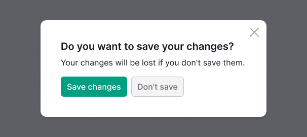
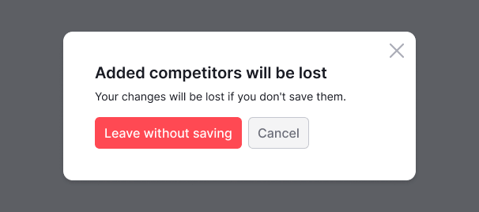
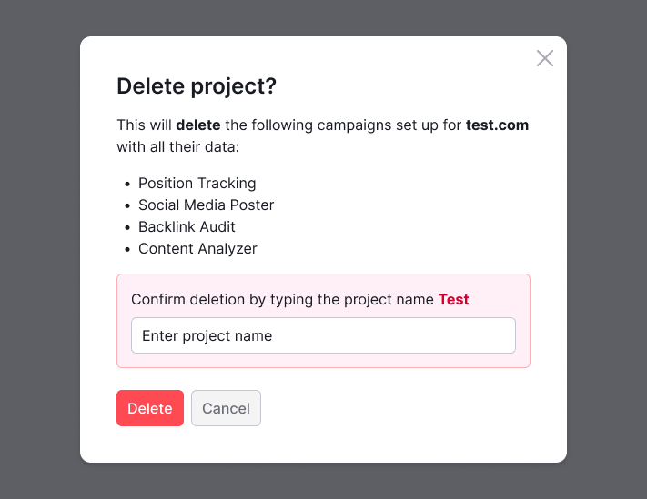
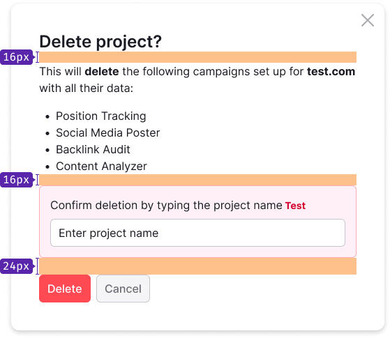

@## Description

A **confirmation dialog** asks users whether they are sure that they want to proceed with a command that they have just issued to a system. It's that consists of [Modal](components/modal/).

It’s a second chanse for user to predict issues, but it wouldnt be one if users automate their response to the conformation and simply click Yes without thinking further.

Having a clear and descriptive message will explain the window’s usage. Users should be able to read the text and understand the message you’re trying to tell them and possible actions.

@## Component appearing

> Description of the component for modal windows can be found in the [Modal](components/modal/), for cancell actions in the [NoticeBubble](/components/notice-bubble/).

When users are about to take an irreversible action, like permanently deleting an item or they can lost unsaved data, we should ask them in advance if they understand what’s about to happen.

When users are about to take an action that will result in complex consequences, for example, affecting the configuration of the data:

- it must be explained exactly what will change;
- the user has to confirm the action by entering a name.

Try to avoid situations when the content in a modal window requires a scrollbar.

@## Paddings

@## Other recommendations

See more recommendations in the [article](https://www.nngroup.com/articles/confirmation-dialog/) from Nielsen Norman Group.

@page confirm-dialog-code
