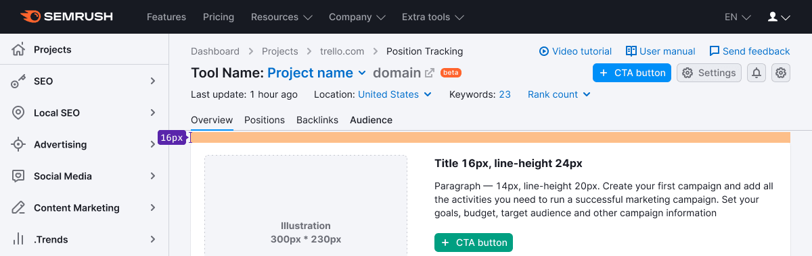
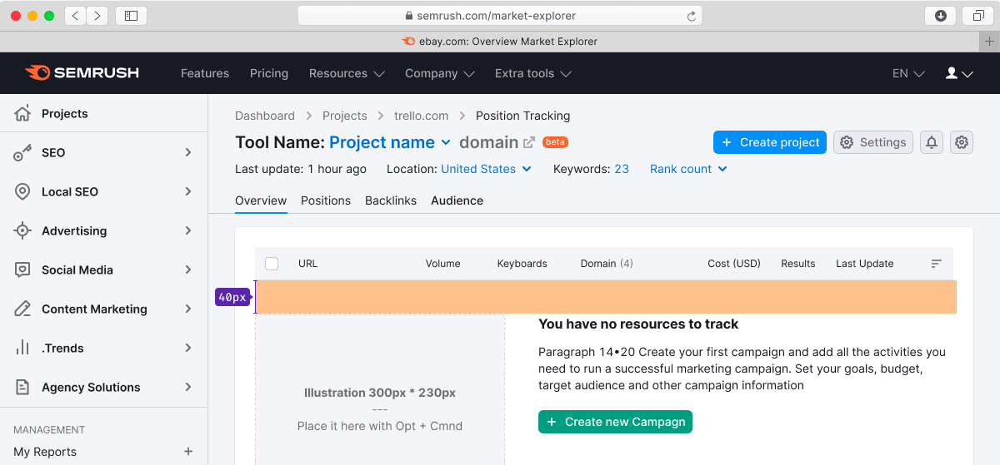
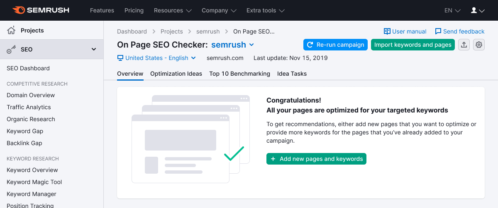

@## Description

**Empty page** is the "blank" state of the tool. May act as an advertising state to enable some other tool/service or before a new report tab appears.

Commonly, the user faces such a state, when certain actions are required to start working and gather data in the tool.

**For example, this state indicates that:**

- we can't display the data because the user doesn't have the right tool / service / account enabled;
- there is no data to display because the user hasn't created or configured anything in the tool yet;
- "Soon there will be an awesome report here" (we need to display something as a "lure").

@## Regular view

### Basic rules for styles

> Space from the text to the button is 24px or 32px, but sometimes for the composition (if the button is almost aligned with the image), the button can be aligned with the bottom edge of the image.

1. The image is always located to the left of the content and can be in two sizes: large (300x230) or small (240x180);
2. The header h6 (19px, `--fs-400`);
3. Text — paragraph size L (14px, `line-height 20px`);
4. The type of button is primary or secondary, depending on the context, size L.
5. The entire block "sticks" to the left side and doesn't stretch over the full width of the page;
6. **The content width is determined by the composition, but should not exceed 500px (otherwise it becomes difficult to read);**
7. Margin between the [TabPanel](/components/tab-panel/) and an "empty" state — 40px;
8. Margin between the image and the text — 40px;
9. Margin from the header to the text — 16px (in cases where the content is large and the composition requires bigger spacing) and 12px (in cases, where the text is small).

> As an option, the tertiary button can be added, which, for example, opens a dropdown with additional information.

@## "Empty" state along with other blocks

### Basic rules

- if there are other elements to the left of the placeholder, margin from them is 60px;
- the picture is vertically aligned with the block content on the left;
- spacing from the table to the block — 40px.

@## Examples of images for empty states

In products, special pictures are drawn for each specific situation with similar "empty" states. They should carry out an advertising function and reflect the essence of the report which is currently hidden from the user.

