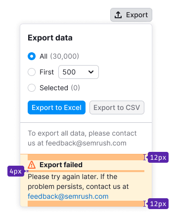
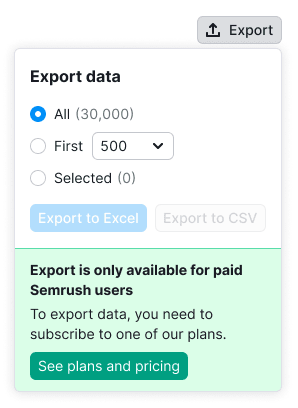

@## Description

**ComplexExport** is a pattern that describes elements and the process of data export to different formats from our tools.

To export data, we use a button that the user can click to set up export and/or download data in a specific format immediately.

> **Essential technical information**
>
> 💡 Remember that exporting to CSV requires using comma as a separator character.

**The pattern includes:**

- Trigger;
- Dropdown with settings (when we allow export customization).

@## Trigger

### Basic version

- This version is recommended for use wherever there is a space and an ability to adjust export settings.
- If exporting is the target action on the page, you can add blue or green color to the button, when it is a CTA button.
- Clicking on this button always opens a dropdown menu with the form.

### Additional version in case if there's a little of space

- There is an unsigned version if there's not enough space for the main version.
- Clicking on this button always opens a dropdown menu with the form.

### Additional version for exporting in a single format

- If export is possible to the only one format and there are no additional settings, use this version.
- Clicking on this button triggers the file download straight away.

> 💡 **Important!**
>
> If there is nothing to download, the file is anyway downloaded with the table headers. The file shouldn't be empty, because it is important to show the user that the export is working.
>
> If the process is time consuming, the button changes its state to loading. The recommended time for showing loader is `300ms`.

@## Dropdown with settings

- The dropdown appears by clicking the export button. The button state must change to active.
- [The dropdown content](/components/dropdown-menu/) may comprise variety of components, depending on the tool/report. An essential condition is that there should be at least two download buttons in the dropdown.
- **The width and height of the dropdown depend on the content.**

@## The minimum version of dropdown

- If you can export at least in two formats, and no additional settings are needed, the button opens the list of formats. This is necessary because new formats may appear in the future.
- When you click on the item, the selector closes and the file starts downloading in the browser.
- If the process is time consuming, the button state changes to `loading`.

@## Extended version

- This version of the dropdown must have the `Export data` heading.
- If the data can be exported to one or two formats, you should use full names in the buttons. _For example, `Export to CSV`._
- If the data can be exported to three formats, it is better to shorten the button names to the format name. _For example, you can use `CSV` instead of `Export to CSV`._
- If there is zero data for all export parameters and settings, the button shouldn't be in the `disabled` state.

> 💡 Additionally, there may be other necessary controls in the dropdown settings. **Please, re-use existing patterns and components, do not create new ones.**

@## Postponed export version

This option is used if the file is too large and can't be exported straight away. To the input field for an email address, automatically enter the email from the profile, but it can be changed manually. Use the buttons to show possible formats for exporting.

@## Additional information in the dropdown

### Additional information on downloading all data and export in general

- **Always located under the buttons.**
- There is a notification in our interface of a certain condition for downloading all data. It concerns either limitation, or large exporting, since all the data is typically not needed.
- Use [divider](/components/divider/) to separate this information from controls.

Text, that we use for such cases: `To export all data, please contact us at {email}`.

Or lead to the page with the custom_report form, if possible, the text is as follows: `To export all data, please order a custom report`.

> 💡 It is important to write an email in full, so it is easier to copy it for future use, compared to opening a link in the mailer.

### Additional information concerning the selected export settings

- **Always located above the buttons**.
- If there is additional information in the dropdown that is directly related to export (as a result of selected settings, for example), then use [divider](/components/divider/) to separate it (it doesn't overflow the inside content paddings in the dropdown).

@## Corner cases

### Error

- If the export operation fails, a [warning notification](/components/notice) with an error report appears at the bottom of the dropdown.
- **If you know the problem, then write about it immediately in the heading**.
- If you can't identify the problem, then write the standard text and email of the command.

> 💡 Note that you don't need to put a dot symbol after the email.

In the minimum version of dropdown with selector, a [NoticeBubble](/components/notice-bubble). appears when this error occurs.

### Limit

A [notice informing about the limit](/components/notice) appears at the bottom of the dropdown.

All the dropdown content remains, you can click, select in order to allow the user explore the export opportunities that could be lost without upgrading. But the export buttons are in the `disabled` state.

### Loading

- **Remember the download state.**
- It may appear at the first opening of the dropdown and after clicking the export button.
- When loading, [SpinContainer](/components/spin-container/) hanged on the dropdown.
- After downloading, the dropdown closes and the file starts loading in the browser.
- The spinner size in all dropdowns is `XL`, regardless of the size of the dropdown.

@## How to work with the group of settings

- The `All` value is selected in the radio group by default, if nothing is chosen in the table.
- If the value is chosen in the table, the corresponding `Selected` value is selected when opening.
- Clicking the selector in the item, it opens and also automatically activates the radio button.
- If the item value is zero, then it is `disabled`.
- The first item is the most popular option in the tool / report by default.
