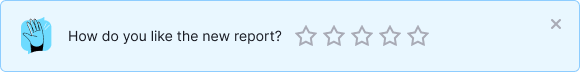
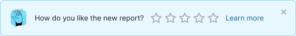
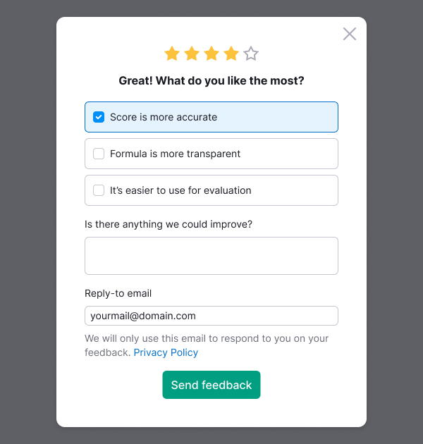
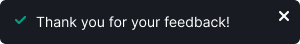
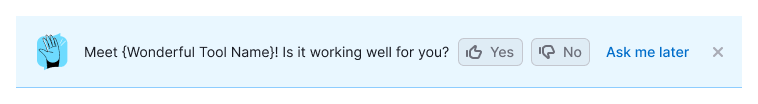
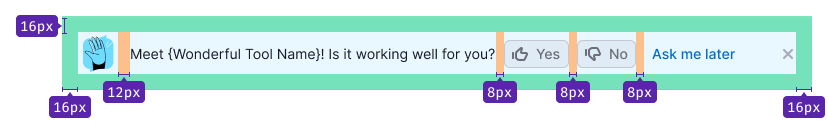
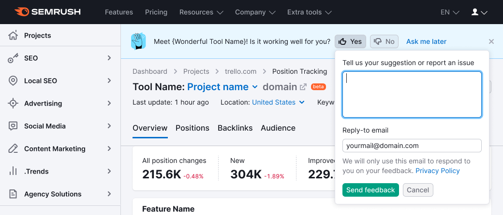
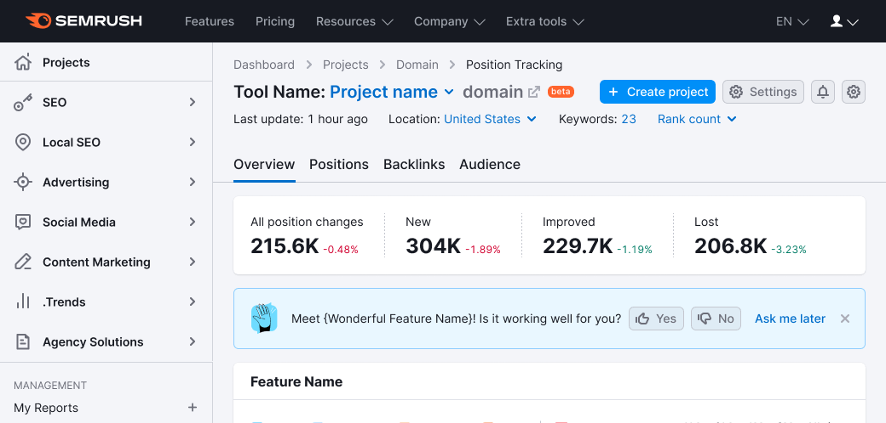

## Description

## FeedbackRating form

**FeedbackRating** is a pattern for collecting feedback on a 5-rating scale from users.

Use it when you need to collect user's feedback after they performed specific step or used specific feature in the interface.

This pattern includes:

- Notice with `info` theme and `SliderRating` that triggers modal window.
- Modal window with a form for specifying feedback.
- [NoticeBubble](/components/notice-bubble/notice-bubble-code#success-notice) for providing the success state after sending the data.

### Notice

Notice includes the following mandatory elements:

- **[FeedbackIllustration](/style/illustration/illustration) as Notice.Label.** Avoid changing it.
- **Message for the user.** Set the text that is more suitable for your case.
- **Rating Slider** with 0 value by default.
- **Close button.**

**"Learn more" link is optional.** Text with a link to the article, the text is always “Learn more”, only the href changes.

### Modal window with feedback form

**Contains the following mandatory elements:**

- **Rating Slider.** Non-interactive and shows the user's choice on the previous step. If user closes the window, then its choice will be cleared.
- **Title.** Set titles that are suitable for the value that user have chosen. Don't forget to add the appropriate `h` tag.
- **Group of checkboxes with suggestions.** Depending on the number of stars chosen, you can show different predefined sets of checkboxes for selection. Show 3 checkboxes maximum.
- **Textarea for optional text feedback.** It has defailt label "Is there anything we could improve?". But you can change it if necessary. You can set a maximum number of symbols for it.
- **"Send feedback" button.** You can change button's label if necessary.

**Optional elements that you can add if necessary:**

- **Input for entering an email for a response.** The default label is "Reply-to email", but you can change the text if necessary. The input is pre-filled with the user's email, the user can clear it.
- **Policy text.** Default text: "We will only use this email to respond to you on your feedback. Privacy Policy".

### NoticeBubble

Use [Success pattern for NoticeBubble](/components/notice-bubble/notice-bubble-code#success-notice).

For the text use "Thank you for your feedback!".

## FeedbackYesNo form

**FeedbackYesNo** represents a feedback collection pattern. This pattern consists of the [Notice](/components/notice/notice) and [Feedback form](/components/feedback/feedback). Its purpose is to introduce a new feature to the user and pose a straightforward question about the product's performance. _For instance, "Discover our new Dashboard! Is it functioning effectively for you?"_

### Styles

Show [Feedback illustration](/style/illustration/illustration) on the left to the text.

#### Margins and paddings

### Behavior

There are two potential variants for the notice to appear:

1. The notice appears simultaneously with the loading of the product or report.
2. The notice is displayed for the first time in the second session (recommended). Subsequently, it remains visible until closed or the "Ask me later" button is clicked.

The length of a session is determined by the Product Owner or UX designer of the product. It might be defined as a time interval, the next page load, or an update of company data.

#### Location

Typically, this component is positioned at the top of a report or product.

It is also could be placed next to the feature for which feedback is desired.

### Form behavior

Refer to the comprehensive behavior description of the feedback dropdown in the [Feedback](/components/feedback/feedback).

### Buttons behavior

#### "Yes" and "No" buttons

- The pressed button becomes `active`.
- The dropdown with the feedback form appears from the pressed button over `500ms`.
- The focus is directed to the textarea, with a placeholder stating: "Please provide suggestions or report issues."

#### "Send feedback" button

- The button that triggers the dropdown for sending a message remains `active`.
- After field validation and message sending, an illustration and the text "Thank you for your feedback!" are displayed in the dropdown.
- After `2500ms`, the dropdown is gently closed with a `500ms` `fade-out` effect. An additional `500ms` later, the dropdown with buttons is also closed, smoothly lifting the entire page content over `500ms`.

#### "Cancel" button

- Pressing the "Yes" or "No" button reverts it to its normal state.
- The notice remains visible.

### Closing behavior

#### "Ask me later" button

1. This button is consistently present within the notice, following the "Yes" and "No" buttons.
2. Clicking this button closes the notice.
3. Over `500ms`, the product/report content shifts upwards.
4. The notice reappears in the user's next session.

#### Close button

The `Close` button is optional.

Display this element if the report or product offers an alternate method for sending feedback (such as a "Send Feedback" link next to the settings).

- The first option involves having the `Close` button always present within the notice.
- The second option (**recommended**) entails the `Close` button appearing after clicking "Ask me later" and upon reopening the notice in the second session (which could be the second, third, or subsequent sessions).

### Remembering states

1. If the user submits feedback, the notice will no longer appear to them.
2. Storing this status in the user's profile is advisable, in order to avoid being intrusive.
3. It is permissible to use local storage for saving the closing and appearing statuses.
