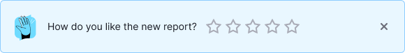
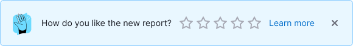
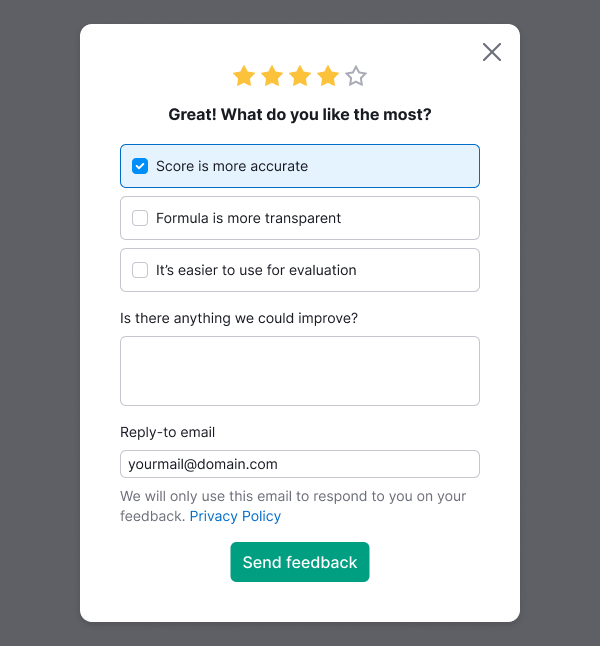
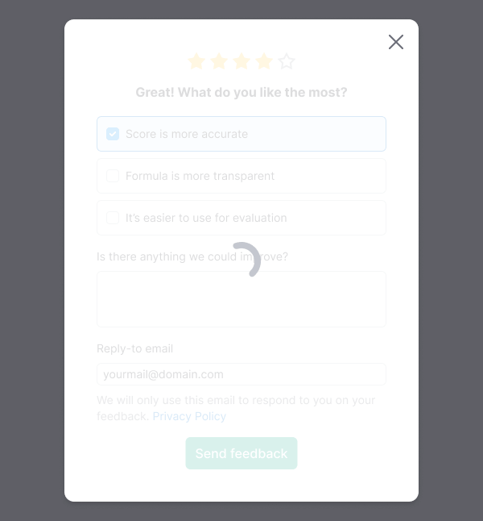
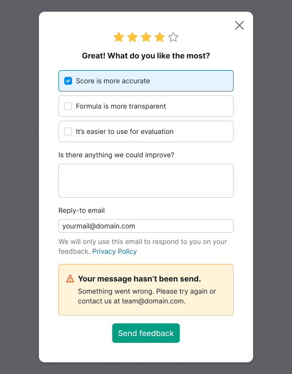

## Description

**FeedbackRating** is a pattern for collecting feedback on a 5-rating scale from users.

Use it when you need to collect user's feedback after they performed specific step or used specific feature in the interface.

This pattern is built with:

- [Feedback form](/components/feedback-form/feedback-form).
- [Notice](/components/notice/notice) with `info` theme and `SliderRating` that triggers modal window.
- [Modal window](/components/modal/modal) with a form for specifying feedback.
- [NoticeBubble](/components/notice-bubble/notice-bubble-code#success-notice) for providing the success state after sending the data.

## Notice

Notice includes the following mandatory elements:

- [FeedbackIllustration](/style/illustration/illustration) as Notice.Label. Avoid changing it.
- **Message for the user.** Set the text that is more suitable for your case.
- **Rating slider** with 0 value by default.
- **Close button.**

**"Learn more" link is optional.** Text with a link to the article, the text is always “Learn more”, only the href changes.

### Notice behavior requirements

- If the user has closed the Notice, don't show it to them again.
- The Notice is displayed until the user closes it using the `Close` button, submits the feedback form, or until the set time expires.
- Avoid displaying multiple Notices in a single product simultaneously.
- Also, avoid showing the next Notice immediately after the user has closed the previous one.
- Avoid displaying a Notice and a FeaturePopover simultaneously on the page to prevent cognitive overload.

## Modal feedback form

**Contains the following mandatory elements:**

- **Rating slider.** Noninteractive and shows the user's choice on the previous step. If user closes the window, then its choice will be cleared.
- **Title.** Set titles that are suitable for the value that user have chosen. Don't forget to add the appropriate `h` tag.
- **Group of checkboxes with suggestions.** Depending on the number of stars chosen, you can show different predefined sets of checkboxes for selection. Show 3 checkboxes maximum.
- **Textarea for optional text feedback.** It has defailt label "Is there anything we could improve?". But you can change it if necessary. You can set a maximum number of symbols for it.
- **"Send feedback" button.** You can change button's label if necessary.

**Optional elements that you can add if necessary:**

- **Input for entering an email for a response.** The default label is "Reply-to email", but you can change the text if necessary. The input is pre-filled with the user's email, the user can clear it.
- **Policy text.** Default text: "We will only use this email to respond to you on your feedback. Privacy Policy".

## NoticeBubble

Use [Success pattern for NoticeBubble](/components/notice-bubble/notice-bubble-code#success-notice).

For the text use "Thank you for your feedback!".

## Interaction with form

Table: Interaction with form inputs

| Input                                    | Description                                                                                                                                                                                                                                                                                                                      |
| ---------------------------------------- | -------------------------------------------------------------------------------------------------------------------------------------------------------------------------------------------------------------------------------------------------------------------------------------------------------------------------------- |
| **Group of checkboxes with suggestions** | Optional to select. Users can select any number of suggestions.                                                                                                                                                                                                                                                                  |
| **Textarea for optional text feedback**  | Optional to fill. If user filled the textarea with less than any 3 characters, then highlight the textarea with an invalid state and show a tooltip with the message how to fix this situation. Button isn't disabled. You can set the message in the tooltip if necessary.  |
| **Input for email**                      | Optional to fill. If the user clears the input, they get no errors or something that can block the form's submission.                                                                                                                                                                                                            |

## States

The form can be submitted without filling in any additional information (for example, immediately after it appears).

Table: Feedback Rating form states

| State       | Description                                                                                                                                                                                                                                       | Appearance example                             |
| ----------- | ------------------------------------------------------------------------------------------------------------------------------------------------------------------------------------------------------------------------------------------------- | ---------------------------------------------- |
| **Loading** | Triggered after clicking on the "Send feedback" button or maybe triggered while the initial loading of the form.                                                                                                                                  |         |
| **Error**   | Triggered if the data wasn't sent for some reason. The notification appears in the form above the “Send feedback” button with the default text: “Something went wrong. Please try again or contact us at {email} ". Set the {email} by yourself. |           |
| **Success** | Shown after feedback data was successfully submitted.                                                                                                                                                                                             |  |
