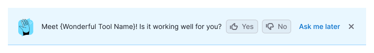
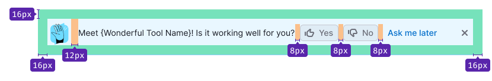
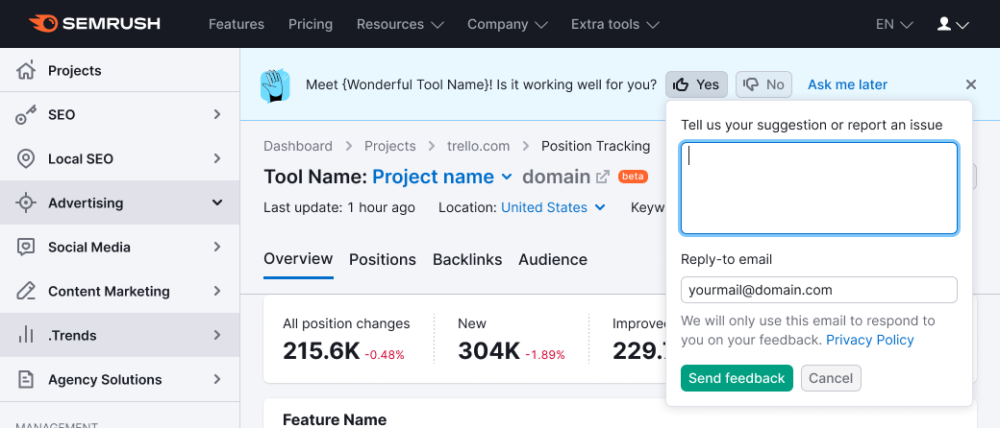
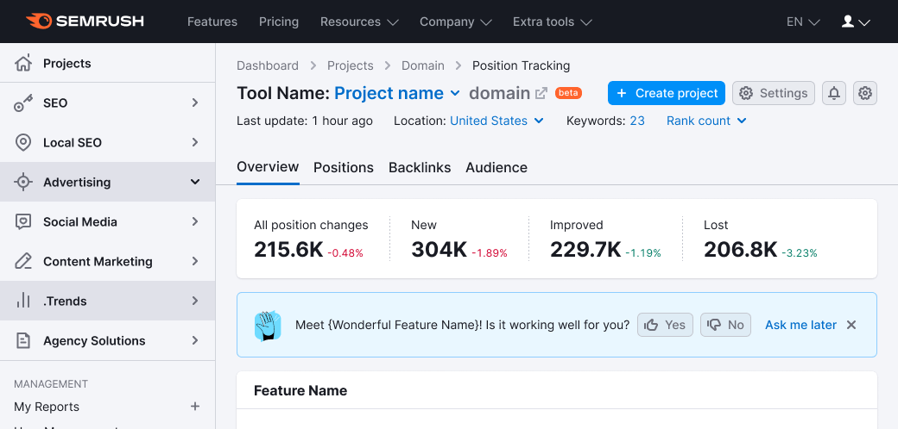

## Description

**FeedbackYesNo** represents a feedback collection pattern.

This pattern consists of [Notice](/components/notice/notice) and [Feedback form](/components/feedback-form/feedback-form). Its purpose is to introduce a new feature to the user and pose a straightforward question about the product's performance. _For instance, "Discover our new Dashboard! Is it functioning effectively for you?"_

## Appearance

Show [Feedback illustration](/style/illustration/illustration) on the left to the text.

### Margins and paddings

## Behavior

There are two potential variants for the notice to appear:

1. The notice appears simultaneously with the loading of the product or report.
2. The notice is displayed for the first time in the second session (recommended). Subsequently, it remains visible until closed or the **Ask me later** button is clicked.

Session length can be defined as a time interval, the next page load, or an update of company data.

### Placement

Typically, this component is positioned at the top of a report or product.

It can also be placed next to the feature for which feedback is desired.

## Form behavior

Refer to the comprehensive behavior description of the feedback dropdown in the [Feedback](/components/feedback-form/feedback-form).

## Buttons behavior

### "Yes" and "No" buttons

- The pressed button becomes `active`.
- The dropdown with the feedback form appears from the pressed button over `500ms`.
- The textarea is automatically focused, with the "Please provide suggestions or report issues" placeholder.

### "Send feedback" button

- The button that triggers the dropdown for sending a message remains `active`.
- After the message has been submited successfully, the `MailSent` illustration and the "Thank you for your feedback!" text are displayed in the dropdown.
- After `2500ms`, the dropdown is gently closed with a `500ms` `fade-out` effect. An additional `500ms` later, the notice with buttons is also closed, smoothly lifting the entire page content over `500ms`.

### "Cancel" button

- Pressing the **Cancel** button closes the feedback form.
- The notice remains visible.

## Closing behavior

### "Ask me later" button

1. This button is consistently present within the notice, following the **Yes** and **No** buttons.
2. Clicking this button closes the notice.
3. Over `500ms`, the product/report content shifts upwards.
4. The notice reappears in the user's next session.

### Close button

The **Close** button is optional.

Display this element if the report or product offers an alternate method for sending feedback (such as a **Send Feedback** link next to the settings).

- The first option involves having the **Close** button always present within the notice.
- The second option (**recommended**) entails the **Close** button appearing after clicking **Ask me later** and upon reopening the notice in the second session (which could be the second, third, or subsequent sessions).

## Remembering states

1. If the user submits feedback, the notice will no longer appear to them.
2. Storing this status in the user profile is advisable, to avoid being intrusive.
3. It's acceptable to use local storage for saving the closing and appearing statuses.
