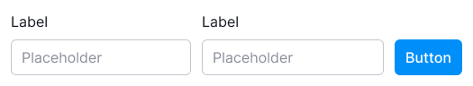
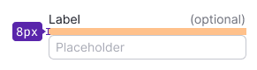
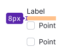
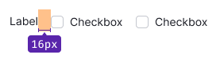
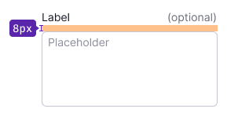
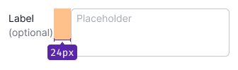
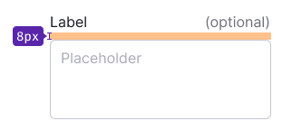
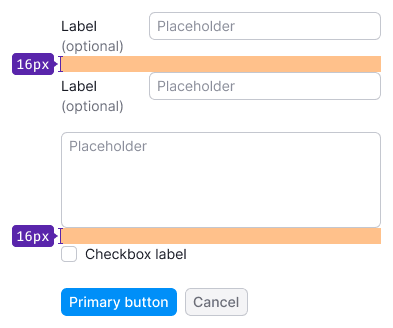
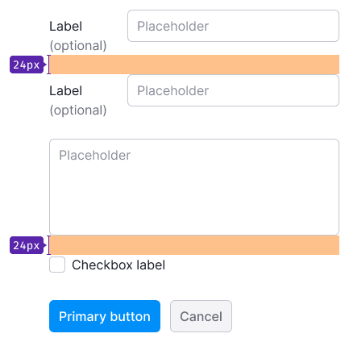
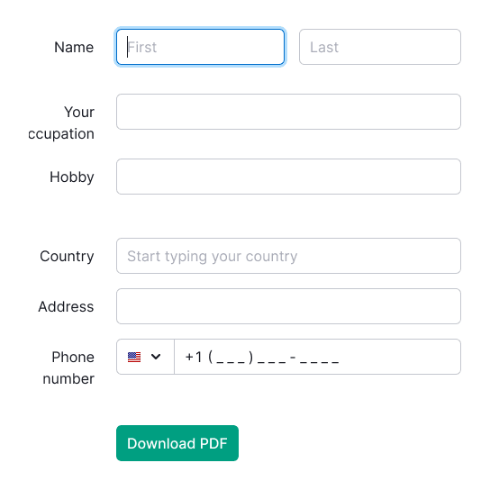

## Description

**Form** is a pattern used for the collection and submission of data to the system. It consistently includes various types of inputs and controls.

**Use one size for inputs and controls within the form.**

## Layout types

Table: Form layout types

| Layout type | Example                      |
| ----------- | ---------------------------- |
| Horizontal  |    |
| Vertical    |      |
| Inline      |        |

## Input labels

Input should have an accompanying text label.

- The font weight should be set to `regular`. Use `bold` font-weight sparingly for emphasizing input labels.
- Omit colons after text labels.

You also could mark an input as optional.

| Input size | Vertical layout    | Horizontal layout        | Font size         |
| ---------- | ------------------ | ------------------------ | ----------------- |
| M          |        |        | 14px (`--fs-200`, `--lh-200` tokens) |
|            |  |  |                                          |
|            |  |  |                                          |
| L          |        |        | 16px (`--fs-300`, `--lh-300` tokens) |
|            |  |  |                                          |
|            |  |  |                                          |

When the form is centered on the page, input labels can be aligned to the right.

## Placeholders

Placeholders are necessary to guide users on the expected data input.

- Relying solely on placeholders for inputs isn't user-friendly, as the completed form can become difficult to read.
- Avoid using specific values as placeholders, as users might think the input is pre-filled.

Placeholders can be omitted when the input purpose is self-evident.

## Input margins

The key unit in the design system is 4. All spacings between components and widgets should be multiples of this unit. Refer to the [Spacing system](/layout/box-system/box-system#spacing-system) for further information.

Table: Margins between inputs

| Input size | Example           |
| ---------- | ----------------- |
| M          |  |
| L          |  |

## Form validation

Find detailed information about form validation in [Validation](/patterns/validation-form/validation-form).

## Usage in UX/UI

### Vertical form layout vs. horizontal form layout

Depending on your objectives, you can choose between vertical and horizontal form layouts.

In brief:

- Vertical layout is suitable for short and simple forms, especially on mobile screens.
- Horizontal layout is preferable for complex forms, slowing users down to reduce errors.

### Vertical form layout

**When to use**

- The form is small and straightforward.
- Mistakes made after form completion have minimal consequences.

**Advantages of vertical form layout**

- Faster completion (refer to [research](https://www.uxmatters.com/mt/archives/2006/07/label-placement-in-forms.php)).
- Easier scanning with the eyes.
- Ideal for multilingual interfaces.

**Disadvantages of vertical form layout**

- Requires more vertical space.
- Not ideal for extensive or complex forms.

### Horizontal form layout, left label alignment

**When to use**

- The form is sizable and/or complex, warranting a slower user pace to prevent errors.
- Substantial consequences result from mistakes after completing a large form.

**Advantages of horizontal form layout with left label alignment**

- Can be more compact (uses less vertical space than vertical layouts).
- Attracts more user attention.

**Disadvantages of horizontal form layout with left label alignment**

- Requires more horizontal space.
- Takes longer to complete (read [research](https://www.uxmatters.com/mt/archives/2006/07/label-placement-in-forms.php)).
- Less suitable for multilingual interfaces.
- Users who magnify their screens may struggle to match labels with inputs, given their limited screen visibility.

### Horizontal form layout, right label alignment

**When to use**

- The form is sizable and/or complex, requiring a slower user pace to prevent errors.
- Right-aligned labels enhance the visual connection between labels and inputs, compared to left alignment.

**Advantages of horizontal form layout with right label alignment**

- Improved visual connection between labels and inputs.
- Higher completion rates compared to the previous layout (read [research](https://www.uxmatters.com/mt/archives/2006/07/label-placement-in-forms.php)).
- Potentially more compact than vertical layouts.

**Disadvantages of horizontal form layout with right label alignment**

- More challenging to scan and read (labels are right-aligned, requiring more time to find the start of each line).
- Less suitable for multilingual interfaces.

