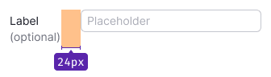
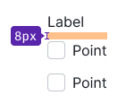
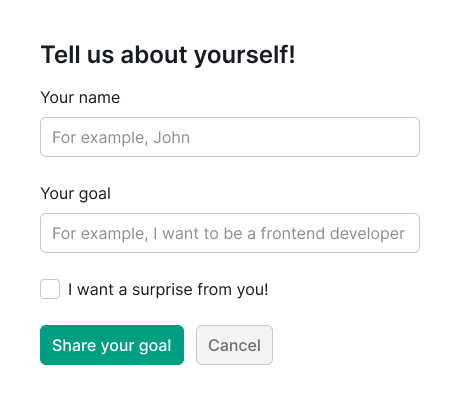

@## Description

**Form** is a pattern for collecting and sending data to the system. It always consists of different types of inputs and controls.

> Use one size of inputs and controls in the form.

@## Layout

| Layout type | Example                      |
| ----------- | ---------------------------- |
| Horizontal  |    |
| Vertical    |      |
| Inline      |        |

@## Input labels

Input should have a text label.

- Font weight should be `regular`. In cases when you need an extra accent fo the input's label you can use `bold` font-weight.
- **Do not put a colon after the text label.**

You also can mark the input as an optional.

| Input size | Vertical layout                                                  | Horizontal layout                                                       | Font size                                |
| ---------- | ---------------------------------------------------------------- | ----------------------------------------------------------------------- | ---------------------------------------- |
| M          |        |        | 14px (Use `--fs-200`, `--lh-200` tokens) |
|            |  |  |                                          |
|            |  |  |                                          |
| L          |        |        | 16px (Use `--fs-300`, `--lh-300` tokens) |
|            |  |  |                                          |
|            |  |  |                                          |

In cases, when the form is centered on the page, input labels can be right-aligned.

@## Placeholders

Placeholders are required to prompt the user about what data should be entered.

- It is not user-friendly to use only placeholders for inputs. When completed, such form becomes poorly readable.
- Do not put a specific value as a placeholder. The user may think that the input has already been filled.

You may not add a placeholder only if the input’s purpose is obvious.

To format values that the user enters use [InputMask](/components/input-mask/).

@## Inputs

> After opening the form the first input should get the `focus`.

**The main denominator in the design system is 4.** All margins between the components and widgets shall be a multiple of this denominator. See [Spacing system](/layout/box-system/#spacing_system) for more information.

| Input size | Example           |
| ---------- | ----------------- |
| M          |  |
| L          |  |

@## Form validation

See detailed information about the form validation in [Validation](/patterns/validation-form/).

@## Usage in UX/UI

### Vertical form layout vs. horizontal form layout

Depending on your task, you can use vertical or horizontal form layout.

Briefly:

- vertical layout is good for short simple forms and forms for mobile screens;
- horizontal layout is suitable for complex forms, where you need to slow the user down in order he/she do not make mistakes.

### Vertical form layout

**When to use?**

- The form is small and simple.
- “Price of the mistake” after completing the form is not big.

**Advantages of vertical form layout**

- It is quicker to be completed (see the [research](https://www.uxmatters.com/mt/archives/2006/07/label-placement-in-forms.php)).
- It is simpler to be scanned with eyes.
- It is ideal for multilingual interfaces.

**Disadvantages of vertical form layout**

- It needs more vertical space.
- It is not an ideal solution for large forms (and the complex ones).

### Horizontal form layout, left label alignment

**When to use?**

- The form is large and/or complex, and you need to slow the user down in order he/she do not make mistakes.
- “Price of the mistake” after the completion of a large form is significant.

**Advantages of horizontal form layout with left label alignment**

- It can be compact (take less vertical space, unlike the forms with vertical layout).
- It claims more user’s attention.

**Disadvantages of horizontal form layout with left label alignment**

- It needs more horizontal space.
- It takes more time to complete (see the [research](https://www.uxmatters.com/mt/archives/2006/07/label-placement-in-forms.php)).
- It is less suitable for multilingual interfaces.
- Screen magnification users may find it challenging to match labels with inputs as they only see a small part of the screen at a time.

### Horizontal form layout, right label alignment

**When to use?**

- The form is large and/or complex, and you need to slow the user down to help them avoid mistakes.
- Right alignment of labels visually better connects labels with inputs, in comparison with left alignment.

**Advantages of horizontal form layout with right label alignment**

- In view of visual connection between the label and the input this variant is better than the previous one.
- Higher results of filling rate, in comparison with the previous one (see the [research](https://www.uxmatters.com/mt/archives/2006/07/label-placement-in-forms.php)).
- It can be more compact in comparison with the forms with vertical layout.

**Disadvantages of horizontal form layout with right label alignment**

- Such forms are more difficult to be scanned and read (labels are right aligned, user needs more time to find the beginning of the following line).
- It is less suitable for multilingual interfaces.

@page form-a11y
@page form-code
