## Description

**Error message** is a component for showing global error messages on a page. Use it when the user is blocked from interacting with the website and needs to know why. This pattern covers server errors, system limitations, and other issues preventing content from loading.

::: tip
The state description should be brief. Two or three short sentences are usually enough.
:::

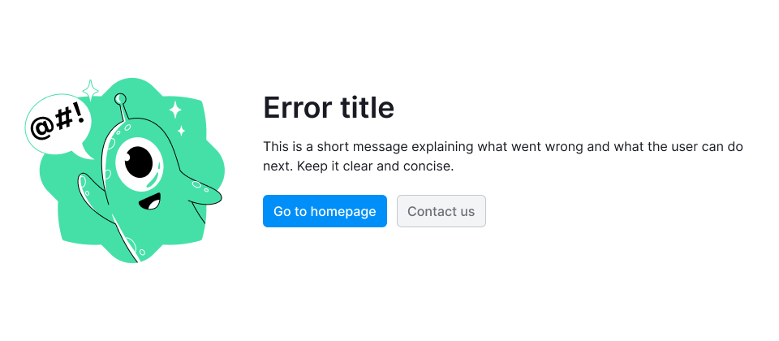

## Appearance

### Positioning on page

Center the message on the page horizontally and vertically.

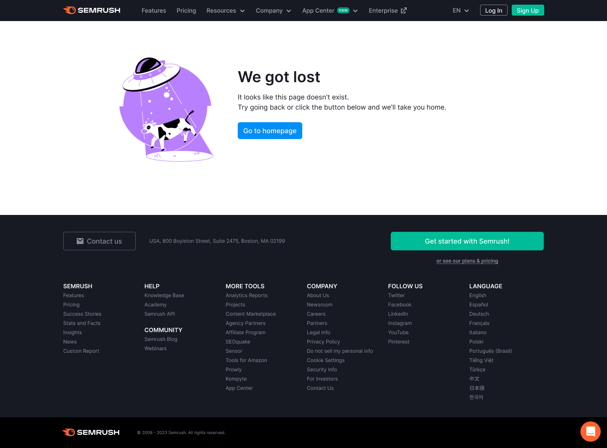

### Appearance on small screens

For viewports less than 648px in width:

- message layout changes to vertical
- illustration's size changes to 200px * 200px
- message paddings are reduced

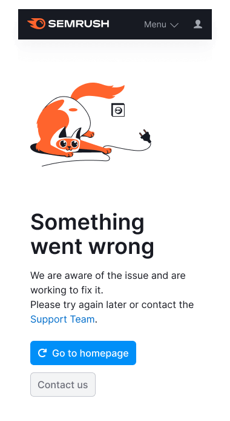

## Page not found

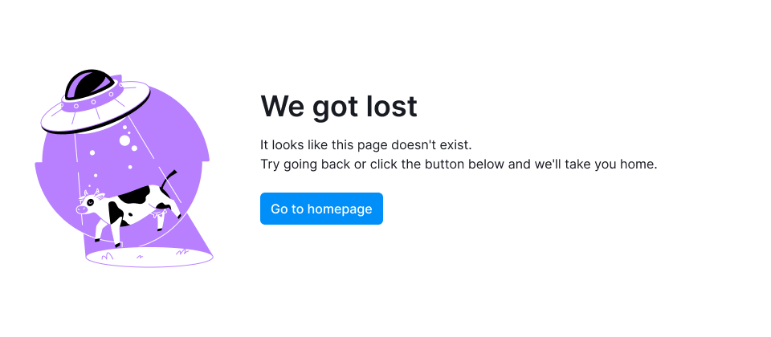

Illustration can be found in the [internal Figma library](https://www.figma.com/design/EWdX1ly5KsoNu8sywYJdKk/%F0%9F%92%A0-UX-Patterns?node-id=12537-41788).

::: info We got lost
It looks like this page doesn't exist. 
Try going back or click the button below and we'll take you home.  

**Controls:**
- Go to homepage (when logged out, leads to the main Semrush; when logged in, leads to the Dashboard)
:::

## Project not found

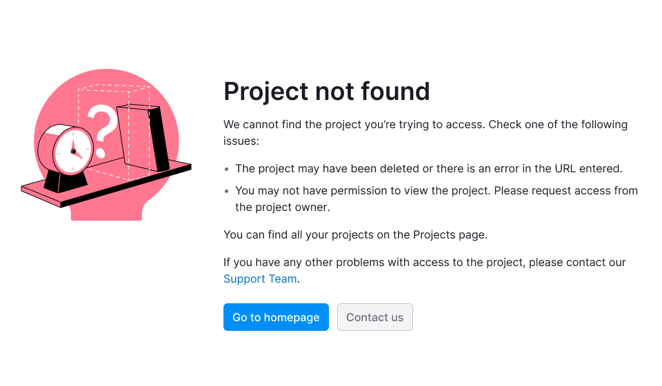

Illustration can be found in the [internal Figma library](https://www.figma.com/design/EWdX1ly5KsoNu8sywYJdKk/%F0%9F%92%A0-UX-Patterns?node-id=12537-41788).

<!-- vale off -->
::: info Project not found

We cannot find the project you’re trying to access. Check one of the following issues:

- The project may have been deleted or there is an error in the URL entered.
- You may not have permission to view the project. Please request access from the project owner.

You can find all your projects on the Projects page.

If you have any other problems with access to the project, please contact our [Support Team](https://www.semrush.com/company/contacts/).
  

**Controls:**

- Go to Projects (leads to the projects page)
- [Contact us](https://www.semrush.com/company/contacts/)
:::
<!-- vale on -->

## Something went wrong

### Unexpected problem

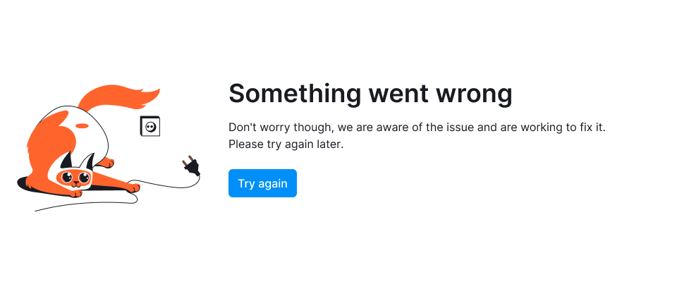

Illustration can be found in the [internal Figma library](https://www.figma.com/design/EWdX1ly5KsoNu8sywYJdKk/%F0%9F%92%A0-UX-Patterns?node-id=12537-41788).

<!-- vale off -->
::: info Something went wrong

Don't worry though, we are aware of the issue and are working to fix it. 
Please try again later.
  

**Controls:**

- Try again (reloads the page)
:::
<!-- vale on -->

### Known problem

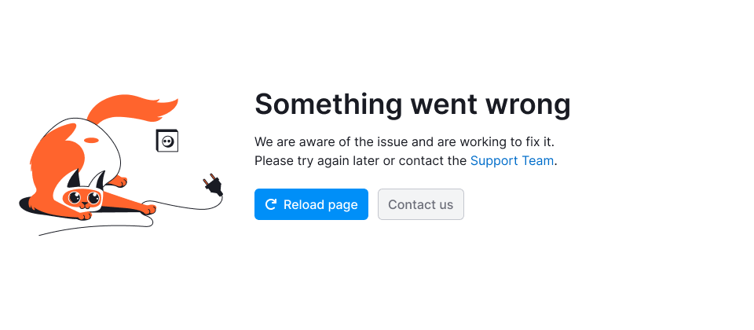

Illustration can be found in the [internal Figma library](https://www.figma.com/design/EWdX1ly5KsoNu8sywYJdKk/%F0%9F%92%A0-UX-Patterns?node-id=12537-41788).

<!-- vale off -->
::: info Something went wrong

We are aware of the issue and are working to fix it. 
Please try again later or contact the [Support Team](https://www.semrush.com/company/contacts/).
  

**Controls:**

- Reload page
- [Contact us](https://www.semrush.com/company/contacts/)
:::
<!-- vale on -->

## Under maintenance

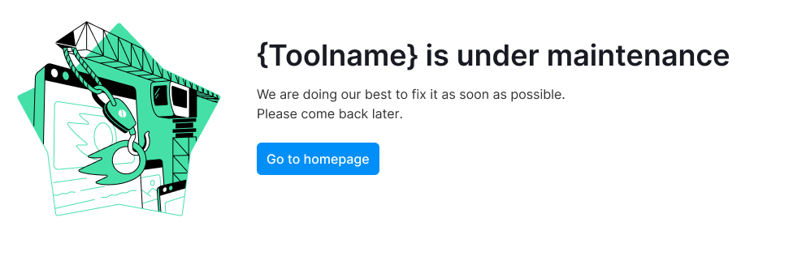

Illustration can be found in the [internal Figma library](https://www.figma.com/design/EWdX1ly5KsoNu8sywYJdKk/%F0%9F%92%A0-UX-Patterns?node-id=12537-41788).

<!-- vale off -->
::: info {product name} is under maintenance

We are doing our best to fix it as soon as possible. 
Please come back later.
  

**Controls:**

- Go to homepage (when logged out, leads to the main Semrush; when logged in, leads to the Dashboard)
:::
<!-- vale on -->

## Log in to access

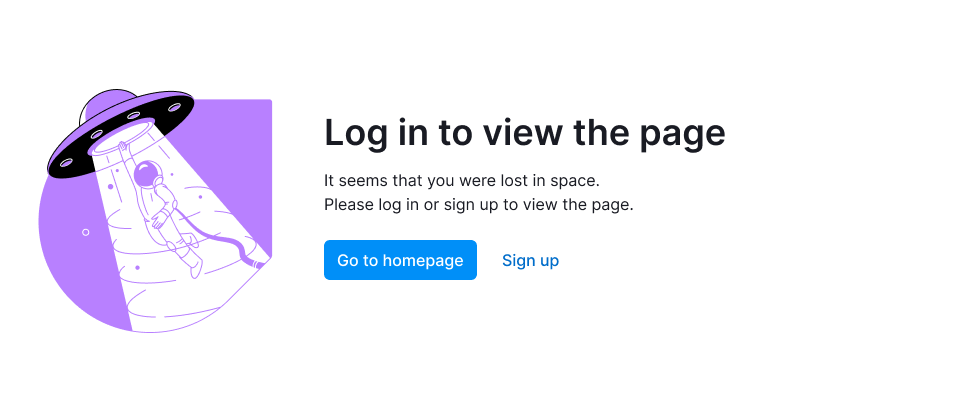

Illustration can be found in the [internal Figma library](https://www.figma.com/design/EWdX1ly5KsoNu8sywYJdKk/%F0%9F%92%A0-UX-Patterns?node-id=12537-41788).

<!-- vale off -->
::: info Log in to view the page

It seems that you were lost in space. 
Please log in or sign up to view the page.
  

**Controls:**

- Log in (leads to the log-in page)
- Sign up (leads to the sign-up page)
:::
<!-- vale on -->

## Access denied

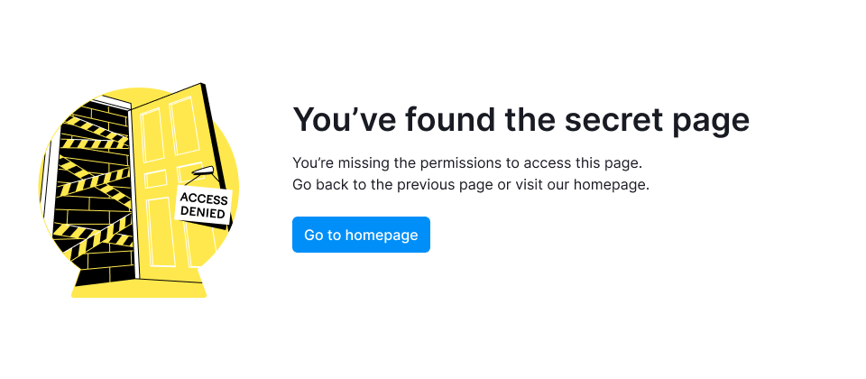

Illustration can be found in the [internal Figma library](https://www.figma.com/design/EWdX1ly5KsoNu8sywYJdKk/%F0%9F%92%A0-UX-Patterns?node-id=12537-41788).

::: info You’ve found the secret page

You’re missing the permissions to access this page. 
Go back to the previous page or visit our homepage.
  

**Controls:**

* Go to homepage (when logged out, leads to the main Semrush; when logged in, leads to the Dashboard)
:::

## Connection was lost

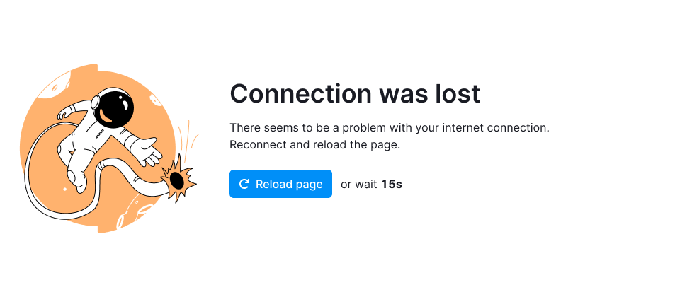

Illustration can be found in the [internal Figma library](https://www.figma.com/design/EWdX1ly5KsoNu8sywYJdKk/%F0%9F%92%A0-UX-Patterns?node-id=12537-41788).

::: info Connection was lost

There seems to be a problem with your internet connection. 
Reconnect and reload the page.
  

**Controls:**

- Reload page
- or wait **{XX}s** (counts down to 0 and reloads the page automatically)
:::

## Connection timed out

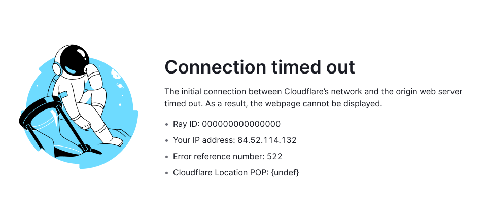

Illustration can be found in the [internal Figma library](https://www.figma.com/design/EWdX1ly5KsoNu8sywYJdKk/%F0%9F%92%A0-UX-Patterns?node-id=12537-41788).

<!-- vale off -->
::: info Connection timed out

The initial connection between Cloudflare’s network and the origin web server timed out. As a result, the webpage cannot be displayed.

- Ray ID: \{000000000000000\}
- Your IP address: \{84.52.114.132\}
- Error reference number: 522
- Cloudflare Location POP: \{undef\}
:::
<!-- vale on -->

## Blocked (Bad) request

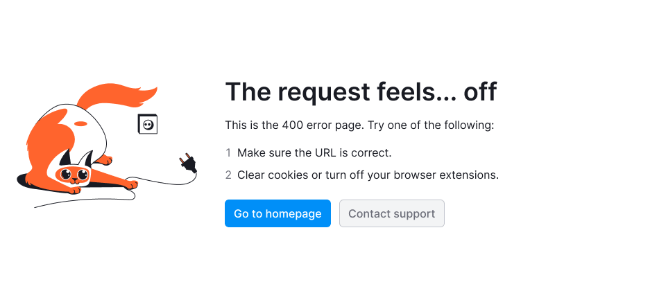

Illustration can be found in the [internal Figma library](https://www.figma.com/design/EWdX1ly5KsoNu8sywYJdKk/%F0%9F%92%A0-UX-Patterns?node-id=12537-41788).

::: info The request feels... off

This is the 400 error page. Try one of the following:

1. Make sure the URL is correct.
2. Clear cookies or turn off your browser extensions.
  

**Controls:**

- Go to homepage (when logged out, leads to the main Semrush; when logged in, leads to the Dashboard)
- [Contact support](https://www.semrush.com/company/contacts/)
:::

## Confirmation

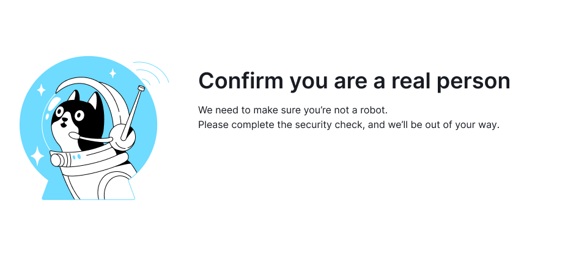

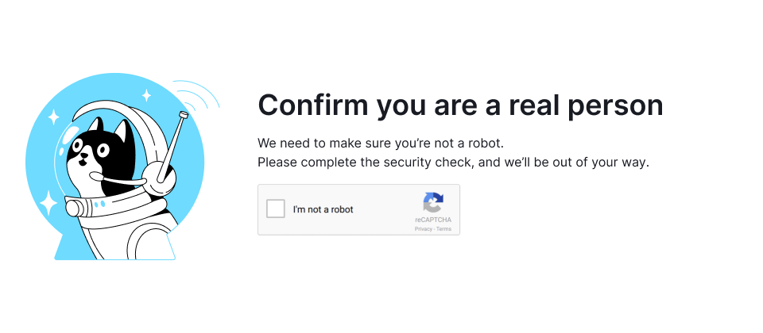

Illustration can be found in the [internal Figma library](https://www.figma.com/design/EWdX1ly5KsoNu8sywYJdKk/%F0%9F%92%A0-UX-Patterns?node-id=12537-41788).

<!-- vale off -->
::: info Confirm you are a real person

We need to make sure you’re not a robot. 
Please complete the security check, and we’ll be out of your way.
  

**Controls:**

- Submit (confirms the action, then we take the user to the page where they were going)

or
- Captcha (confirms the action, then we take the user to the page where they were going)
:::
<!-- vale on -->

<!-- vale off -->
## Payment cannot be accepted

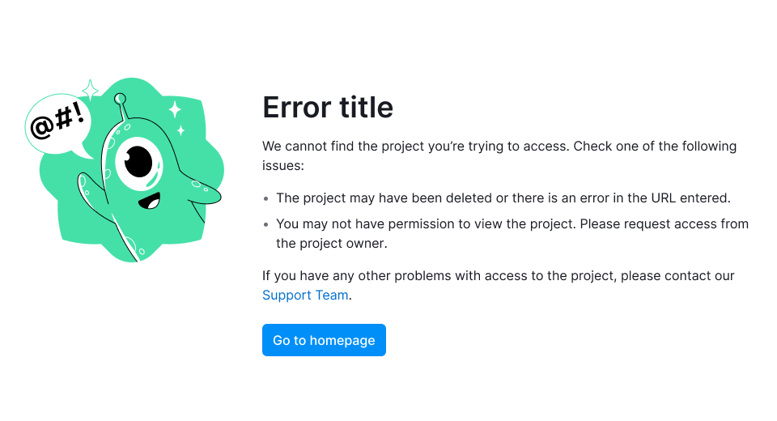

Illustration can be found in the [internal Figma library](https://www.figma.com/design/EWdX1ly5KsoNu8sywYJdKk/%F0%9F%92%A0-UX-Patterns?node-id=12537-41788).

::: info Your payment cannot be accepted

Unfortunately, we don’t accept payments from {country}.
  

**Controls:**

- Go to homepage
:::
<!-- vale on -->

## DNS Resolution Error

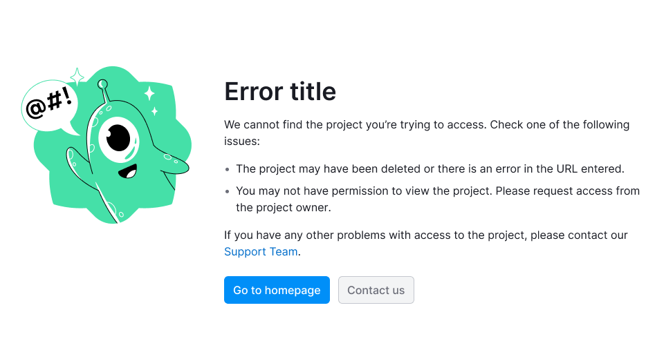

Illustration can be found in the [internal Figma library](https://www.figma.com/design/EWdX1ly5KsoNu8sywYJdKk/%F0%9F%92%A0-UX-Patterns?node-id=12537-41788).

<!-- vale off -->
::: info DNS resolution error

You've requested a page on a website (cloudflarepreview.com) that is on the Cloudflare network. Cloudflare is currently unable to resolve your requested domain (cloudflarepreview.com). There are two potential causes of this:

- Most likely: if the owner just signed up for Cloudflare it can take a few minutes for the website's information to be distributed to our global network.

- Less likely: something is wrong with this site's configuration. Usually this happens when accounts have been signed up with a partner organization (for example, a hosting provider) and the provider's DNS fails.
  

- Ray ID: \{000000000000000\}

- Timestamp: \{Thu, 01-Jan-70 00:00:00 GMT\}

- Your IP address: \{84.52.114.132\}

- Requested URL: \{example.URL/foo\}

- Error reference number: 1001

- Server ID: \{FL_FOO\}

- User-Agent: \{Example\}
:::
<!-- vale on -->

## Global errors usage

**When do we use it?**

In case of an error defined by the HTTP state code.

- DNS resolution error (1xx)
- Access denied – Access request (403)
- Page not found, Project not found (404)
- Connection lost (408)
- Something went wrong (500, 520)
- Connection timed out (522)

In case of a state caused by security reasons:

- Blocked request
- Confirmation

Additional situations where the state blocks all content and restricts access to it:

<!-- vale DevDocs.Contractions = NO -->
- Your account has been deleted
- Under maintenance
- Your payment cannot be accepted
<!-- vale DevDocs.Contractions = YES -->

### Use cases

There are two possible cases of the pattern's use:

- As a full-page for the whole website.
- As a state of the product.

::: tip
The position is the same in both cases: the message is centered both vertically and horizontally on the page.
:::

| For the whole website                                | In the product                                             |
| ---------------------------------------------------- | ---------------------------------------------------------- |
| 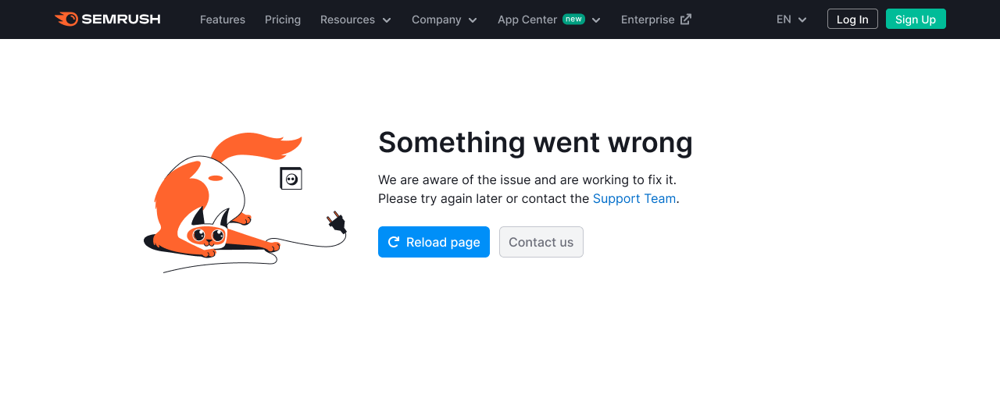 | 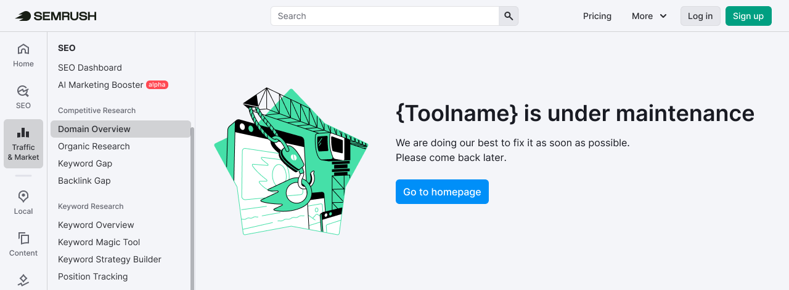 |

### Controls

1. If the error is processed by Cloudflare, don't add buttons.
2. In other cases, it's recommended to add controls allowing the user:
    - to leave the page, such as **Go to homepage**
    - to handle the problem and reload the page, such as **Reload page**, **Try again**, or **Submit**
3. The **Contact us** button is only used for unexpected errors, so that the user can contact support and report the problem.
