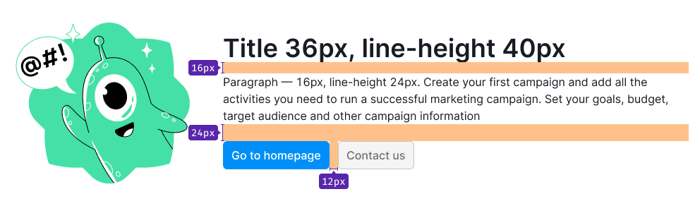
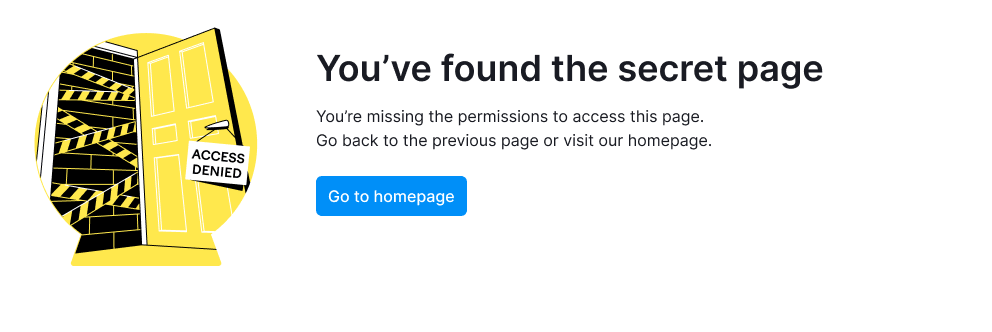
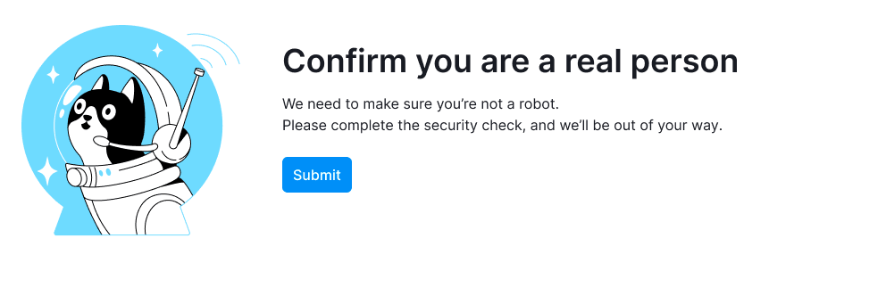
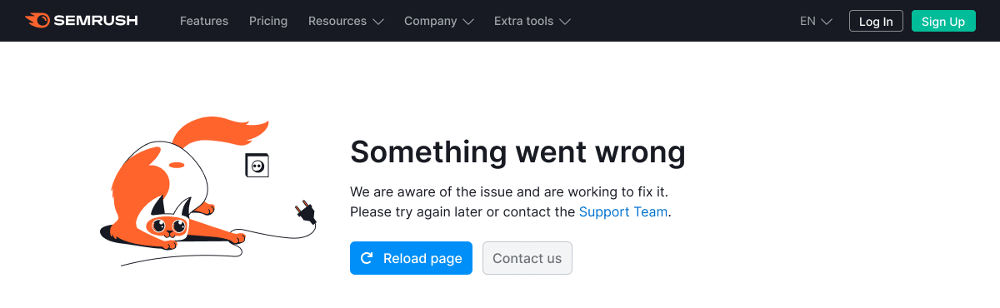

@## Description

**Error message** is a component for displaying error message on the page. Use it for global error messages. Global errors is a pattern for pages blocking the user from working with the website, and informing why the system can't display the content. This pattern is also related to server errors, limitations, etc.

@## Appearance

Composition, styles, and margins of the message:

- For an image in svg format use `width: 240px; height: 240px; margin-right: 40px;`.
- For title use text with 36px size (`--fs-700; --lh-700;`), `--gray-800` color and `margin-bottom: 16px`.
- For message text use text with 14px size (`--fs-200`,`--lh-200`), `--gray-800` color and `margin-bottom: 24px`.
- For CTA use buttons with L size (optional).
- Captcha (optional).

> 💡 Be brief. Don't write too long message in the state description. Two or three small sentences usually are enough.

### Margins

- Margin between the illustration and the message is 40px.
- Maximum width of the message is 640px. Top margin of the container with the message is 32px.

### Positioning on the page

The message is centered horizontally and vertically. Give a container with an error message a relative height — `height: height: 70vh;`.

### Apperance on small screens

For screens less than 768px:

- change layout of the message to vertical;
- change illustration's size to 200px \* 200px;
- change margin between the illustration and a message from 40px to 8px;
- stretch controls to the width of the content.

@## Page not found

Illustration you can find in the [inner Figma library](https://www.figma.com/file/EWdX1ly5KsoNu8sywYJdKk/?node-id=2482%3A102726).

**Title**

We got lost

**Message**

It looks like this page doesn't exist. Try going back or click the button below and we'll take you home.

**Controls**

Go to homepage (if not logged in, it leads you to the main Semrush; if logged in, it leads you to the Dashboard).

@## Project not found

Illustration you can find in the [inner Figma library](https://www.figma.com/file/EWdX1ly5KsoNu8sywYJdKk/?node-id=2482%3A105405).

**Title**

Project not found

**Message**

We cannot find the project you’re trying to access. Check one of the following issues:

- The project may have been deleted or there is an error in the URL entered.
- Maybe you don’t have permission to view the project. Please request access from the project owner.

You can find all your projects on the Projects page.

If you have any other problems with access to the project, please contact our [Support Team](https://www.semrush.com/kb/support/).

**Controls**

- Go to Projects (leads you to the projects page).
- Contact us (sends the user to the [support page](https://www.semrush.com/kb/support/)).

@## Something went wrong

### When you don't know what the problem is

Illustration you can find in the [inner Figma library](https://www.figma.com/file/EWdX1ly5KsoNu8sywYJdKk/?node-id=2484%3A102761).

**Title**

Something went wrong

**Message**

We are aware of the issue and are working to fix it. Please try again later or contact the [Support Team](mailto:semrush-email@semrush.com).

**Controls**

Reload page (refreshes the page).

### When you know, what the problem is

Illustration you can find in the [inner Figma library](https://www.figma.com/file/EWdX1ly5KsoNu8sywYJdKk/?node-id=2484%3A105950).

**Title**

Something went wrong

**Message**

Don't worry though, we are aware of the issue and are working to fix it.

Please try again later.

**Controls**

Try again (refreshes the page).

@## Under maintenance

Illustration you can find in the [inner Figma library](https://www.figma.com/file/EWdX1ly5KsoNu8sywYJdKk/?node-id=2484%3A107925).

**Title**

{name tool} is under maintenance

**Message**

We are doing our best to fix it as soon as possible. Please come back later.

**Controls**

Go to homepage (if not logged in, it leads you to the main Semrush; if logged in, it leads you to the Dashboard).

@## Log in to access

Illustration you can find in the [inner Figma library](https://www.figma.com/file/EWdX1ly5KsoNu8sywYJdKk/?node-id=2484%3A115802).

**Title**

Log in to view the page

**Message**

It seems that you were lost in space. Please log in or sign up to view the page.

**Controls**

- The "Log in" button leads to a page with a login form.
- The "Sign up" button leads to the same page, but with the registration form.

@## Access denied

Illustration you can find in the [inner Figma library](https://www.figma.com/file/EWdX1ly5KsoNu8sywYJdKk/?node-id=2484%3A118562).

**Title**

You’ve found the secret page

**Message**

You’re missing the administrator permissions to access this page.
Go back to the previous page or visit our homepage.

**Controls**

Go to homepage (if not logged in, it leads you to the main Semrush; if logged in, it leads you to the Dashboard).

@## Connection was lost

Illustration you can find in the [inner Figma library](https://www.figma.com/file/EWdX1ly5KsoNu8sywYJdKk/?node-id=2484%3A110472).

**Title**

Connection was lost

**Message**

There seems to be a problem with your internet connection.

Reconnect and reload the page.

**Controls**

- Reload page (refreshes the page).
- or wait {XX}s

@## Connection timed out

Illustration you can find in the [inner Figma library](https://www.figma.com/file/EWdX1ly5KsoNu8sywYJdKk/?node-id=2484%3A113086).

**Title**

Connection timed out

**Message**

The initial connection between Cloudflare’s network and the origin web server timed out. As a result, the webpage cannot be displayed.

- Ray ID: {000000000000000}
- Your IP address: {84.52.114.132}
- Error reference number: 522
- Cloudflare Location POP: {undef}

@## Blocked (Bad) request

Illustration you can find in the [inner Figma library](https://www.figma.com/file/EWdX1ly5KsoNu8sywYJdKk/?node-id=2842%3A114910).

**Title**

The request feels... off

**Message**

This is the 400 error page. Try one of the following:

1. Make sure the URL is correct.
2. Clear cookies or turn off your browser extensions.

**Controls**

- Go to homepage (if not logged in, it leads you to the main Semrush; if logged in, it leads you to the Dashboard).
- Contact support.

@## Confirmation

Illustration you can find in the [inner Figma library](https://www.figma.com/file/EWdX1ly5KsoNu8sywYJdKk/?node-id=2484%3A123668).

**Title**

Confirm you are a real person

**Message**

We need to make sure you’re not a robot.

Please complete the security check, and we’ll be out of your way.

**Controls**

- Submit (confirms the action, then we take the user to the page where he was going).
- Captcha (confirms the action, then we take the user to the page where he was going).

@## Payment cannot be accepted

Illustration you can find in the [inner Figma library](https://www.figma.com/file/EWdX1ly5KsoNu8sywYJdKk/?node-id=2484%3A128860).

**Title**

Your payment cannot be accepted

**Message**

Unfortunately, we do not accept payments from {Russian Federation}.

**Controls**

Go to Dashboard (leads user to the Dashboard)..

@## DNS Resolution Error

Illustration you can find in the [inner Figma library](https://www.figma.com/file/EWdX1ly5KsoNu8sywYJdKk/?node-id=2482%3A94736).

**Title**

DNS resolution error

**Message**

You've requested a page on a website ([cloudflarepreview.com](http://cloudflarepreview.com/)) that is on the Cloudflare network. Cloudflare is currently unable to resolve your requested domain ([cloudflarepreview.com](http://cloudflarepreview.com/)). There are two potential causes of this:

- Most likely: if the owner just signed up for Cloudflare it can take a few minutes for the website's information to be distributed to our global network.

- Less likely: something is wrong with this site's configuration. Usually this happens when accounts have been signed up with a partner organization (e.g., a hosting provider) and the provider's DNS fails.

  - Ray ID: {000000000000000}

  - Timestamp: {Thu, 01-Jan-70 00:00:00 GMT}

  - Your IP address: {84.52.114.132}

  - Requested URL: {example.url/foo}

  - Error reference number: 1001

  - Server ID: {FL_FOO}

  - User-Agent: {Example}

@## Global errors usage

**When do we use it?**

In case of an error defined by the HTTP state code.

- DNS resolution error (1xx)
- Access denied — Access request (403)
- Page not found, Project not found (404)
- Connection lost (408)
- Something went wrong (500, 520)
- Connection timed out (522)

In case of a state caused by security reasons:

- Blocked request
- Confirmation

Additional situations where the state blocks all content and restricts access to it:

- Your account has been deleted
- Project not found
- Under maintenance
- Your payment cannot be accepted

### Use cases

There are two possible cases of the pattern's use:

- As a full-page for the whole website.
- As a state of the product.

> 💡 The location is the same in both cases: the placeholder is centered vertically and horizontally on the page.

| For the whole website                                | In the product                                             |
| ---------------------------------------------------- | ---------------------------------------------------------- |
|  |  |

### Controls

1. If the error is processed by Cloudflare, we don't add buttons.
2. In other cases, it is recommended to add controls allowing the user:
   2.1 to leave the page:" Go to homepage";
   2.2 to take some actions to get rid of this state and load the page: "Reload page" / "Try again" / "Submit".
3. The "Contact us" button is only used for unexpected error states. In order that the user could contact support and report that something is not working.

@page global-errors-a11y
@page global-errors-api
@page global-errors-code
@page global-errors-changelog
