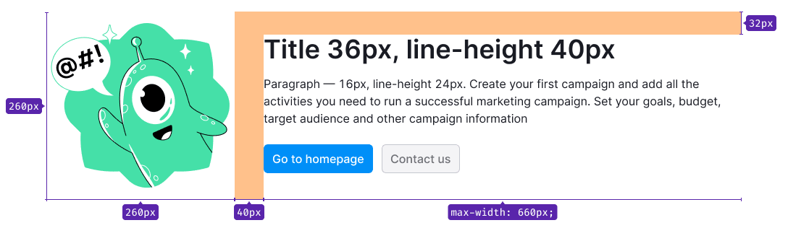
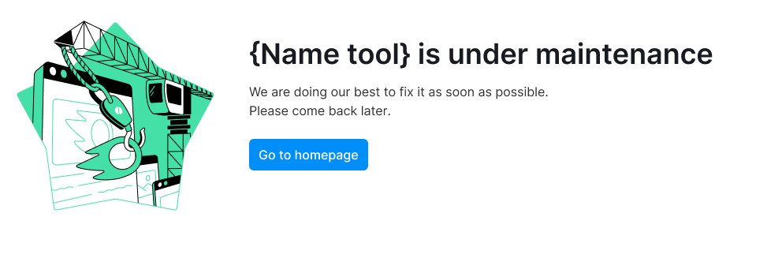
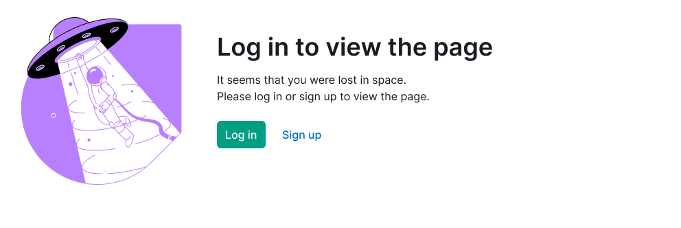

@## Description

**Global errors** are pages blocking the user from working with the site, and informing why we can't display the content. They may also be related to server errors, limitations, etc.

@## Appearance

Composition, styles, and margins inside the error block:

- an image in svg format, `width: 240px; height: 240px; margin-right: 80px;`;
- the heading state, `h2 [--fs-700],$gray20`, `margin-bottom: 16px`;
- state description, `p — 14px [--fs-200], $gray20`, `margin-bottom: 24px;`;
- controls of size L (optional for some states);
- captcha (optional for some states).

> 💡 Be brief. Don't write too much text in the state description. Two or three small sentences are enough.

### Spacing

- Padding between the illustration and the block with the content is 80px;
- The block width is not less than 320px, not more than 640px. There is a fixed spacing from the top edge of the box – 32px.

### Positioning on the page

The block with an error is centered horizontally and vertically. A block that includes an error block is given a relative height — `height: height: 70vh;`.

@## Page not found

[Image source](https://drive.google.com/drive/folders/1hXKRAyq23ETAVc3Y4a4h1fFOpJv6qqMb)

**Heading** — Page not found

**Message**

We can't find the page you're looking for. You can either return to the previous page or visit our homepage.

**Button**

- Visit homepage (if not logged in, it leads you to the main Semrush; if logged in, it leads you to the Dashboard).

@## Project not found

[Image source](https://drive.google.com/drive/folders/1hXKRAyq23ETAVc3Y4a4h1fFOpJv6qqMb)

**Heading** — Project not found

**Message**

We cannot find the project you’re trying to access. Check one of the following issues:

- The project may have been deleted or there is an error in the URL entered.
- Maybe you don’t have permission to view the project. Please request access from the project owner.

You can find all your projects on the Projects page.

If you have any other problems with access to the project, please contact our [Support Team](https://www.semrush.com/kb/support/).

**Controls**

- Go to Projects (leads you to the projects page).
- Contact us (sends the user to the [support page](https://www.semrush.com/kb/support/)).

@## Something went wrong

### When you don't know what the problem is

[Image source](https://drive.google.com/drive/folders/1hXKRAyq23ETAVc3Y4a4h1fFOpJv6qqMb)

**Heading** — Something went wrong

**Message**

There seems to be a problem with the server. Try to reload the page.

If the problem persists, please contact us at {semrush-email@semrush.com}

**Button**

- Reload page (refreshes the page).

### When you know, what the problem is

[Image source](https://drive.google.com/drive/folders/1hXKRAyq23ETAVc3Y4a4h1fFOpJv6qqMb)

**Heading** — Something went wrong

**Message**

Don't worry though, we are aware of the issue and are working to fix it.

Please try again later.

**Button**

- Try again (refreshes the page).

@## Under maintenance

[Image source](https://drive.google.com/drive/folders/1hXKRAyq23ETAVc3Y4a4h1fFOpJv6qqMb)

**Heading** — {name tool} is undergoing maintenance

**Message**

We will be up again on {Oct 23, 2017 at 11:30 AM}.

**Button**

- Visit homepage (if not logged in, it leads you to the main Semrush; if logged in, it leads you to the Dashboard).

@## Log in to access

[Image source](https://drive.google.com/drive/folders/1hXKRAyq23ETAVc3Y4a4h1fFOpJv6qqMb)

**Heading** — Log in or sign up to see the page

**Message**

It seems that you were lost in space.

Please log in or sign up to see the page.

**Controls**

- The `Log in` button leads to a page with a login form.
- The `Sign up` button leads to the same page,but with the registration form.

@## Access denied

[Image source](https://drive.google.com/drive/folders/1hXKRAyq23ETAVc3Y4a4h1fFOpJv6qqMb)

**Heading** — You’ve found the secret page

**Message**

You’re missing the administrator permissions to access this page.
Go back to the previous page or visit our homepage.

**Button**

- Visit homepage (if not logged in, it leads you to the main Semrush; if logged in, it leads you to the Dashboard).

@## Connection was lost

[Image source](https://drive.google.com/drive/folders/1hXKRAyq23ETAVc3Y4a4h1fFOpJv6qqMb)

**Heading** — Connection was lost

**Message**

There seems to be a problem with your internet connection.

Reconnect and reload the page.

**Button**

- Reload page (refreshes the page).
- or wait {XX}s

@## Connection timed out

[Image source](https://drive.google.com/drive/folders/1hXKRAyq23ETAVc3Y4a4h1fFOpJv6qqMb)

**Heading** — Connection timed out

**Message**

The initial connection between Cloudflare’s network and the origin web server timed out. As a result, the webpage cannot be displayed.

- Ray ID: {000000000000000}
- Your IP address: {84.52.114.132}
- Error reference number: 522
- Cloudflare Location POP: {undef}

@## Blocked request

[Image source](https://drive.google.com/drive/folders/1hXKRAyq23ETAVc3Y4a4h1fFOpJv6qqMb)

**Heading** — Blocked request

**Message**

Our security system has detected suspicious activity on your account and blocked this request. If you think we made a mistake, please contact us at security@semrush.com and provide us with all the necessary details: the requested URL and your email account.

Your IP: {84.52.114.132}

@## Confirmation

[Image source](https://drive.google.com/drive/folders/1hXKRAyq23ETAVc3Y4a4h1fFOpJv6qqMb)

**Heading** — Confirm you are a real person

**Message**

We need to make sure you’re not a robot.

Please complete the security check, and we’ll be out of your way.

**Controls**

- Submit (confirms the action, then we take the user to the page where he was going).
- Captcha (confirms the action, then we take the user to the page where he was going).

@## Payment cannot be accepted

[Image source](https://drive.google.com/drive/folders/1hXKRAyq23ETAVc3Y4a4h1fFOpJv6qqMb)

**Heading** — Your payment cannot be accepted

**Message**

Unfortunately, we do not accept payments from {Russian Federation}.

**Button**

- Go to Dashboard (leads user to the Dashboard)..

@## DNS Resolution Error

[Image source](https://drive.google.com/drive/folders/1hXKRAyq23ETAVc3Y4a4h1fFOpJv6qqMb)

**Heading** — DNS resolution error

**Message**

You've requested a page on a website ([cloudflarepreview.com](http://cloudflarepreview.com/)) that is on the Cloudflare network. Cloudflare is currently unable to resolve your requested domain ([cloudflarepreview.com](http://cloudflarepreview.com/)). There are two potential causes of this:

- Most likely: if the owner just signed up for Cloudflare it can take a few minutes for the website's information to be distributed to our global network.

- Less likely: something is wrong with this site's configuration. Usually this happens when accounts have been signed up with a partner organization (e.g., a hosting provider) and the provider's DNS fails.

  - Ray ID: {000000000000000}

  - Timestamp: {Thu, 01-Jan-70 00:00:00 GMT}

  - Your IP address: {84.52.114.132}

  - Requested URL: {example.url/foo}

  - Error reference number: 1001

  - Server ID: {FL_FOO}

  - User-Agent: {Example}

@## Use of global errors

**When do we use it?**

In case of an error defined by the HTTP state code.

- DNS resolution error (1xx)
- Access denied — Access request (403)
- Page not found, Project not found (404)
- Connection lost (408)
- Something went wrong (500, 520)
- Connection timed out (522)

In case of a state caused by security reasons:

- Blocked request
- Confirmation

Additional situations where the state blocks all content and restricts access to it:

- Your account has been deleted
- Project not found
- Under maintenance
- Your payment cannot be accepted

### Use cases

Pages with global errors assume 2 options of use:

- As a full-page placeholder (leaving only the top menu and footer).
- As a placeholder on the product (leaving the top and left menus + footer). Used for products if only they have the error.

| On the full page                                     | On the product                                             |
| ---------------------------------------------------- | ---------------------------------------------------------- |
|  |  |

> 💡 The location is the same in both cases: the placeholder is centered vertically and horizontally in the area.

### Controls

1. If the error is processed by Cloudflare, we don't add buttons.
2. In other cases, it is recommended to add controls allowing the user:
   2.1 to leave the page: `Visit Homepage`;
   2.2 to take some actions to get rid of this state and load the page: `Reload page`/`Try again`/`Submit`.
3. The `Contact us` button is only used for unexpected error states. In order that the user could contact support and notify us that something is not working. In cases where we anticipated an error here and know that this state is being displayed, the button is not needed.

@page global-errors-api
@page global-errors-code
@page global-errors-changelog
