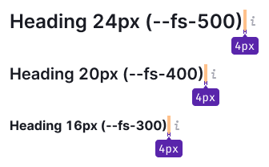
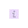
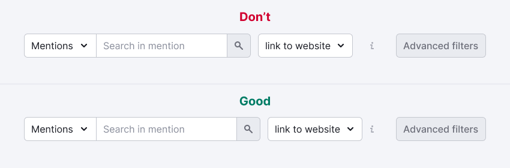
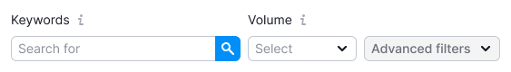

## Description

**Informer** is a pattern used to visually indicate hints within the interface. It is useful when there is limited space to add, for example, a [hint link](/style/typography/typography) alongside a component.

## Appearance

The informer consists of the following elements:

- `Info` icon with `margin-left: 4px`
- [Tooltip](/components/tooltip/tooltip) containing the hint message (appears upon hovering over the icon)

::: tip
Avoid using the `Info` icon with the `h1` title. This title typically pertains to hero blocks and similar elements. Adding hints to the main page title might seem unusual.
:::

Table: Info icon with different title sizes

| Font size         | Icon size | Usage          |
| ----------------- | --------- | -------------- |
| 36px (`--fs-700`), 32px (`--fs-600`) | L         | Use exclusively for the largest titles and controls.                 |
| Smaller than 24px (`--fs-500`)       | M         | Suitable for text sizes smaller than 24px.    |

## Interaction

Table: Informer states

| State  | Appearance example       | Styles       |
| ------ | ------------------------ | ------------ |
| Normal |                   | `background-color: var(--icon-secondary-neutral)`                              |
| Hover  |  | The icon color doesn't change on hover. Only cursor changes to `cursor: help`. |

## Click zone

Table: Informer click zone

| Icon size | Target zone size  | Appearance example           |
| --------- | ----------------- | ---------------------------- |
| L         | 24px * 24px       |  |
| M         | 16px * 16px       |  |

## Tooltip

For comprehensive details, refer to the [Tooltip](/components/tooltip/tooltip).

## Usage in UX/UI

When the `Info` icon contains supplementary information about a control within a group of controls (for example, filters), pay attention to margins.

When controls are accompanied by text labels, position the `Info` icon adjacent to the labels.

