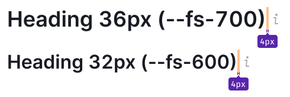
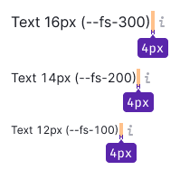
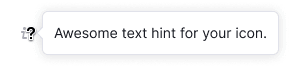

@## Description

**Informer** is a pattern used for visual marking of hints in the interface.

It is required when there is no space or possibility to put, for example, [hint link](/style/typography/) next to the component.

@## Appearance

The informer consists of:

- Info icon with `margin-left: 4px`;
- [tooltip](/components/tooltip/) with a hint message (appears when you hover over the icon).

> 💡 The Info icon shouldn't be used with the h1 title. This is usually the title of hero blocks, etc. Hiding hints in an info icon next to the main page's title is strange, isn't it? 😎

| Font size                            | Icon size | Use                                                                  |
| ------------------------------------ | --------- | -------------------------------------------------------------------- |
| 36px (`--fs-700`), 32px (`--fs-600`) | L         | Use only with the largest titles and controls.                       |
|                                      |           |                |
| Smaller tnah 24px (`--fs-500`)       | M         | Use with text sizes smaller than 24px.                               |
|                                      |           |                 |
|                                      |           |                     |
|                                      |           |  |

@## Interaction

| State  | Appearance example                             | Styles                                                                          |
| ------ | ---------------------------------------------- | ------------------------------------------------------------------------------- |
| normal |                   | `background-color: --var(--gray-300);`                                          |
| hover  |  | The icon color doesn't change on hover. Only cursor changes to `cursor: help;`. |

@## Click zone

| Icon size | The size of the click zone                             |
| --------- | ------------------------------------------------------ |
| L         | `24px * 24px`                                          |
|           |  |
| M         | `16px * 16px`                                          |
|           |  |

@## The tooltip

See detailed infromation in the [Tooltip guide](/components/tooltip/).

@## Use in UX/UI

If the Info icon hides additional information about the control in a group of controls (for example, in filters), then pay attention to margins.

In the case when controls have text labels, place Info icon next to the labels.

@page informer-code
