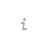
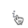

## Description

**Informer** is a pattern used to show rich tooltips within the interface. It's useful when there is limited space to add, for example, a [hint link](/style/typography/typography#hints-hint-links) alongside a component.

## Appearance

The informer consists of the following elements:

- [ButtonLink](../../components/button/button#button-with-link-styles) with the `Info` icon and without text, with `margin-left: 4px`
- [DescriptionTooltip](/components/tooltip/tooltip) with the message (appears on clicking or pressing Enter/Space on the icon)

::: tip
Avoid using the `Informer` with the `h1` title. This title typically pertains to hero blocks and similar elements. Adding tooltips to the main page title might seem unusual.
:::

Table: Info icon with different title sizes

| Font size                            | Icon size | Usage          |
| ------------------------------------ | --------- | -------------- |
| 36px (`--fs-700`), 32px (`--fs-600`) | L         | Use exclusively for the largest titles and controls.                 |
| Smaller than 24px (`--fs-500`)       | M         | Suitable for text sizes smaller than 24px.    |

## Interaction

Table: Informer states

| State          | Appearance example          | Styles       |
| -------------- | --------------------------- | ------------ |
| Normal         |         | `color: var(--intergalactic-icon-secondary-neutral)`                              |
| Hover, active  |  | `color: var(--intergalactic-icon-secondary-neutral-hover-active)`, `cursor: pointer`. |

## Click zone

Table: Informer click zone

| Icon size | Target zone size  | Appearance example           |
| --------- | ----------------- | ---------------------------- |
| L         | 24px * 24px       |  |
| M         | 16px * 16px       |  |

## Tooltip

For comprehensive details, refer to [Tooltip](/components/tooltip/tooltip).

## Usage in UX/UI

When the `Informer` contains supplementary information about a control within a group of controls (for example, filters), pay attention to margins.

When controls are accompanied by text labels, position the `Informer` adjacent to the labels.

