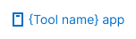
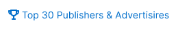
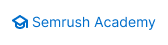
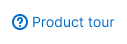
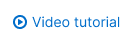

Place additional links in the upper right corner of [ProductHead](/components/product-head/) in the following order:

| Link name                                                   | Description                                                                         | Appearance example                |
| ----------------------------------------------------------- | ----------------------------------------------------------------------------------- | --------------------------------- |
| **Old version**                                             | Switches to the old version of the page.                                            |   |
| **App name**                                                | Opens page with application on the relevant platforms.                              |   |
| **API**                                                     | Opens page with the API description.                                                |   |
| **Top data (for example, Top 30 Publishers & Advertisers)** | Opens a page/modal with a certain data.                                             |   |
| **Check out the (article title)**                           | Opens blog article.                                                                 |   |
| **News**                                                    | Opens the modal window with product news.                                           |   |
| **Semrush Academy**                                         | Opens page with certain [Semrush Academy course](https://www.semrush.com/academy/). |   |
| **FAQ**                                                     | Opens a modal window or page with the FAQ.                                          |   |
| **Product tour**                                            | Launches a product tour.                                                            |   |
| **Video tutorial**                                          | Opens a modal window with the video.                                                |  |
| **User manual**                                             | Opens page with manual in the Knowledge Base.                                       |  |
| **Send feedback**                                           | Opens dropdown with feedback form.                                                  |  |

> For more information about link styles, check the guide for [Link](/components/link/).
