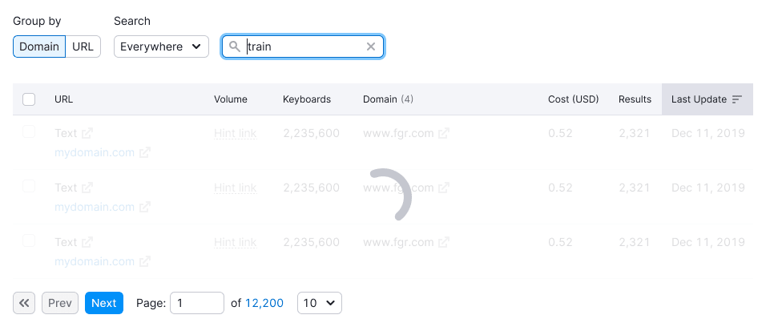

## Description

These components are employed to manage user expectations:

- [SpinContainer](/components/spin-container/spin-container) / [Spin](/components/spin/spin)
- [Skeleton](/components/skeleton/skeleton)
- [ProgressBar](/components/progress-bar/progress-bar)

**Use them for different cases.** For detailed insights into each component, refer to their guides.

::: tip
Ensure that the container housing the loading message has margins. This prevents the container from becoming tightly attached to other elements on the page during cases like viewport size adjustments. The margin values are usually multiples of 4 (for example, for the spinner, we recommend using `margin: 40px`).
:::

## Response from system

### Lazy loading

When you possess insight into the loading time of a page, apply the "Lazy Loading" principle to load the page.

For instance, if you know that a landing page loads quickly, you can progressively load elements without displaying either the spinner or the skeleton. Essential functionality, such as input fields and submit buttons, appear first, followed by illustrations and marketing content.

### Page loading

In all other circumstances, implement [Skeleton](/components/skeleton/skeleton) to display while the page loads.

A delay of `600ms` should be incorporated before the skeleton becomes visible across all products. This delay mitigates flickering during transitions between products.

## Usage rules

### Skeleton

**Use it for:**

- Initial data loading.
- Displaying the structure of loading pages and data.
- Loading new data.

### SpinContainer

**Use it while:**

- Filtering substantial data within widgets/tables/pages.
- Sorting significant data within widgets/tables/pages.
- Conducting data searches.

::: tip
If the loading process is rapid, this state can be omitted.
:::

### Spin

You can use [Spin](/components/spin/spin) instead of [SpinContainer](/components/spin-container/spin-container) when you need to show a loading state of a single element, such as a [table cell](/table-group/table-states/table-states#data-loading-in-cell).

### ProgressBar

Use it for scenarios where data collection extends beyond 5 seconds. This duration may differ across various widgets. For instance, within tables, if data collection takes longer than 1 minute.

