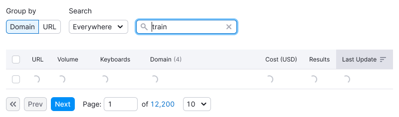
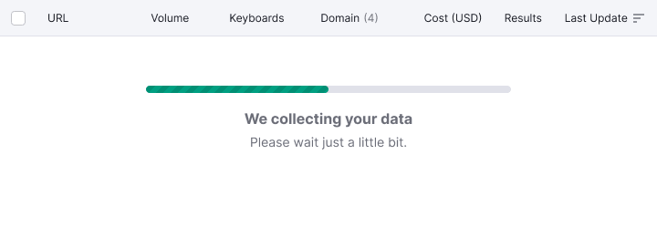

@## Description

Components that we use to work with user expectations:

- [Spin](/components/spin)
- [Skeleton](/components/skeleton)
- [ProgressBar](/components/progress-bar)

**They are used in different cases.** 🤓 For a detailed description of each component, see the guides.

> 💡 **The block that has the loading state should have spacing, so that in extreme cases, when the user changes the size of the viewport, the block with the loading does not "stick" to other blocks**. The margins depend on the block where the component is used. They are usually multiple 4. For the largest spinners use `margin: 40px`.

@## How to work with waiting for a response from the system

### Lazy loading

If we know how much it takes to load a page, and it does it quickly, we load the page using the “Lazy loading " principle.

_For example, we know that Landing Pages loads quickly. For this reason on such pages, you can load elements in turn, without showing either the spinner or the skeleton. First, important functionality appears (input and a submit button, for example), then illustrations and marketing text._

### The structure of the page when loading

In all other cases, we always show [Skeleton](/components/skeleton) when loading the page.

All tools should have a delay of `0.6ms` before the skeleton appears. This is to prevent flickering when switching from tool to tool.

### Spin as the interface's response to interaction

[Spin](/components/spin) is only used when the user interacts with a clickable interface element on the page. _For example, click on the export --> spinner button on the export button._

@## Usage rules

### [Skeleton](/components/skeleton)

#### When we use it

First data upload. Showing the structure of the loaded page and data.

- Page loading
- Initial data loading
- Uploading new data

### [Spin](/components/spin)

#### When we use it

Loading/searching data. Data is filtered/sorted/searched for no longer than 5 seconds.

> 💡 If the download is fast, you can do without this state.

- Filtering a large amount of data in a widget/table/page
- Sorting a large amount of data in a widget/table/page
- Other data operations that do not require a long wait
- Searching (if possible, show the search query)

### [ProgressBar](/components/progress-bar)

#### When we use it

Collecting data.

- In the case where data collection takes a long time, we display that data is in a process of collection.
- In different widgets this may take different time. _For example, in the table, if we collect for more than 1 minute, we show the progress bar._
- In some widgets, this data collection time **is more than 5 seconds**.
