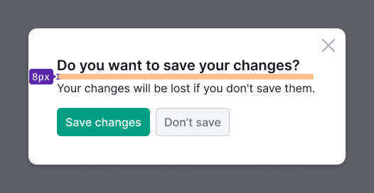
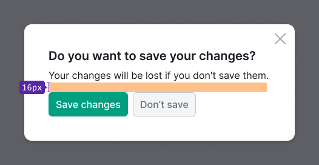
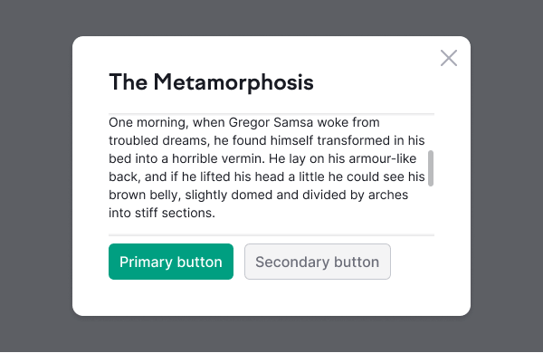
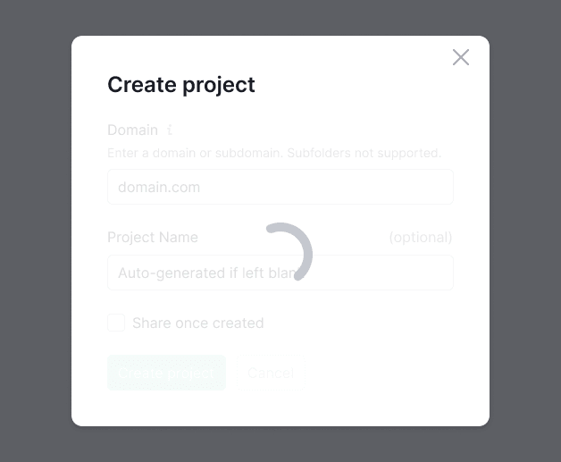

::: tip
Description of the component for modal windows can be found in the [Modal](/components/modal/modal).
:::

Here we have compiled recommendations for content styles in modal windows.

## Margins

Table: Margins for the content of the modal window

| Margin                                             | Appearance example                         |
| -------------------------------------------------- | ------------------------------------------ |
| 16px to a text (`--spacing-4x` token)              |             |
| 24px to controls and inputs (`--spacing-6x` token) |         |
| For confirm modals use small margin of 8px (`--spacing-2x` token) |     |
| Margin between the content and CTA buttons is 24px (`--spacing-6x` token) |                 |
| For confirm modals margin between the content and CTA buttons is 16px (`--spacing-4x` token) |  |

## Title and text

- For title in confirm windows use text with 20px size (`--fs-400`, `--lh-400`). For title in all other window types use text with 24px size (`--fs-500`, `--lh-500`).
- For blocks of text use 16px size (`--fs-300`, `-lh-300` tokens). Avoid using font-size less than 16px for blocks of text that user needs to read. Use 14px font-size carefully, and always check it's readability and contrast against background.


## Buttons

Modal windows must include a Call-to-Action (CTA) or main button. While the "Cancel" button and "Close" icon are optional, they are recommended.

We also advise using controls with a large (L) size within modal windows.

## Notice

Notices should be positioned next to the element that triggers the alert. For instance, if a user attempts to submit a project title and encounters an error, the notice should be placed before the buttons.


## Dual-zone modal

For dual-zone modal window use:

```css
background-color: var(--bg-secondary-neutral);
```


## Fixed header and footer

When scrolling the modal's content area, the fixed areas acquire shadows from the top and bottom sides. Maintain moderate padding inside the fixed areas (for example, 8px).




## Loading

While content inside the modal window is loading or reloading, display the [Spin](/components/spin/spin) overlay on top of the content.

- Use the largest Spin size – XXL.
- Ensure the spinner is centered relative to the hidden content.
- Including a message for this state is optional.



## Content alignment

In most cases, we recommend you aligning the content, titles, and controls of modal windows to the left.

However, exceptions may arise where, according to the composition, both the header and controls should be centered within the modal window.

**Align content to the left when:**

- Content includes lists and large texts (left alignment enhances readability).
- Forms feature inputs of varying lengths.
- Modal windows are divided into multiple logical sections (for example, wizards, dual-zone windows with previews, and a separate filter section).
- Content includes different types of content: form, lists, tables, etc.
- Fixed controls are present.


**Align content to the center when:**

- Modal window displays success notifications containing illustrations.
- Modal window includes a notification with single main button or buttons for scrolling through content.


