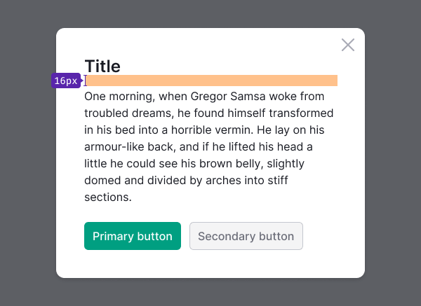
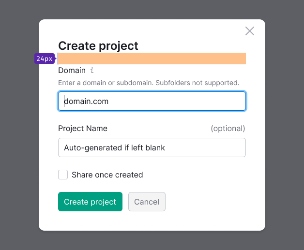
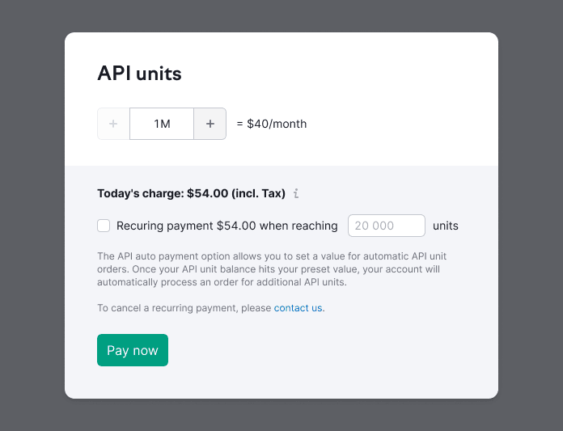

> 💡 Standard description of modal windows can be found in the [Modal](/components/modal/) component. And here we have compiled recommendations for content styles in modal windows.

@## Margins

**Margin between the title and the content:**

- 16px to a text;
- 24px to controls/inputs.





**For confirm modals use small margin of 8px.**


**Margin between the content and CTA buttons — 24px.**


**For confirm modals margin between the content and CTA buttons — 16px.**


@## Title

- For title in confirm windows use text with 20px size (`--fs-400; --lh-400;`). For title in all other window types use text with 24px size (`--fs-500; --lh-500;`).
- For paragraph text use 14px size (`--fs-300; --lh-300;`). For buttons - M size.


@## Buttons

Modal window must have a CTA or main button. The "Cancel" button and "Close" icon are optional, but recommended.

@## Dual-zone modal window

For the dual-zone modal window use:

```
background-color: var(--gray-50);
```



@## Fixed header and footer

While scrolling the modal's content area fixed areas get following shadow style:

```
background: linear-gradient(180deg, rgba(25, 27, 35, 0.1) 20.55%, rgba(255, 255, 255, 0.0001) 100%);
```

Make paddings inside the fixed area not too big (for example, 8px).


@## Loading

While loading or reloading the content inside the modal window, show [Spin](/components/spin/) over the content.

- Use Spin with the largest size — XXL.
- The spinner is necessarily centered regarding the hidden content.
- The message for this state is optional.


@## Content alignment

In most cases, we make the content, titles, and controls of modal windows left aligned.

**However, there may be exceptions,** when according to the composition, both the header and controls are should be aligned to the center of the modal window.

**Align the content to the left when:**

- content has lists, large texts (they are left aligned for readability);
- form has inputs of different lengths;
- modal window is divided into several logical parts (wizards, dual-zone windows with previews and a separate filter section);
- content has different types of content: form, lists, tables, etc.;
- content has fixed controls.


**Align the content to the center when:**

- modal window displays a success notification that contains an illustration;
- modal window displays a notification with a single main button or buttons that scroll through the content.


