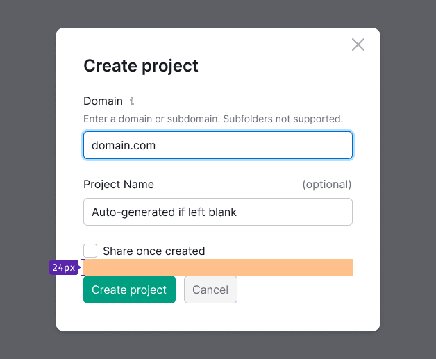

> 💡 Standard description of modal windows can be found in the [Modal](/components/modal/) component. And here we have compiled recommendations for content styles in modal windows.

@## Spacing

### Spacing between the header and the content

- 16px to a text;
- 24px to controls/inputs.

### Spacing between the content and CTA buttons - 24px

@## Headings

- The header size in confirm windows - H5 (19px, `--fs-400`, since there is usually a small amount of content). The header size in all other window types - H4 (25px, `--fs-500`).
- The paragraph size - L (14px, `--fs-300`). Buttons - L, 32 px.

@## Buttons

Modal window must have a CTA or main button. The `Cancel` button and `Close` icon are optional, but recommended.

@## Dual-zone modal window background

Gray background color for the dual-zone modal window – `background-color: $gray94;`.

@## Fixed area styles
Shadows style of the fixed area when scrolling, see in [Variables](/style/variables/).

> 💡 The area with pinned elements does not overlap the inside padding in the modal window.

Paddings inside the pinned area are recommended to make them not too large (for example, 8 px), so that pinned area won't take too much area.

@## Loading

While loading or reloading the content inside the modal window, [Spin](/components/spin/) appears over the content.

- The spinner size inside the modal window is XXL (72px).
- The spinner is necessarily centered regarding the hidden content.
- The text of the spinner is optional.

@## The content alignment

In most cases, we make the content, titles, and controls of modal windows left aligned.

**However, there may be exceptions,** when according to the composition, both the header and controls are should be aligned to the center of the modal window.

**Align the content to the left in the following cases:**

- presence of lists, large texts (they are located on the left for readability);
- presence of controls of different lengths;
- the modal window is divided into several logical parts (wizards, dual-zone windows with previews and a separate filter block);
- presence of different types of content: controls, texts, lists, tables, etc.;
- presence of pinned controls.

**Align the content to the center in the following cases:**

- the modal window displays a success notification that contains an image;
- the modal window displays a notification with a single main button or buttons that scroll through the content.
