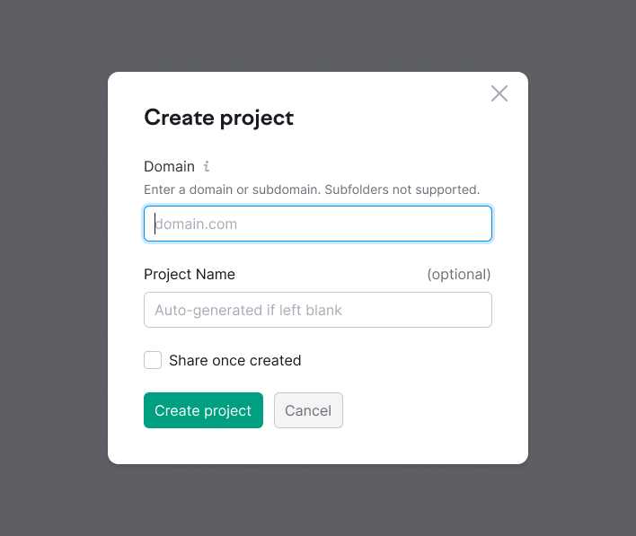
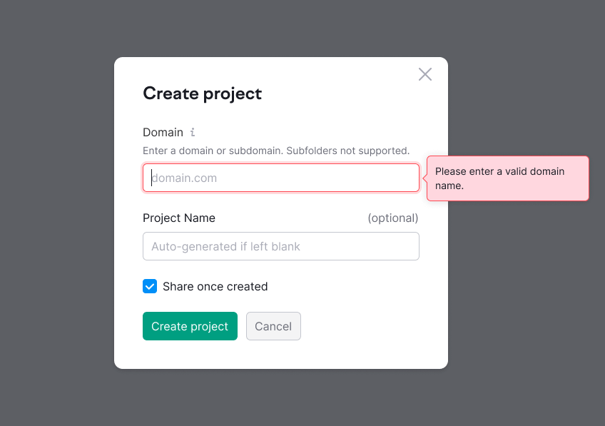
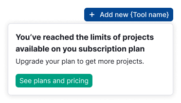

@## Description

**ProjectCreate** is a module for easy access to the project creation functionality on any Semrush tools page.

@## Appearance

The component consists of:

- trigger (usually it is a button located in the upper-right corner of the tool);
- a modal window with a form.

### Trigger

The trigger must have a MathPlus icon. It visually indicates the possibility of adding something.

Text: `Add new {Tool name}`.

> 💡 Note that if this button should have a lower priority in the visual hierarchy in your tool, you can use the secondary button.

### Modal window

Use L-sized inputs in the form. The text in the tooltip next to the button is 12px (`--fs-100`).

@## Interaction

> When the modal window opens, the first empty input gets the `focus` state. You can read more about the behavior of forms in the [Froms guide](/components/form/).

If the user will try to submit the form without the entered domain for the project, the input will get the `invalid` state. Focus will move on it and open the tooltip with an error.

You can read more about form validation in the [Validation guide](/patterns/validation-form/).

@## Limit

In some cases, adding a project may be restricted for some reason (for example, due to a limit). In this situation, we show a dropdown with the corresponding text and button.

|                                        | Text in English                                                              |
| -------------------------------------- | ---------------------------------------------------------------------------- |
| Heading                                | `You have reached the limit of projects available on your subscription plan` |
| Text                                   | `Upgrade your plan to get more projects.`                                    |
| Button (must be in the `active` state) | `See plans and pricing`                                                      |

@page project-create-api
@page project-create-code
@page project-create-changelog
